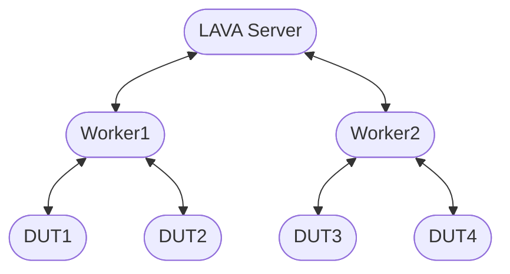
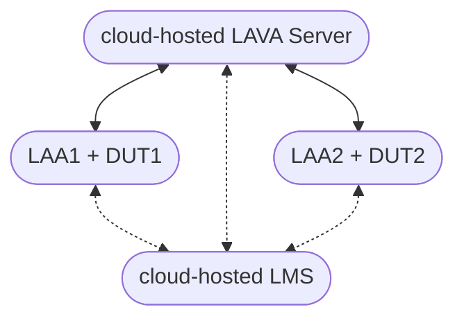

# Topology

LAVA's [distributed architecture](../../technical-references/architecture.md)
enables horizontal scaling and flexible deployment across geographically
distributed and network-restricted environments.

A LAVA server can be deployed in an isolated lab or in the cloud. LAVA workers
can be deployed from any location with network connectivity to the LAVA server.

## Local LAVA deployment

LAVA server and workers can be deployed on local machines. Several workers can be
connected to a LAVA server. Multiple DUTs can be connected to a worker.

## Cloud-hosted Services

LAVA server can be hosted in the cloud using
[docker-composer](https://gitlab.com/lava/pkg/docker-compose) or K8s. Some
companies provide managed LAVA instances.

For example, Linaro offers both cloud-hosted LAVA instances and
[Linaro Automation Appliance](https://docs.lavacloud.io/) (LAA) that managed by
the LAVA Managed Service (LMS) at [lavacloud.io](https://lavacloud.io/). This
integrated solution significantly simplifies and accelerates LAVA deployment and
device enablement in LAVA.

While the LAVA server and LMS are cloud-hosted, the LAA can be deployed from any
location. LMS provides seamless LAVA integration, secure remote access and
Over-The-Air (OTA) upgrades for your LAAs.

Each LAA serves as a pre-configured LAVA worker. It provides everything needed
by most hardware automation tasks. The DUT is attached to the LAA via the
[MIB](https://docs.lavacloud.io/hardware/mibs.html) directly. Simply plug
in the LAA power and Ethernet cables, then it will automatically connect to the
LMS. You can connect it to your LAVA server and add device configurations with
just a few clicks on the LMS web UI.

See also [LAVA worker](./hardware.md#lava-worker).

--8<-- "refs.txt"
