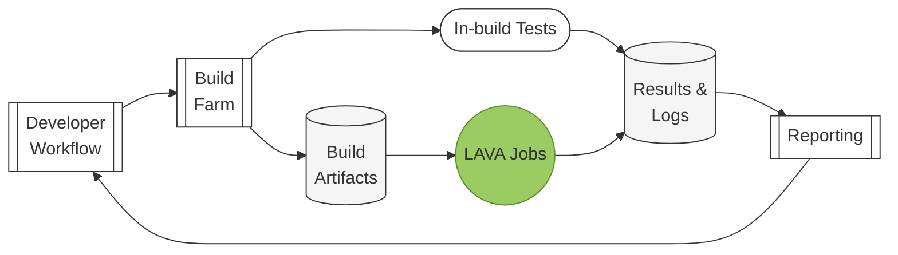

# Concepts

## What is LAVA?

LAVA is the **L**inaro **A**utomated **V**alidation **A**rchitecture.

LAVA is a continuous integration system for deploying operating systems onto
physical and virtual hardware for running tests. Tests can be simple boot
testing, bootloader testing and system level testing, although extra hardware
may be required for some system tests. Results are tracked over time and data
can be exported for further analysis.

LAVA is a collection of participating components in an evolving architecture.
LAVA aims to make systematic, automatic and manual quality control more
approachable for projects of all sizes.

LAVA is designed for validation during development - testing whether the code
that engineers are producing "works", in whatever sense that means. Depending
on context, this could be many things, for example:

* Testing whether changes in a bootloader initialize and boot the board
* Testing whether changes in the Linux kernel compile and boot
* Testing whether a kernel scheduler change reduces power consumption
* Testing whether the code produced by GCC is smaller or faster

LAVA is good for automated validation. LAVA tests the Linux kernel on a range
of supported boards every day. LAVA tests proposed android changes in Gerrit
before they are landed, and does the same for other projects like GCC.

LAVA is good for providing developers with the ability to run customized tests
on a variety of different types of hardware, some of which may be difficult to
obtain or integrate. LAVA has great support for emulation platforms like AVH,
FVP and QEMU, and is best at providing test support for real hardware devices.

LAVA is principally aimed at testing changes made by developers across
multiple hardware platforms to aid portability and encourage multi-platform
development.

## What is LAVA **not**?

LAVA is not a set of tests. It is the infrastructure to enable users to run
their own tests. LAVA concentrates on providing a range of deployment methods
and boot methods. Once the login is complete, the test consists of whatever
scripts the test writer chooses to execute in that environment.

LAVA is not a test lab. It is the software that can be used in a test lab to
manage and control test devices.

LAVA is not a complete CI system. It is the software that can form part of a
CI loop. LAVA supports data extraction to make it easier to produce a frontend
which is directly relevant to particular groups of developers.

LAVA is not a build farm. Other tools need to be used to prepare binaries
which can be deployed to the devices using LAVA.

## LAVA in CI

Continuous Integration (CI) is a development model where developers make changes
which are continuously integrated into the main development tree. Testing of
that tree allows developers to know if their changes have introduced new bugs,
regressions, or exposed side effects in other systems.

LAVA is focused on bootloader, kernel and system validation as part of a CI loop
and provides a way to test on a wide variety of different hardware to aid
portability and develop multi-platform systems.

LAVA fits into a CI loop where code changes trigger builds that are tested on
virtual and real hardware. LAVA handles the testing and validation phase,
providing results that feed back to developers to close the loop.

LAVA's role in this loop is to:

1. **accept** job submission
2. **deploy** build artifacts onto physical and virtual DUTs
3. **boot** DUT to expected environment
4. **execute** predefined tests
5. **notify** reporting system to pull job and test results

For CI to work effectively, tests need to be relevant, reproducible, and timely.
Test jobs submitted to LAVA should follow a basic rule:
**test one element at a time**. If a test changes the kernel, deployment method,
and OS simultaneously, failures cannot be attributed to a specific cause.
