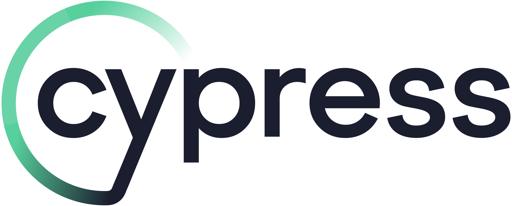

# Trusted by

LAVA is the backbone of hardware testing for some of the world's most important
open-source projects. The organizations below rely on LAVA to validate their
code on real physical hardware or emulated platforms (QEMU, FVP).

## KernelCI — Linux kernel validation

KernelCI uses LAVA as its **primary backend** for automated Linux kernel
hardware testing. Every kernel patch that lands in mainline has likely been
validated by LAVA running on dozens of boards across the KernelCI labs network.

> As KernelCI continues to grow and mature, the complexity of managing
> hardware testing laboratories has become increasingly apparent. While we
> currently support LAVA as our primary backend, the community has expressed
> strong interest in expanding our capabilities.
>
> — [KernelCI Labs Working Group announcement](https://kernelci.org)

KernelCI's Labs Working Group was created specifically to strengthen the
LAVA integration and scale hardware testing across the Linux community.

## 10x Engineers — RISC-V CI

10x Engineers uses LAVA through their Cloud-V platform for automated firmware
and kernel testing on RISC-V hardware. Their LAVA lab supports testing on
boards like StarFive VisionFive 2, SiFive HiFive Unleashed, Banana Pi F3,
Milk-V Jupiter, and Milk-V Pioneer Box.

## Android — pre-merge validation

LAVA tests proposed Android changes in Gerrit before they are landed, running
boot tests, VTS/CTS suites, and hardware compatibility checks on physical
Android development boards.

## Apertis — Debian-based IoT platform testing

Apertis uses LAVA for integration testing and package testing of their
Debian-based IoT platform. They have a dedicated LAVA test shell distro
profile, use Robot Framework integrated on LAVA, and run complete test
automation on LAVA infrastructure for all their reference hardware.

Apertis developers can also submit personal LAVA jobs during development
to debug tests or verify changes before final integration.

## GCC — compiler validation

LAVA tests GCC compiler output on real hardware, validating that code
produced by GCC is correct and performs as expected across a wide range of
embedded and server processors.

## Linux kernel — daily validation

LAVA tests the Linux kernel on a range of supported boards every day. It
validates bootloader changes, kernel boot sequences, and system-level
functionality across multiple architectures.

## Qualcomm — Debian and Yocto image validation

Qualcomm uses LAVA to automatically test their Linux images on physical
Qualcomm development boards. Their CI pipeline integrates LAVA via GitHub
Actions, submitting test jobs, monitoring execution, and publishing results
back to their repositories.

---

## Supported by

LAVA is built and maintained by a global community of engineers from leading
technology companies. The organizations below are the testimony of LAVA's
success.

## Core contributors

These organizations account for the vast majority of LAVA's codebase:

Linaro

Collabora

Debian

Canonical

## Hardware partners

Major semiconductor and hardware companies:

NXP

BayLibre

ARM

Qualcomm

Pengutronix

Renesas

STMicroelectronics

Texas Instruments

## Additional contributors and users

Ubuntu

Foundries.io

AMD

Amlogic

Cypress

Fairphone

Siemens

Linux Foundation

Realtek

Hitachi Energy

Schneider Electric

