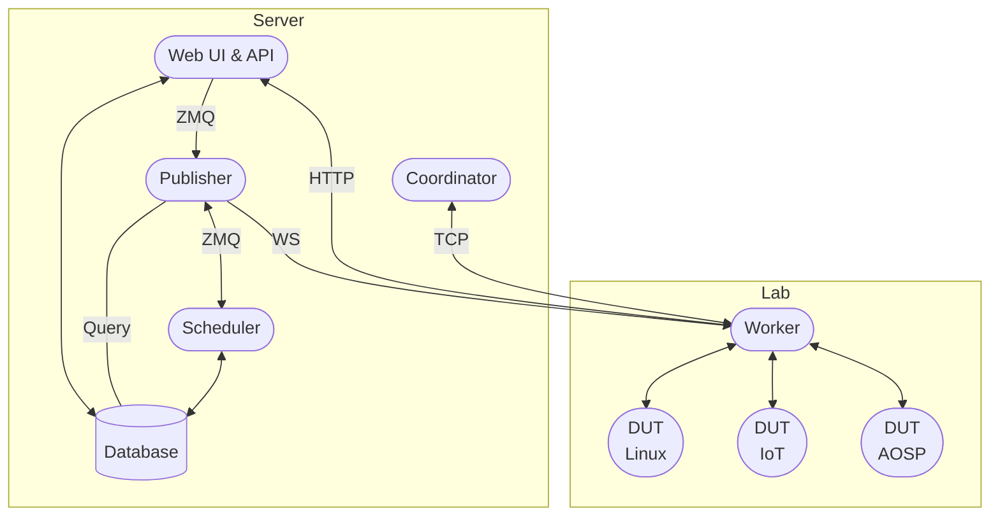

# Architecture

LAVA consists of several components with different roles, organized in a
server-worker model.

The simplest possible configuration is to run the server and worker components
on a single machine. Larger instances can be configured with multiple workers
controlling a greater number of attached test devices.

## Server

### Web interface

The LAVA web interface is built using the [apache2](./services/apache2.md) web
server, the [gunicorn](./services/lava-server-gunicorn.md) application server
and the Django web framework. It also provides XML-RPC access and the REST API.

!!! danger
    In production, do not serve the web application or the [publisher](#publisher)
    over plain HTTP. Put them behind a reverse proxy that terminates TLS.

### Publisher

The [lava-publisher](./services/lava-publisher.md) receives events from LAVA
services and forwards them to subscribers.

### Scheduler

The [lava-scheduler](./services/lava-scheduler.md) periodically schedules jobs
in the queue to idle devices.

### Coordinator

The [lava-coordinator](./services/lava-coordinator.md) daemon receives, stores,
and dispatches messages for
[MultiNode](../user/advanced-tutorials/multinode.md) jobs.

## Worker

The [lava-worker](./services/lava-worker.md) daemon pulls scheduled jobs for
this worker from the server over HTTP. For each job it starts a `lava-run`
process to manage all the operations on the DUT. It also keeps a WebSocket
connection to the [publisher](#publisher) for real-time events, reducing
latency when jobs are assigned or updated.

## DUT

Physical or virtual devices under test. Multiple DUTs can be attached to a
single [worker](#worker).
