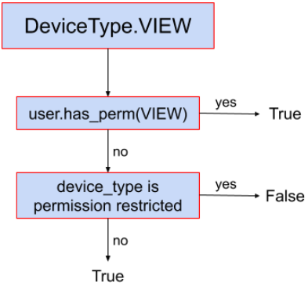
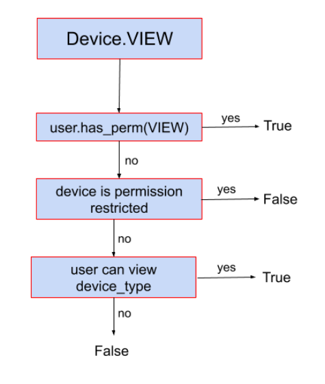
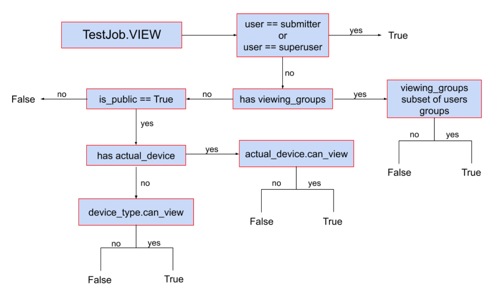

# Authorization

## Private instance

By default, device types, devices and test jobs are publicly visible meaning
that a non-authenticated users can view everything. This does not apply to
submit and change permissions.

It is possible to require all users to login before accessing any page outside
the home page, documentation pages and the login page itself by setting the
`REQUIRE_LOGIN: true` in any YAML configuration file under
`/etc/lava-server/settings.d/*.yaml`.

For a public instance, the access can be controlled globally or per-object.

## Global authorization

LAVA's global authorization is built on top of
[Django's permission system](https://docs.djangoproject.com/en/stable/topics/auth/default/#topic-authorization).
A user can hold a global permission for any system entity. Global permissions
are checked first and take precedence over [per-object permissions](#per-object-authorization).
They are managed through the Django admin user settings.

## Per-object authorization

LAVA per-object authorization is used to apply fine-grained access to a specific
objects in the system. For example, it can be used to hide a specific device
(and all jobs on that device) from the public.

The per-object system is **group-based** and applies to:

- **Device Type**
- **Device**

!!! note "Test Job"
    Test jobs are **not** directly controlled through per-object group
    permissions. Test job visibility is determined by inheritance from the
    device or device type it belongs to, along with the job-level
    [`viewing_groups`](#viewing_groups) and [`is_public`](#is_public) fields.

The supported per-object permissions are:

- **view**
- **submit**
- **change**

!!! important
    LAVA per-object authorization works in an **inverse** manner. This means
    that if no permissions are assigned to an object, that object is considered
    **unrestricted** and is visible to everyone. Once a permission is assigned
    to an object for a specific group, only members of that group (and
    superusers) are granted the corresponding access.

## Permission inheritance

As we already covered that the object is permission restricted if it has any
permission assigned for a specific group and permission unrestricted otherwise.

Since every device belongs to a device type, and every test job is associated
with either a device (actual) or a device type (requested), permissions cascade
from parent to child when the child object is unrestricted.

For example, the device `qemu01` is permission unrestricted but the `qemu`
device type has a permission to allow group `lkft` to view it. Only users from
this particular group will be able to see device `qemu01` even if it’s not
permission restricted because the underlying device type has the restriction.
The same goes for test jobs. If the test job is not permission restricted it
will be visible only if device and device type it belongs to are unrestricted,
or if the user belongs to one of the groups the view permission applies to.

This means that setting a restriction on a device type automatically restricts
all devices of that type (and all jobs on those devices) without requiring
individual configuration.

This particular behavior allows admin to set the permissions on higher level,
and it will be applied to all the lower level objects. For example, if you set
the view permission for aforementioned `lkft` group for the device type, all the
devices and test job will be automatically hidden for non-lkft users.

Conversely, a more specific permission at the lower level takes precedence.
For example, if a group has direct access to a device, that access applies
regardless of whether the same group has any permission on the parent device
type.

## Test job visibility

Test job visibility has two additional fields that override the inherited
device/device-type permissions.

### `viewing_groups`

If `viewing_groups` is set on a test job, the user must belong to **all** the
specified groups to view the job. This field has higher priority than per-object
device/device-type authorization and can be set in the job definition by setting
job [visibility](./job-definition/job.md#visibility) to a list of groups.

### `is_public`

Test job field `is_public` can be used to completely hide job from public. If
set to `False`, only submitter, superusers and users belonging to
`viewing_groups` field (if set) will be able to view the test job. If set to
`True`, regular per-object authorization will be applied. This field can also be
set in the job definition by setting job
[visibility](./job-definition/job.md#visibility) to `personal`.

## Visibility decision trees

### Device type

### Device

### Test job

## Examples

For the sake of simplicity, let's say we have `device-type1`, `device1` (of
`device-type1`), and groups `group1` and `group2`.

1. No per-object permissions set on `device-type1` nor `device1`: All authenticated
   as well as anonymous users are able to access `device-type1`, `device1` page
   and all test jobs view pages (e.g., `/scheduler/device_type/qemu`) as well as
   plain logs etc. All authenticated users are able to submit jobs to `device1`.
   No anonymous users can submit jobs (ever).
2. `device1` has a per-object permission `Can submit to device` set to `group1`:
   Now only users from `group1` are able to submit jobs to `device1`. All
   authenticated and anonymous users are still able to **view** `device1` and
   all jobs running on it since there's no restriction for **view** permission.
3. `group1` has a per-object permission **view** for `device-type1` and `device1`
   has no per-object permissions set: only users from `group1` can **view** the
   `device-type1`, `device1` and all associated test jobs. No-one else.
4. `group1` has a per-object permission **view** for `device-type1` and `group2`
    has a per-object permission **view** for `device1`: users from `group1` are
    not able to **view** `device1` (nor any test jobs running on it) but they
    will be able to access `device-type1` details page. Users from `group1` will
    be able to **view** other devices (if any) of the `device-type1`, but only
    if those devices have no **view** permissions set for them (or they belong
    to some other groups that are included in those permissions). Users from
    `group2` will be able to **view** the `device1` and all the test jobs running
    on it but will not be able to access the `device-type1` detail page.

## See also

[Configure permissions](../admin/basic-tutorials/instance/permissions.md)
