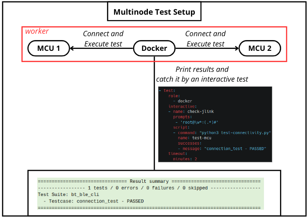

# JLink

The `jlink` boot method is used to flash and boot devices using the
[J-Link](https://www.segger.com/products/debug-probes/j-link/) debug probe from
SEGGER. It supports flashing single or multiple images and can interact with
devices that have multiple cores.

```yaml
- boot:
    method: jlink
    commands:
    - loadfile {shell} 0x0
    prompts:
    - 'SHELL>>'
    timeout:
      minutes: 2
```

!!! note
    Images passed to JLink commands must be first deployed using the
    [`tmpfs`](../deploy/to-tmpfs.md) deploy action.

## Installation

`jlink` must be installed manually on the LAVA worker since it is not provided
as a dependency by LAVA. See
[JLink Software and Documentation Pack](https://www.segger.com/downloads/jlink/)
for installing the tool.

## Configuration

For adding a new device type, see
[JLink device type](../../../configuration/device-type-template.md#jlink).

For adding a new device, refer to
[JLink device configuration](../../../configuration/device-dictionary.md#jlink).

## commands

Optional. A list of JLink commands to execute. These can include `loadfile` or
any other valid JLink command. Variables in the commands reference images
deployed during the prior `tmpfs` deploy action.

### Flashing signal image

When only a single image deployed with `tmpfs` deployment method and the
`commands` is not specified in this boot method, LAVA flashes the single image
to the default load address `0x0`.

```yaml
- boot:
    method: jlink
    timeout:
      minutes: 2
```

### Flashing multiple images

```yaml
- boot:
    method: jlink
    commands:
    - loadfile {shell} 0x0
    - loadfile {hello_world} 0x0
```

In this example, `shell` and `hello_world` are the image keys used in the
`tmpfs` deploy action.

## coretype

For devices with multiple cores, specifies which core to connect to. The
available core types are defined by `supported_core_types` in the device type
template. If not specified, the first core in the list is used.

```yaml
- boot:
    method: jlink
    coretype: M7
    commands:
    - loadfile {test}
    prompts:
    - 'SHELL>>'
    timeout:
      minutes: 2
```

## prompts

See [prompts](./common.md#prompts).

## timeout

See [timeouts](../../timeouts.md).

## Example job

```yaml
device_type: frdm-kw36zj
job_name: health-check

timeouts:
  job:
    minutes: 10
  action:
    minutes: 3

priority: medium
visibility: public

actions:
- deploy:
    to : tmpfs
    images :
      boot :
          url: https://example.com/frdm-kw36-shell.bin

- boot:
    method: jlink

- test:
    monitors:
    - name: tests
      start: Running test suite common_test
      end: PROJECT EXECUTION SUCCESSFUL
      pattern: '(?P<result>(PASS|FAIL)) - (?P<test_case_id>.*)\.'
      fixupdict:
        PASS: pass
        FAIL: fail
```

## Using multiple MCUs

To set up a test requiring multiple MCUs, such as testing Bluetooth
connectivity, you can use a multinode job. In this setup, MCU 1 and MCU 2 are
placed on the same worker, and a Docker device is used to execute tests once
both MCUs have completed their deployment and boot processes.



The test setup consists of:

- **MCU 1 and MCU 2:** These are the target devices to be tested.
- **Docker Device:** A Docker container is deployed to execute the tests. This
Docker device is responsible for coordinating the test execution once both MCUs
are ready.

Here’s how the process works:

1. **Deployment and Boot:** The necessary images are deployed to both MCUs using
tmpfs. Once deployed, the MCUs are booted to initiate the test process.
2. **Test Execution:** Once both MCUs have completed their boot processes, the
Docker device executes the test suite.
3. **Results Analysis:** The test results are collected and analyzed by a LAVA
test to verify the functionality of the MCUs and ensure successful connectivity.

Example job:

```yaml
job_name: Multiple MCUs

timeouts:
  job:
    minutes: 5
  action:
    minutes: 5
  connection:
    minutes: 2

priority: medium
visibility: public

protocols:
  lava-multinode:
    roles:
      host:
        device_type: rw610bga
        count: 1
        tags:
          - rw610bga-fr01
        timeout:
          minutes: 30
      guest:
        device_type: rw610bga
        tags:
          - rw610bga-fr02
        count: 1
        timeout:
          minutes: 30
      docker:
        device_type: docker
        count: 1

actions:
- deploy:
    role:
      - host
      - guest
    to : tmpfs
    images :
      boot :
          url: https://example.com/bt_ble_cli.out
      cpu1 :
          url: https://example.com/rw61xw_raw_cpu1_a1.bin
      cpu2 :
          url: https://example.com/rw61xn_raw_cpu2_ble_a1.bin
      combo :
          url: https://example.com/rw61xn_combo_raw_cpu2_ble_15_4_combo_a1.bin

- deploy:
    role:
      - docker
    to: docker
    os: ubuntu
    image:
      name: connectivity_test
      local: true

- boot:
    role:
      - host
      - guest
    method: jlink
    commands :
      - loadfile {boot}
      - loadfile {cpu1} 0x8400000
      - loadfile {cpu2} 0x8540000
      - loadfile {combo} 0x85E0000
    timeout:
      minutes: 2

- boot:
    role:
      - docker
    method: docker
    command: bash
    prompts:
    - 'root@\w*:(.*)#'
    timeout:
      minutes: 2
```
