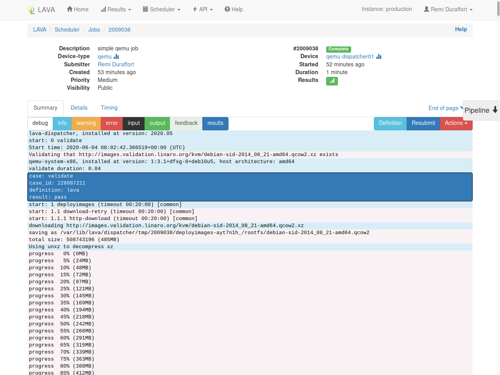

# Job output

A simple [QEMU job page](https://validation.linaro.org/scheduler/job/2009038) will look like this:

## Header

At the top of the page, job meta-data are listed in two columns:

* **static data** on the left (description, device-type, submitter, ...)
* **dynamic data** on the right (job id, actual device, duration, ...)

## Summary

This is the main tabular as it includes the logs of the job.

You can select the levels that should be displayed or hidden by clicking on the corresponding buttons:

* `debug`, `info`, `warning` and `error`: LAVA logs
* `input`: DUT input
* `target` and `feedback`: DUT output
* `results`: LAVA results

!!! tip "`target` vs `feedback`"
    Both `target` and `feedback` are DUT output.

    When using [namespaces](../../technical-references/job-definition/job.md#namespace), DUT
    output for the current namespace will be in `target` while outputs coming
    from over namespace will be in `feedback`.

### Pipeline

On the right side of the page, the `pipeline` element allows you to jump
directly at the log of a specific action of the pipeline.

## Details

In this tabular, you have access to the internal details of the LAVA pipeline
that was running for this specific job definition.

## Timing

This tabular list each individual action with it's duration along with its timeout.

This helps test writers to check for actions with a duration which is
much shorter than the requested timeout. Reducing these timeouts will allow
failures to be identified more quickly.

The graph only shows actions that are longer than 1 second. The full list is
available in the table.

--8<-- "refs.txt"
