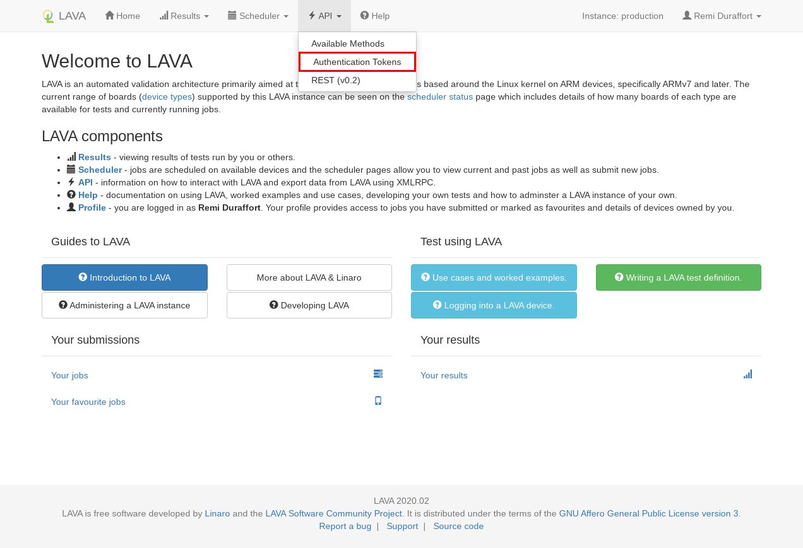
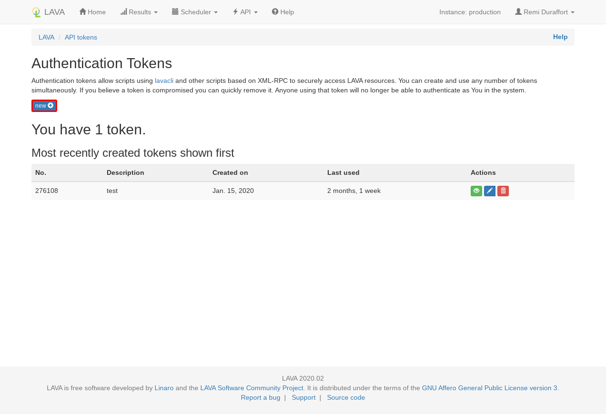
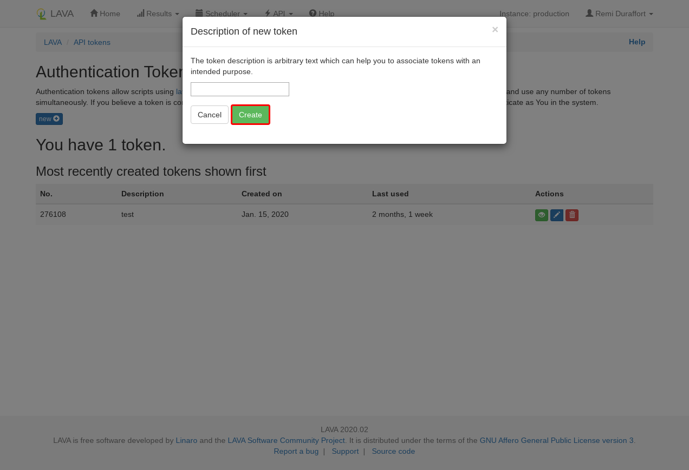
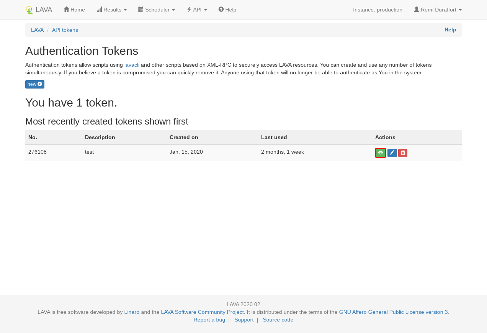

# lavacli

[lavacli] is a command line tool to interact with one or many LAVA instances
using XML-RPC.

## Install

### Debian

A package is provided for both Debian and Ubuntu:

```shell
apt-get install lavacli
```

### Pypi

lavacli is also available on PyPi:

```shell
python3 -m pip install lavacli
```

## Configure

### Create a token

In order to access to restricted API methods, lavacli will need a `token` to authenticate.

In the web interface, go to [/api/tokens/](/api/tokens/).



Click on `new` to create a token.



In the modal, you can add a description to the new token. This description
can be left empty for the moment.



The token has been created, click on the green eye icon and copy the value
shown in the modal dialog.



### Create an identity

You can now add this token to lavacli identities with:

```shell
lavacli identities add --uri https://<lava-server>/RPC2/ \
                       --username <username> \
                       --token <token> \
                       myserver
```

### Use the identity

In order to use the identity, call `lavacli -i myserver <command>`.

!!! tip "default identity"
    If the identity is called `default` lavacli will use it for every command.

    `lavacli -i default <command>` and `lavacli <command>` will use the same identity.

## Help

For more information, refer to the [lavacli documentation][lavacli].

--8<-- "refs.txt"
