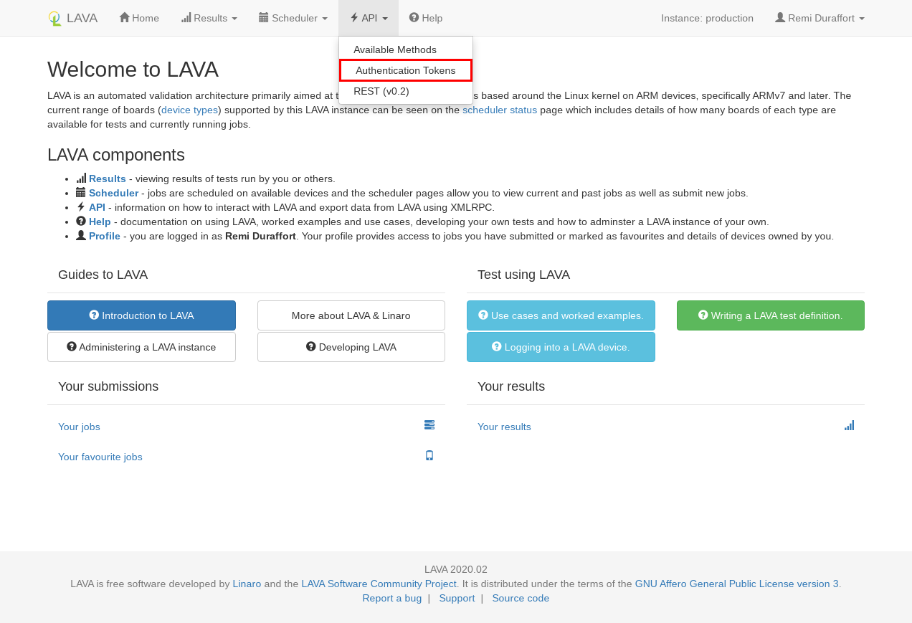
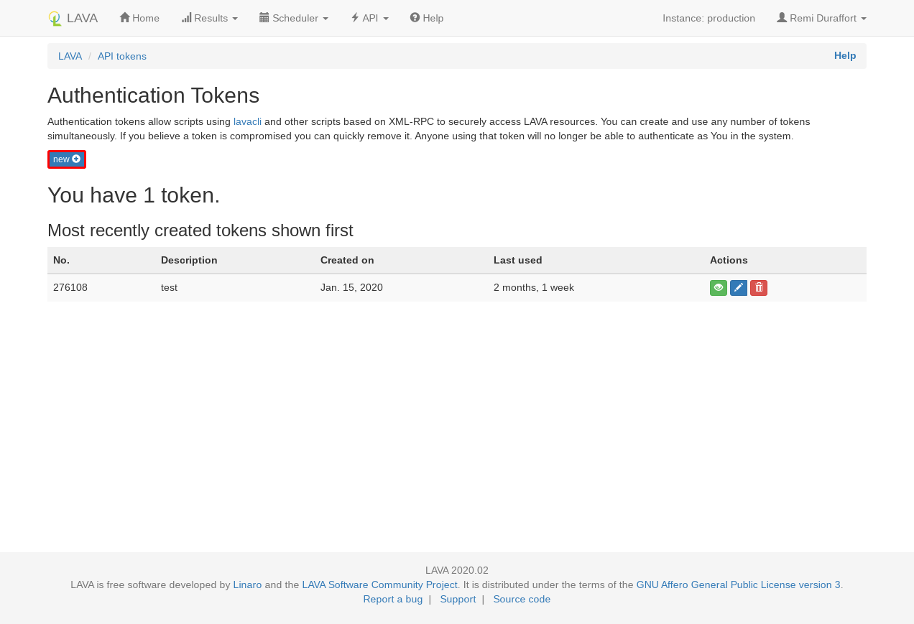
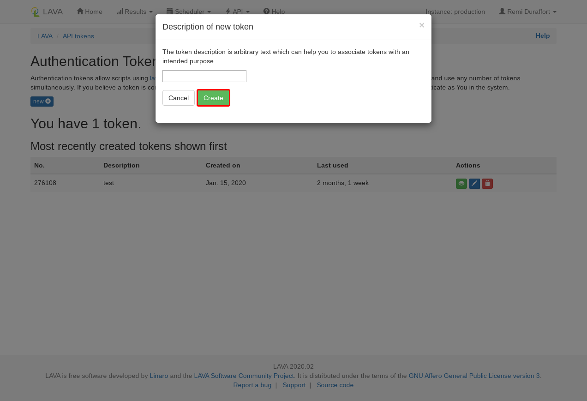
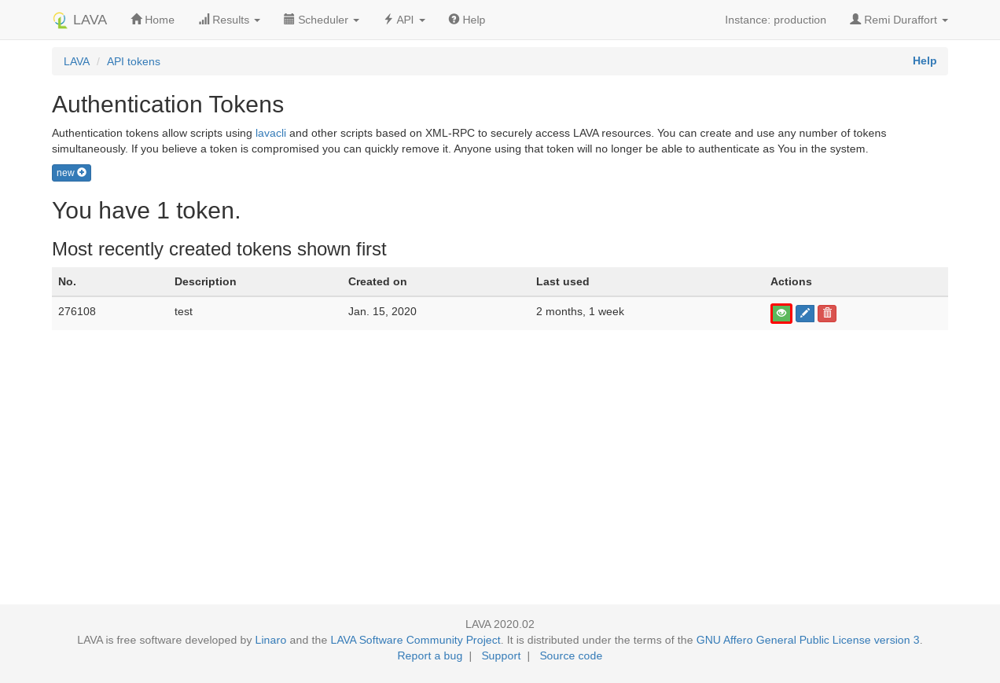

# lavacli

[lavacli] is a command line tool to interact with one or many LAVA instances
using XML-RPC.

## Install

### Debian

A package is provided for both Debian and Ubuntu:

```shell
apt-get install lavacli
```

### Pypi

lavacli is also available on PyPi:

```shell
python3 -m pip install lavacli
```

## Configure

### Create a token

In order to access to restricted API methods, lavacli will need a `token` to authenticate.

In the web interface, go to `/api/tokens/` on your LAVA server.



Click on `new` to create a token.



In the modal, you can add a description to the new token. This description
can be left empty for the moment.



The token has been created, click on the green eye icon and copy the value
shown in the modal dialog.



### Create an identity

You can now add this token to lavacli identities with:

```shell
lavacli identities add --uri https://<lava-server>/RPC2/ \
                       --username <username> \
                       --token <token> \
                       myserver
```

### Use the identity

In order to use the identity, call `lavacli -i myserver <command>`.

!!! tip "default identity"
    If the identity is called `default` lavacli will use it for every command.

    `lavacli -i default <command>` and `lavacli <command>` will use the same identity.

## MCP server

Since version 3.0.0, lavacli can start a [Model Context Protocol][mcp] (MCP)
server, allowing an LLM client to interact with a LAVA instance.

### Install

The MCP server requires the `mcp` python module, which is not installed by
default:

```shell
python3 -m pip install 'lavacli[mcp]'
```

### Start the server

The server talks to the instance selected by `--identity` or `--uri`:

```shell
lavacli -i myserver mcp
```

By default, the server uses the `stdio` transport: the LLM client starts
lavacli itself. For example, with Claude Code:

```shell
claude mcp add lava -- lavacli -i myserver mcp
```

Most other clients use a JSON configuration:

```json
{
  "mcpServers": {
    "lava": {
      "command": "lavacli",
      "args": ["-i", "myserver", "mcp"]
    }
  }
}
```

The server can also be started with the `streamable-http` transport, listening
on `127.0.0.1:8000` by default:

```shell
lavacli -i myserver mcp --transport streamable-http --host 127.0.0.1 --port 8000
```

!!! warning "No authentication"
    The `streamable-http` transport does not authenticate the clients: anyone
    able to reach the port can act on the instance with the identity's token.
    Keep it listening on `127.0.0.1`.

### Available tools

The server provides tools to:

* list and show jobs, device-types, devices and workers
* read the job queue, a job definition and its logs
* read a device-type template, its health-check and a device dictionary
* browse the results of a job: test suites, test cases and metadata
* read this documentation, at the version running on the instance

A few tools change the instance: submitting and canceling a job, setting a
device-type template or a device dictionary. They are flagged as such in their
MCP annotations, so that the client can ask for a confirmation before running
them.

!!! tip "Read-only access"
    The tools act with the permissions of the identity's token. Use a token of
    a user without the matching permissions to keep the server read-only.

### Example: triaging failing jobs

Once the server is configured in your LLM client, you can ask questions about
the instance in plain language, for example:

```text
Look at the jobs that failed in the last 24 hours on the lava instance. Group
them by root cause and, for each group, tell me which device-types and devices
are affected and whether it looks like an infrastructure or a test issue.
```

To answer, the LLM will chain the tools on its own:

1. `jobs_list` with `health=INCOMPLETE`, `since=1440` and `verbose=true` to get
   the failing jobs and their error type and message
2. `job_show` on some of them to get the device-type and device
3. `job_logs` to read the board output and the commands sent by LAVA around
   the error
4. `job_results` to find which action or test case failed
5. `documentation_fetch` when an error relates to a part of the job definition
   or of the device configuration

and answer with a summary like:

```text
3 root causes for 17 incomplete jobs:

* [11 jobs] "bootloader-interrupt timed out" on bcm2711-rpi-4-b, all on
  rpi4-03 and rpi4-05: the serial output is empty after power on.
  Infrastructure issue: check the power control and serial connection of
  these two boards.
* [4 jobs] "Unable to fetch .../rootfs.ext4.xz: 404" on qemu: the artifact
  URL in the job definition is no longer valid. Test issue.
* [2 jobs] "lava-test-shell timed out" on juno-r2: the test
  "ltp-syscalls" hangs. Test issue: increase the timeout or fix the test.
```

The same approach works for other questions, such as *"why did job 1234
fail?"*, *"which devices have been failing their health-checks this week?"* or
*"write a job definition for a qemu arm64 boot and submit it"*. When a request
calls a tool that changes the instance, like `job_submit`, most clients ask for
your confirmation first.

## Help

For more information, refer to the [lavacli documentation][lavacli].

--8<-- "refs.txt"
