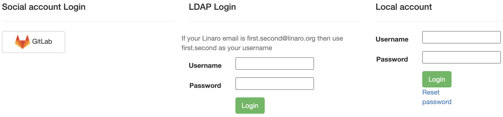
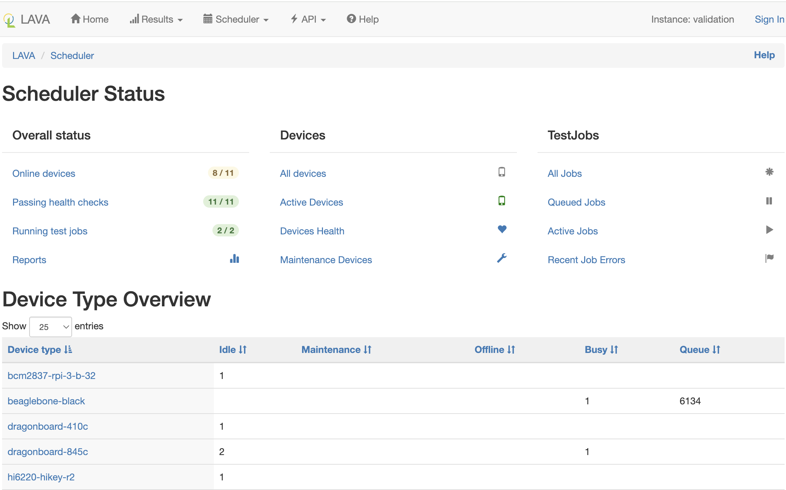

# Signing in

Each LAVA instance offers a local user account and may also be configured with
an alternative authentication method such as LDAP or social accounts.

LDAP authentication relies on local configuration and may involve obtaining a
privileged access token from the LDAP administrators. Local accounts remain
available for all instances.

Whichever authentication method is used, there is no difference in how users
interact with LAVA once signed in.

Click the "Sign In" button in the top-right corner to access the login screen.
It looks something like the following.

## Local user account

A local user account may be created by an administrator within LAVA. The
administrator may grant different permissions to the user to perform various
operations within LAVA.

To log in with a username and password, enter your credentials in the provided
text boxes and click the "Login" button.

Local user accounts can be particularly useful for automated users like build
systems or continuous integration scripts using the LAVA APIs. In this case,
a local admin can create the user with a secure password, sign in as that user
to create an authentication token and then supply the token to the scripts.

## Linaro lab users

Linaro's central validation lab in Cambridge is accessible via
[validation.linaro.org](https://validation.linaro.org/). It is Linaro's core
production instance of LAVA.

This lab is configured to use Linaro LDAP. To sign in, enter your details in the
LDAP fields.

!!! note
    If your Linaro email is `first.second@linaro.org` then use `first.second`
    as your username.

A successful authentication will redirect you to the LAVA dashboard.

