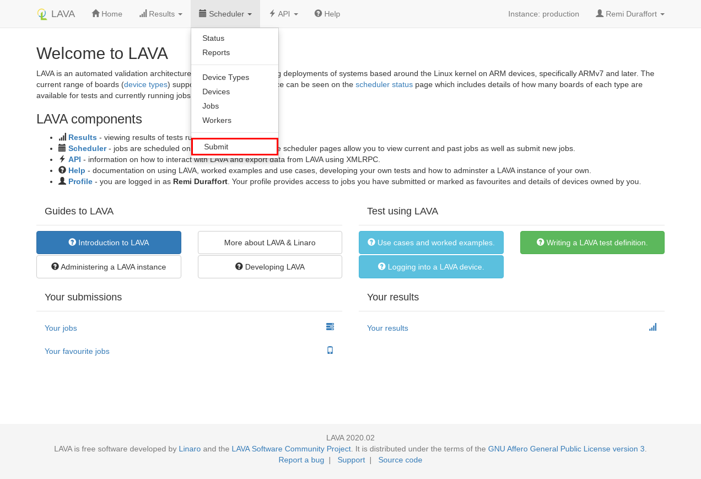
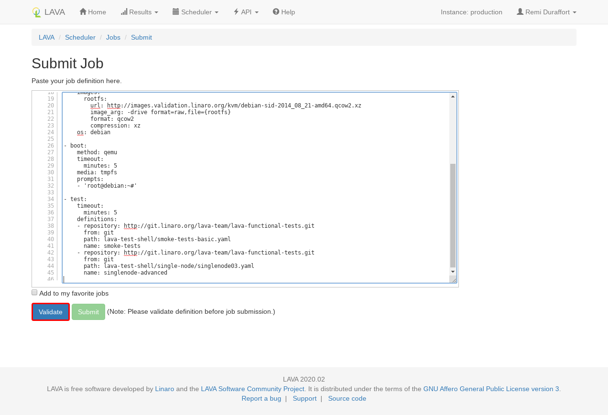
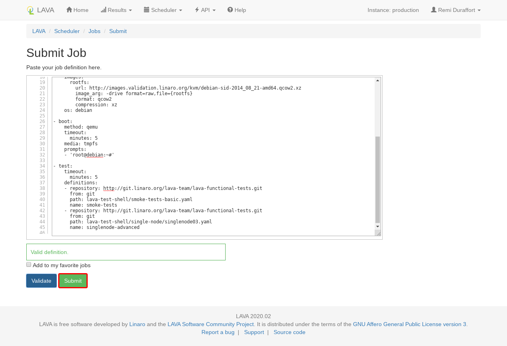

# Job submit

Jobs can be submitted from either the [web interface](#web-interface), [lavacli](#lavacli) or the REST API.

## QEMU job

You will start with this simple QEMU job:

```yaml
--8<-- "jobs/qemu.yaml"
```

## Web interface

In order to submit from the web interface, you should first login and then go to
`Scheduler > Submit`.



In the submit page, copy and paste the job definition and click on `Validate`.



The server will validate the job definition and return any errors or warning found.

If the job is valid, the `Submit` button will become active. Clicking on it
will actually submit the job.




## lavacli

In order to submit using [lavacli][lavacli], start by installing and configure
lavacli with the [lavacli tutorial](./lavacli.md).

Submit the job with:
```shell
lavacli -i <identity> jobs submit qemu.yaml
```

lavacli will submit and print the job identifier that you can use to inspect
the current job.

```shell
lavacli -i <identity> jobs show <id>
lavacli -i <identity> jobs logs <id>
lavacli -i <identity> jobs wait <id>
```

--8<-- "refs.txt"
