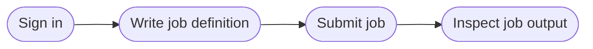

# First steps

Running a test in LAVA is done by submitting a test job that describes what
software to deploy, how to boot the DUT, and what tests to run.

The following diagram shows the typical workflow for running your first test.
Each step is explained in detail in the basic tutorials below.

## Basic tutorials

| Tutorial | Description |
| -------- | ----------- |
| [Signing in](basic-tutorials/signing-in.md) | Sign in to a LAVA instance |
| [Job definition](basic-tutorials/job-definition.md) | Understand the structure of a job definition |
| [Job submission](basic-tutorials/submit.md) | Submit your first job via web UI or lavacli |
| [Test definition](basic-tutorials/test-definition.md) | Write test definitions for your jobs |
| [Job output](basic-tutorials/job-output.md) | Navigate and understand job logs and results |
| [lavacli](basic-tutorials/lavacli.md) | Install and configure the command-line tool |

## What's next

Explore the advanced tutorials to get the most out of LAVA.

--8<-- "refs.txt"
