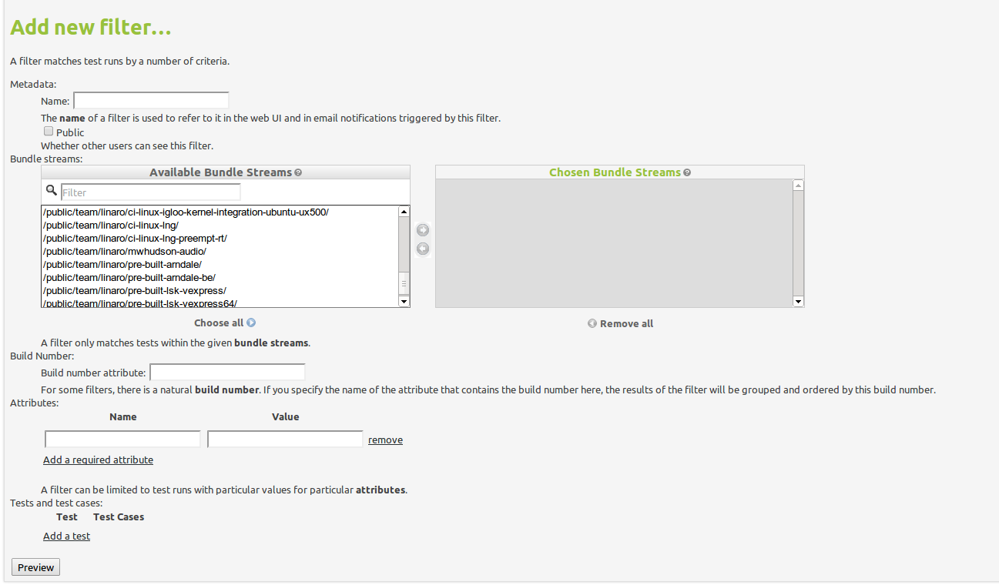

.. index:: filter

.. filter:

Filters
=======

What is a Filter?
-----------------

You can user filters in LAVA to combine test results from multiple bundle
streams in a single view and provides ability to apply attribute filtering
as well include/exclude particular tests or test cases.

Filters can be public or private. Public filters are accessible by all
authenticated and anonymous users, while private ones are only accessible by
the users which created it.

How to create a Filter?
-----------------------

Select a list of bundle streams you would like to be included in your filter
and add attribute labels and values by which you would like to filter out your
test results.

You can set build number attribute as well at this stage, which will sort your
test runs based on a specified field.

After setting up everything you will see a preview page where you can check
if the data your new filter correlates to your need, and you can continue
editing or save the filter.

Subscriptions
-------------

Subscribing to a filter will cause LAVA to send an email to you whenever
certain conditions are satisfied.

You can choose your own level of subscription:
 * whenever a test that matches the criteria of filter is executed
 * only when a test that matches the criteria of filter fails

.. index:: image reports

.. _image_reports:

Image Reports
=============

Image reports allow you to view test run pass/fail results or test result
measurements over time. Only site superusers are allowed to manipulate over
image reports.

Image Report options
--------------------

You can change the options (filters section) in the image reports page like
start/end build numbers, tests, target goal and graph type. Those changes are
saved so every time you come to the same image report, you will have options
from your last visit selected.

Start/end build number will limit the build numbers on the graph and the table
below as well.

With tests option can include/exclude particular tests from this image report
as well as in the table on the bottom.

If you set the target goal value a dotted vertical line will be displayed in
the report chart.

Graph type can have three different options:
 * pass/fail displays number of passed test cases in each test run on the
   report
 * percentage displays percentage of passed test cases in each test run
 * measurement graph type will display the first test case measurement from
   each test run

Image Report table
------------------

Image report table includes pass/fail numbers for all the test runs.

From here you can go to the particular test run by clicking the cell link and
you can also link a bug from a launchpad to the test run.

Image Reports 2.0
=================

Image reports allow you to view test run pass/fail results or test result
measurements over time combined from multiple filters.

Each LAVA user can create his own image reports and update/remove those he
owns. Image reports can be published, making them accessible to all the users
accross the system.

Image report list will show your own and published reports.

Each report can contain multiple charts and each of those chart can combine
results from multiple filters whether they be pass/fail results or measurement
results gathered from test results.

Image Reports 2.0 display page
------------------------------

Interactive charts
^^^^^^^^^^^^^^^^^^

You can click on each of the indices on the chart and a new tab will open with
that particular test run/test result.

If you hover over the any of the indices on the chart, a tooltip will appear
with either pass/fail number of tests or measurement value depending on the
chart type.

Filters List
^^^^^^^^^^^^

Filters used for every particular chart are displayed just above the chart with
links to each of the filters so you can easily change the filters if there is
something off in the report data.

Build number limits
^^^^^^^^^^^^^^^^^^^

You can limit the build numbers in the dropdowns. Start build nuber setting
will be saved and automatically loaded once you visit this page next time.

Print menu
^^^^^^^^^^

There are two options in the print menu:
 * Download as csv - downloads CSV file with all the test data from this chart
 * View as image - displays only chart as an image in a new tab

Target goal subscriptions
^^^^^^^^^^^^^^^^^^^^^^^^^

You can subscribe to the target goal set by the report owner. If you are
subscribe, you will get an email any time the report value drops below the
target goal (value can be either number of passed tests, in case of pass/fail
charts, or measurement value in case of measurement charts).

Legend
^^^^^^

Legend displays the colors of the trends on chart and the aliases set up
during image report creating (default is "filtername: testname: testcasename").

Legend is also interactive. You can shuffle the items in the legend with drag
and drop. The advantage to this is that the indices in the chart can overlap so
in order to use the interactivity you might need to change the order of the
legend items.
