Installation
============

This guide shows you how to setup a LAVA Dashboard instance running on Ubuntu
Lucid Server (LTS). The installation was performed using Virtualbox
4.0.10-72479~Ubuntu~natty running on a Ubuntu Natty Narwhal host.

.. note::
    Currently LAVA server-side installations support Ubuntu Lucid Lynx Server
    *only*. Usually everything works on a more recent Ubuntu release, such as
    Maverick Meerkat, Natty Narwhal and even Oneiric Ocelot however we cannot
    guarantee that is the case. We welcome bug reports though, please let us
    know.

Getting Ubuntu Server
^^^^^^^^^^^^^^^^^^^^^

You can get Ubuntu Server from http://www.ubuntu.com/download/server/download
Please ensure you get 10.04 LTS version. Feel free to use either 32bit or 64bit
version, depending on your hardware needs.

Installing Ubuntu Server
^^^^^^^^^^^^^^^^^^^^^^^^

The installation is rather straightforward. For the purpose of this
installation we selected ``English``

.. image:: lava-dashboard-installation-0.png

You need to make the same choice a moment later:

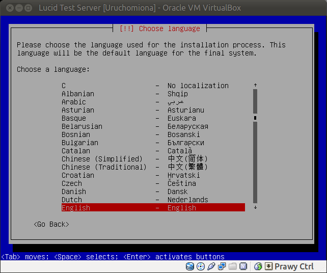

For country, territory or area we selected the default which is ``United
States``. You can safely choose other values.

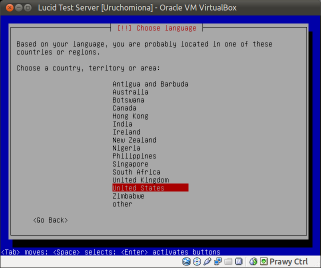

A few moments later the installer will allow you to configure networking. Here
we selected `lava`. It does not matter much but if you have multiple Ubuntu
installations it's a good idea to give each an unique host name.

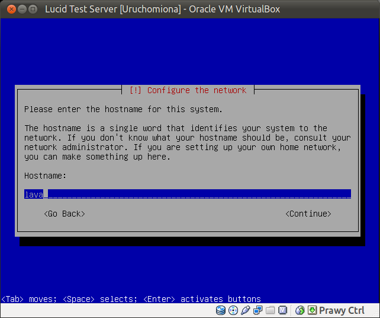

A moment later you will have to create the initial user. This user will have
administrative access to the system. For our demo we created an user called
``Lava Admin``:

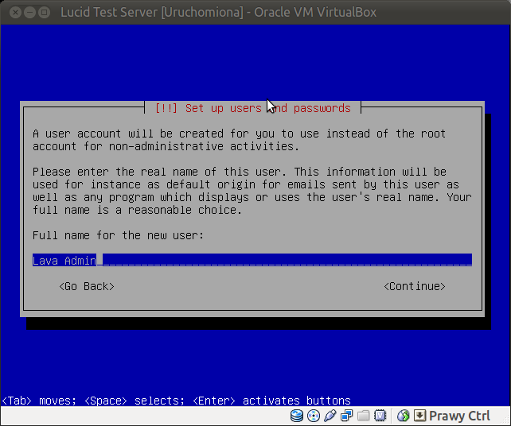

You also need to select a user name, we selected ``lava-admin``.

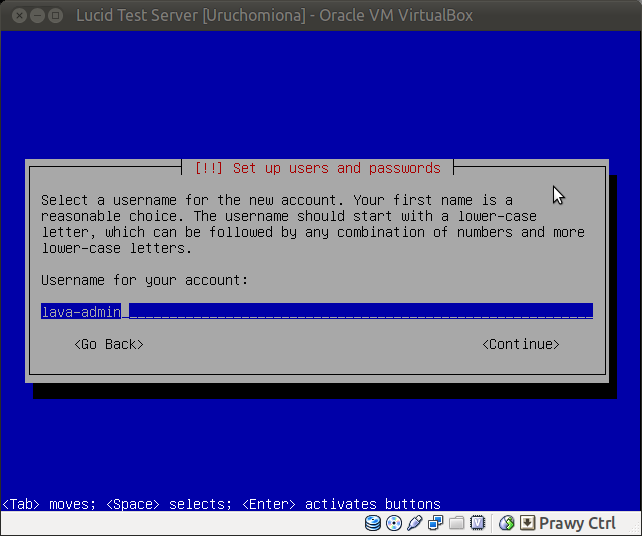

After that the installation is really up to you. You can partition the disk
anyway you like. There is no need to select anything different from the
defaults offered by the installer as far as LAVA is concerned.

Once the installation is done login with the username and password you selected

Adding the Lava Dashboard PPA
^^^^^^^^^^^^^^^^^^^^^^^^^^^^^

Currently LAVA is packaged in a PPA maintained by Zygmunt Krynicki. There is an
official PPA being prepared (owned by the Linaro Validation group) but it is
not ready as of 28th of June 2011.

Usually PPAs are added using the very useful tool called
``add-apt-repository``. It is not installed by default on server installations
so we'll need to get it manually.  Let's install the package that has this tool
``python-software-properties``,  using the following command::

    $ sudo apt-get install python-software-properties

You should see an output similar to the one below:

.. image:: lava-dashboard-installation-6.png

Now we can add the PPA using the following command::

    $ sudo add-apt-repository ppa:zkrynicki/lava

You should see an output similar to the one below:

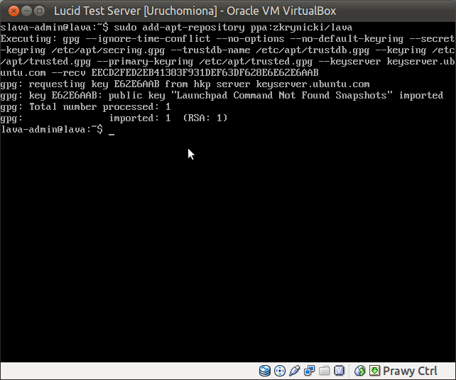

After the PPA is added we need to update the cache of packages that APT knows about. This step is mandatory::

    $ sudo apt-get update

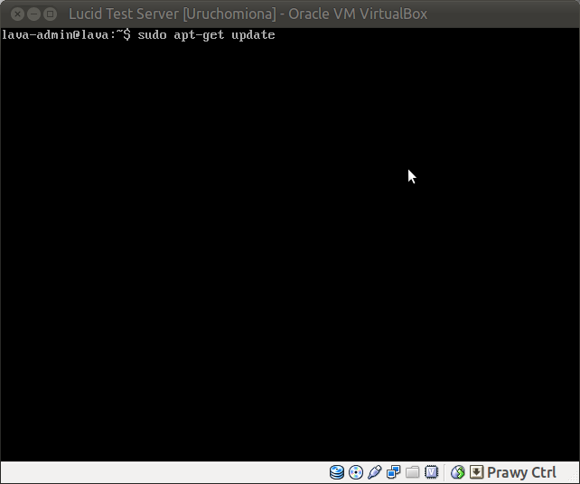

This command does produce a lot of output. After it finishes we can finally install launch-control.

Installing Lava Dashboard Package
^^^^^^^^^^^^^^^^^^^^^^^^^^^^^^^^^

To install the dashboard you need to install a package called
``launch-control``.

.. note::
    Lava Dashboard used to be called Launch Control. The old name is being
    transitioned but we have not prepared a packaged release of the new
    codebase just yet.

You can install this package using the following command::

    $ sudo apt-get install launch-control

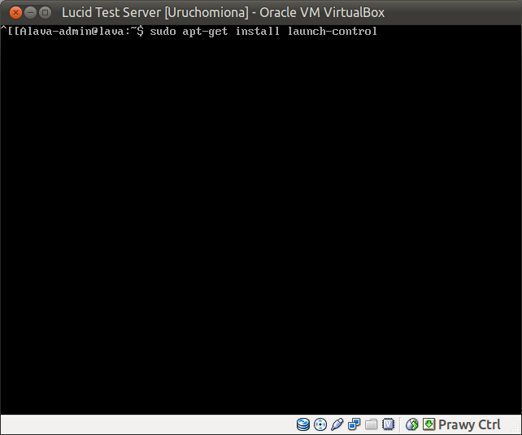

Running this command will make APT ask you for confirmation. It will display a
list of packages that will be installed to fulfill the dependency chain of the
dashboard. Here it required over 20 megabytes of additional packages.

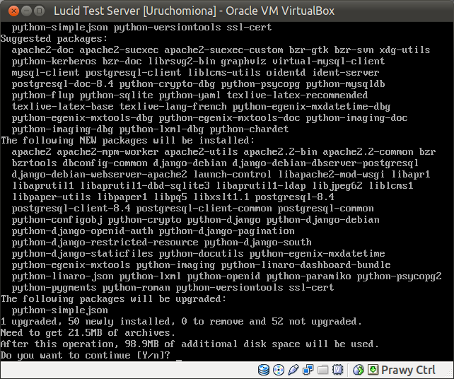

Just confirm the selection and let it download all the packages.

Setting Up The Dashboard Database
^^^^^^^^^^^^^^^^^^^^^^^^^^^^^^^^^

The installer will ask you several questions. Most of the questions come from a
Debian subsystem used by the Dashboard to setup a database. This subsystem is
called ``dbconfig-common``. The first question it asks if whether you wish you
use dbconfig-common with launch-control.

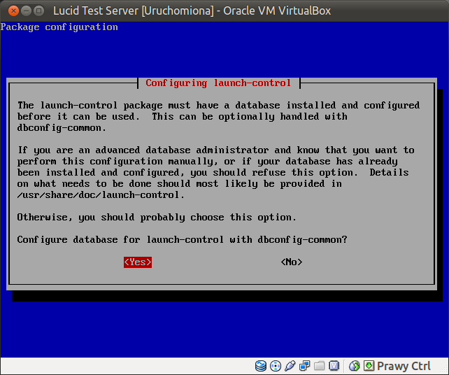

Select ``<Yes>`` here please. If you select ``<No>`` instead you will have to
manually create and configure a database. This is only recommended for advanced
users and is not described in this guide.

The next question is about the database back-end that the Dashboard should use
to store test results and other data. The dashboard supports two back-ends:

#. SQLite
#. PostgreSQL

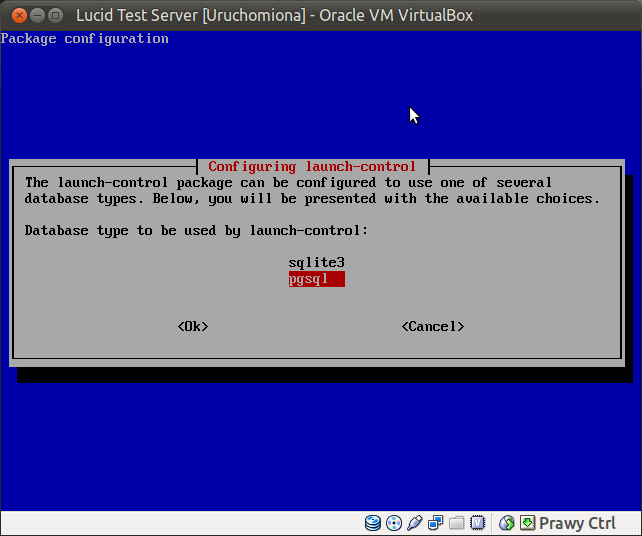

We recommend PostgreSQL for all installations. Some of the features, such as
data mining and reporting, may have database-specific queries and those queries
would not run on SQLite.

.. note::
    It is possible to provide custom data mining queries specific to a database
    back-end so it's possible to have a query that would work on both SQLite
    and PostgreSQL but the users are not required to provide such fall-backs.

The final question is displayed only when using PostgreSQL.

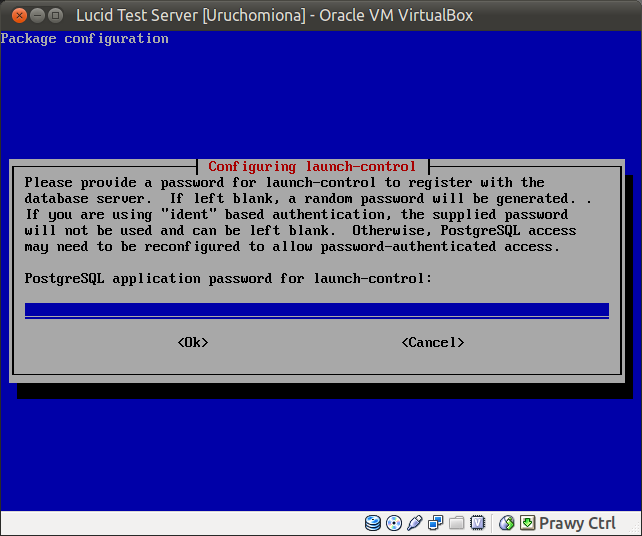

Here ``dbconfig-common`` asks you about the password you would like to use for
the database account that will be used by the dashboard to connect to
PostgreSQL server. By default a random password will be generated for you, just
leave this field blank and continue.

After those questions the interactive part will finish and the dashboard will
be installed and configured automatically. There is very little output, usually
it looks like this:

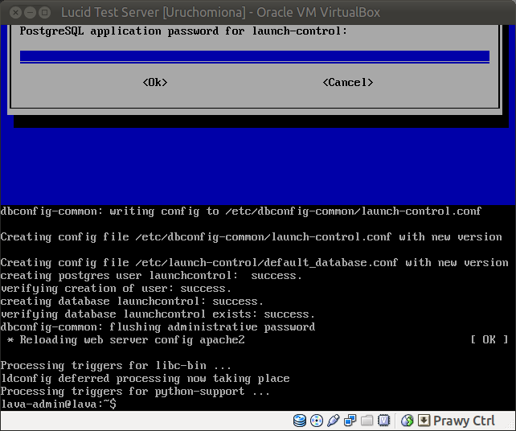

There is much more details about what is happening but it is being redirected
to ``syslog``. To have a look at that immediately after the installation you
can use a command such as::

    $ less /var/log/syslog

Just scroll down to the end of the file (using page down key) to see the
verbose installation details. If you have any questions about that please ask
us.

.. note::
    Asking questions is good. It let's us know what we did wrong and let's us
    build a FAQ for other users. You can find us in the #linaro channel on
    irc.freenode.net. Usually we're up during EU and US timezones. You can also
    use https://answers.launchpad.net/lava-dashboard

Creating the admin user
^^^^^^^^^^^^^^^^^^^^^^^

The dashboard has a user account system separate from the system it is running
on. To control it you need to have a administrator, super-user account. Create
one now using this command::

    $ sudo -u www-data /usr/lib/launch-control/manage.py createsuperuser

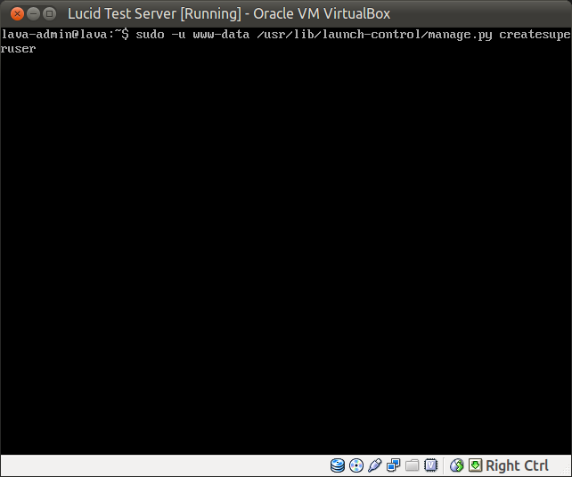

Answer the questions asked by the program. For the purpose of the guide we used
``admin`` for both user name and password.

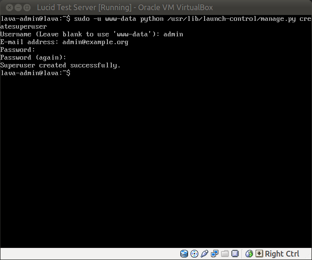

Powering off the virtual machine
^^^^^^^^^^^^^^^^^^^^^^^^^^^^^^^^

We are almost ready to get started with the dashboard. Since we use VirtualBox
and, by default, it is using NAT networking we are unable to connect to the
dashboard from our host operating system. Let's turn off the virtual machine
and reconfigure VirtualBox networking.

To power off the virtual machine use the following command::

    $ sudo poweroff

.. image:: lava-dashboard-installation-17.png

Reconfiguring virtual machine network
^^^^^^^^^^^^^^^^^^^^^^^^^^^^^^^^^^^^^

After the machine shuts down, go to the main VirtuaBox window (you may need to
stat VirtualBox again if you closed it earlier). Next, click on the name of the
virtual machine you created. This will change the pane on the right to display
the configuration of your virtual machine. Locate network settings and click on
the icon next to the label. This should bring up a dialog window similar to the
one below.

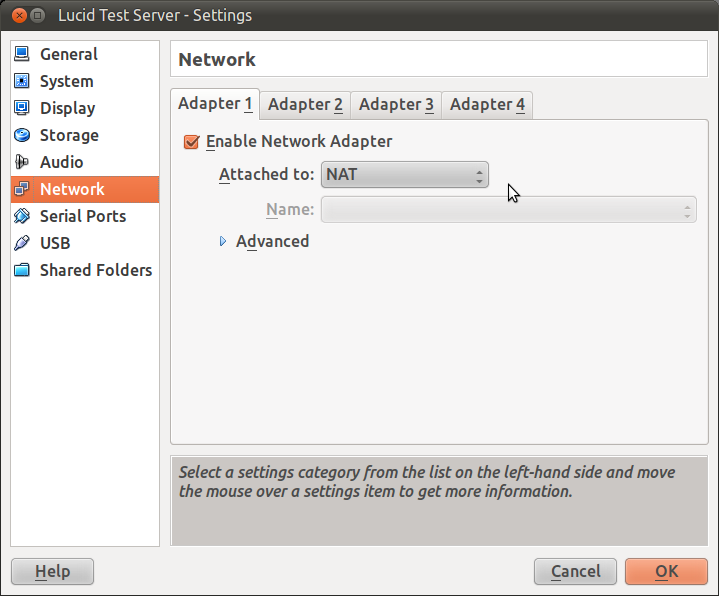

As you can see the network adapter is attached to the ``NAT`` network. Let's
change that to to ``Bridged Adapter``. If you have multiple network adapters
available (such as wired networking and wireless networking) make sure to
select the one you are connected with right now. We used ``wlan0`` which is the
name of the wireless connection on the host computer.

The settings should look like this:

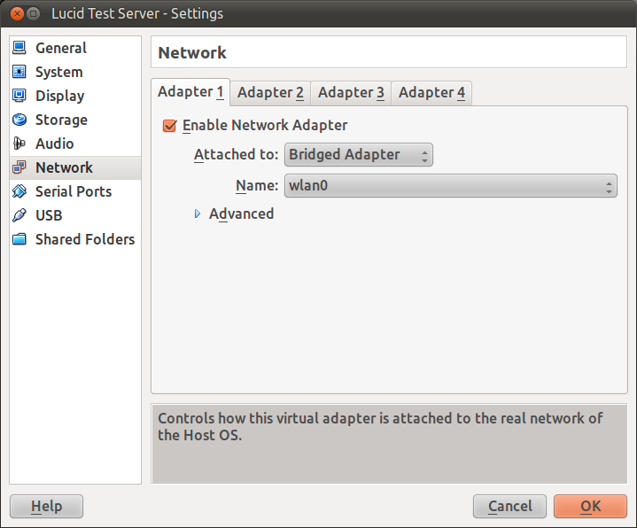

Click okay to close the dialog window and start the machine again.

Booting the virtual machine again
^^^^^^^^^^^^^^^^^^^^^^^^^^^^^^^^^

If you left the Ubuntu Lucid Server installation CD in the virtual machine as
we did please select the option called ``Boot from first hard disk`` and continue.

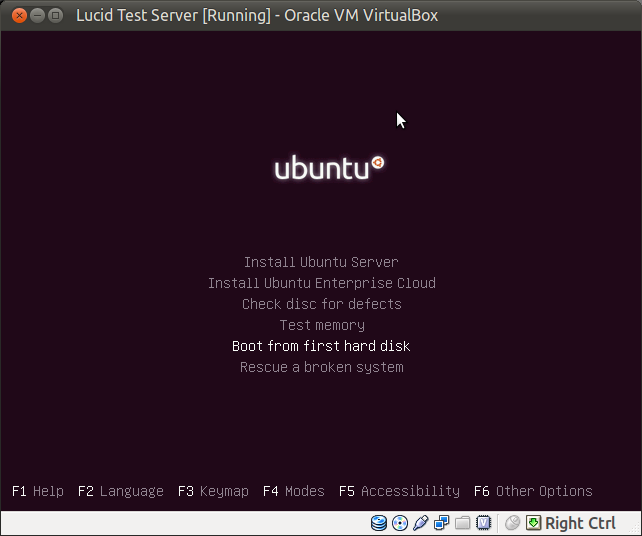

After a moment the machine will be up and running. Let's log in to see the IP
address it got from the DHCP server on your network.

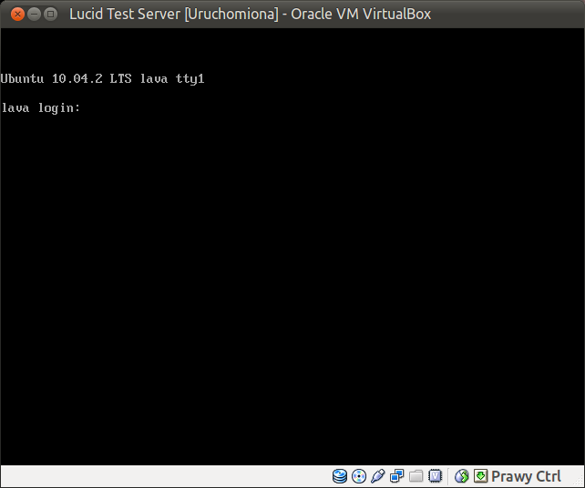

Login with the user you created during operating system installation. As you
remember we used the ``lava-admin`` user.

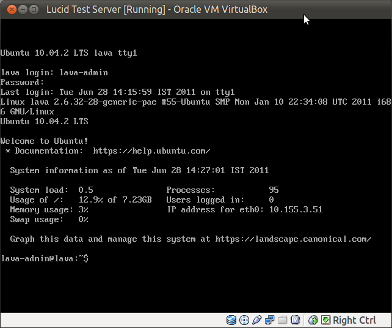

We now need to check the IP address of our virtual server. Use the following command now::

    $ ifconfig

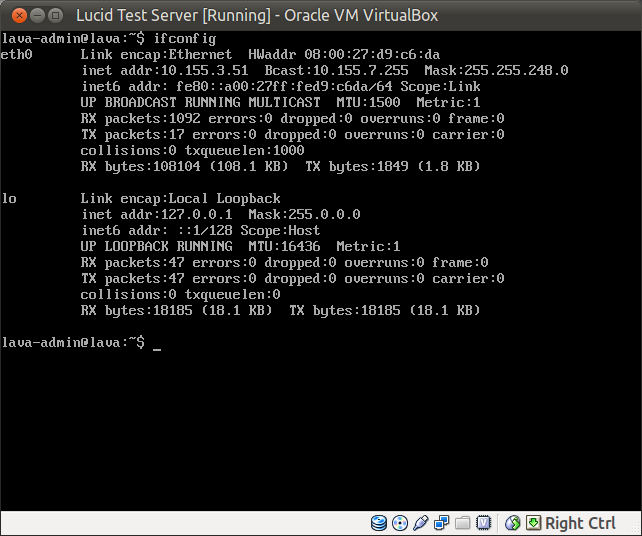

Here our IP address is ``10.155.3.51``, the value you'll see will most likely differ.

Accessing the dashboard for the first time
^^^^^^^^^^^^^^^^^^^^^^^^^^^^^^^^^^^^^^^^^^

Now we are ready to connect to the dashboard. From your host computer open a
web browser of your choice (we used Firefox that came with Ubuntu Natty) and go
to this address::

    http://10.155.3.51/launch-control/

Substitute the value above with the IP address of your server. You should see a screen like this:

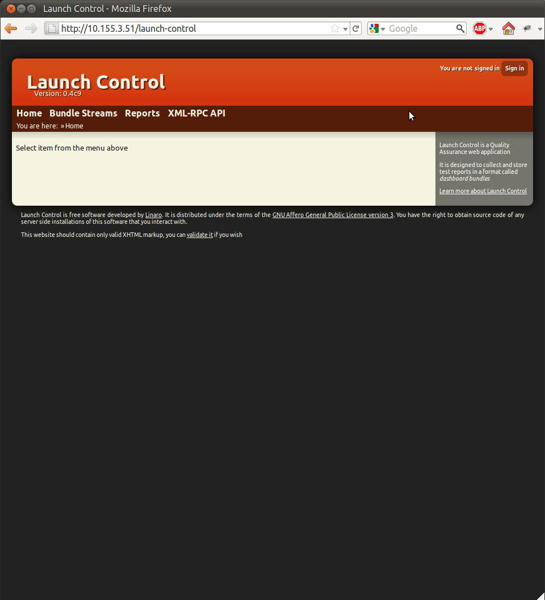

Let's sign in with the admin user we created. Click on the sign in button in
the top-right corner now.

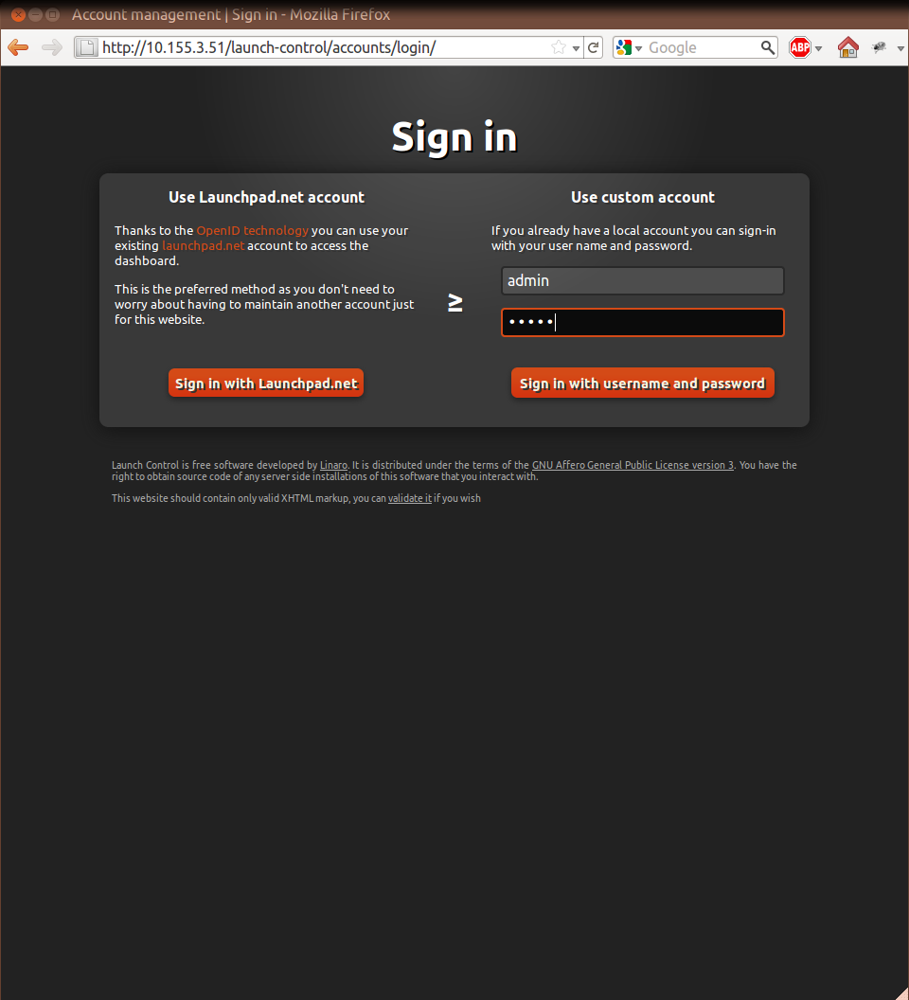

.. note:: 
    The dashboard supports two kinds of user accounts. You can create a local
    account, like the one we did with ``createsuperuser`` or use an existing
    launchpad.net account. For general use we recommend launchpad accounts as
    that will not require creating yet-another password for you to remember.
    This time, however, you need to sign in as the ``admin`` user with the
    ``admin`` password we created earlier. This account is special and has
    access to the administration panel, more such accounts can be created if
    necessary.

After signing in go click on the link that reads ``Bundle Stream``. It will
lead you to a page that contains a list of all the streams in your dashboards.
There are no streams yet so let's create one. Please follow the link on the
page to go to the admin panel, directly to a place that allows you to create
additional bundle streams.

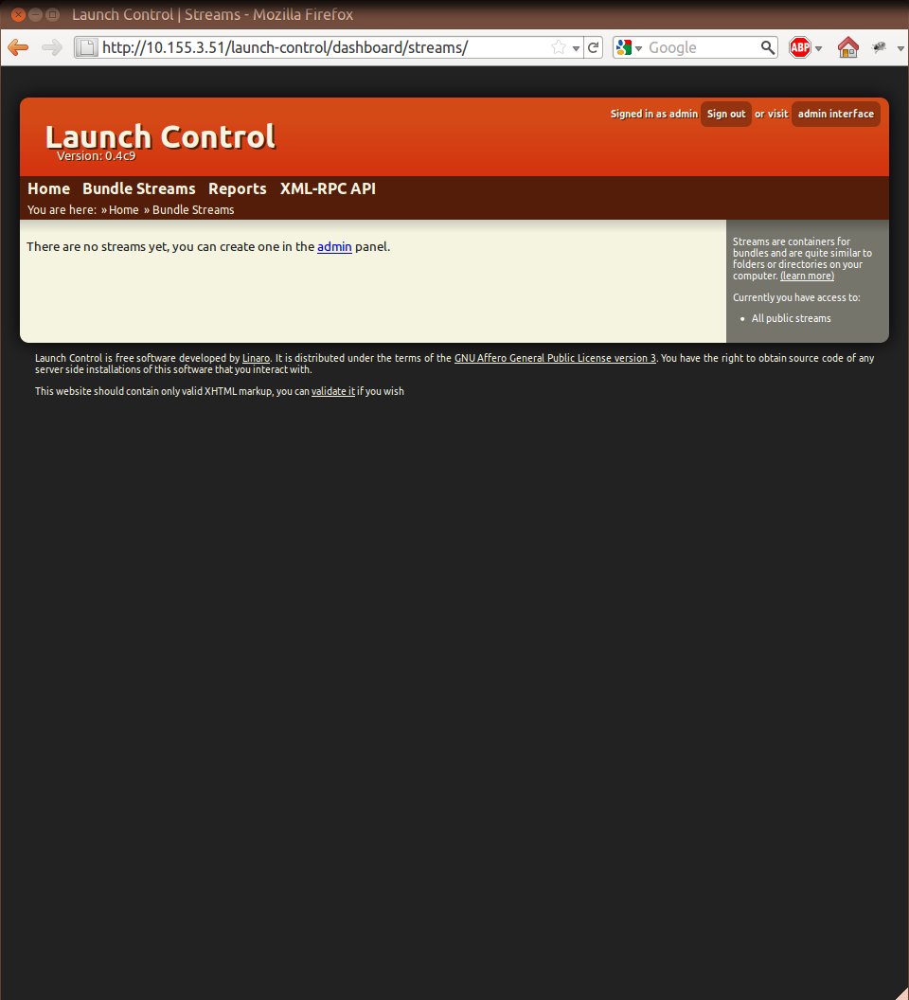

.. note::
    The dashboard uses the term ``stream`` but you can think of it as a
    directory. It's just a directory in the system that can be used to store
    test results in.

You will see a form like the one on the screen shot below, make sure to select
the ``admin`` from the ``Ownership`` section. This will make you the owner of
the data stored in that stream. Also make sure to select the ``is public`` and
``is anonymous`` check-boxes below in the ``Access Rights`` section. Finally
click save.

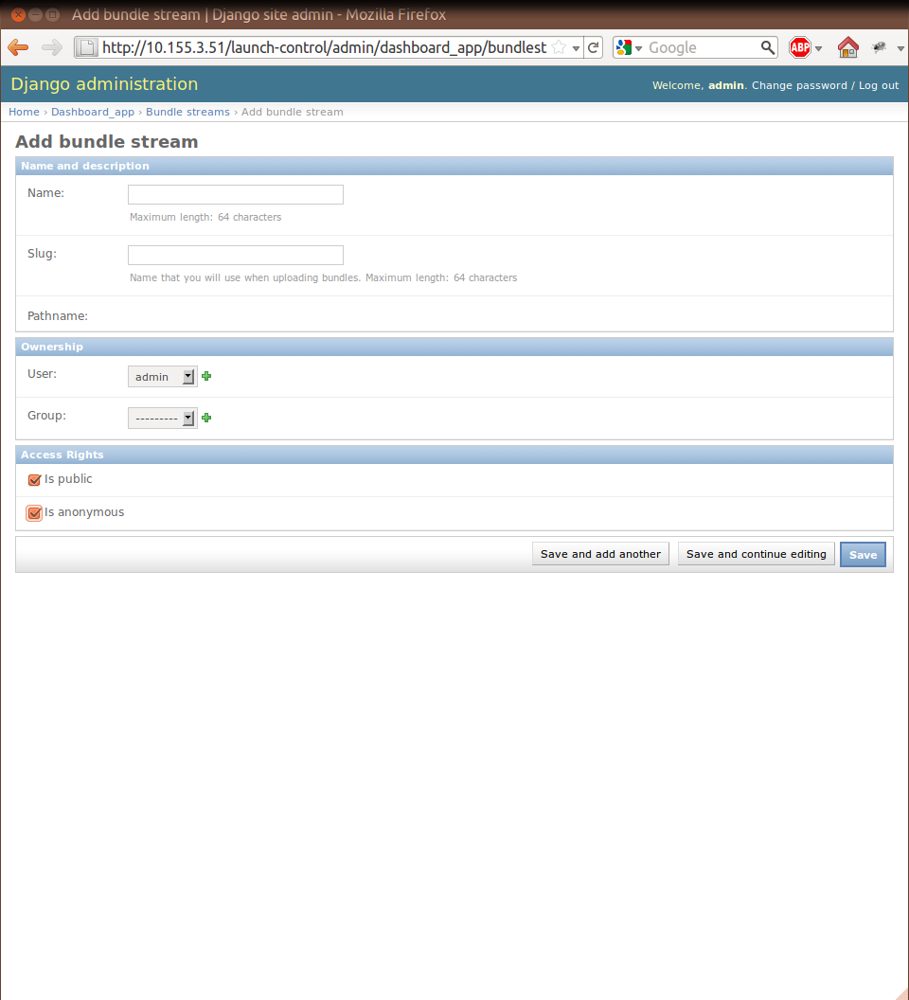

.. note::
    The dashboard has a simple ownership and access control system. It is not
    described here but the settings you selected a moment ago will allow anyone
    to upload and download test results to the bundle stream you just created.

Now click on the address bar of your browser and go to this URL::

    http://10.155.3.51/launch-control/dashboard/streams/

As before, please replace the IP address with the IP address of your server.
You should be able to see the ``/anonymous/`` bundle stream.

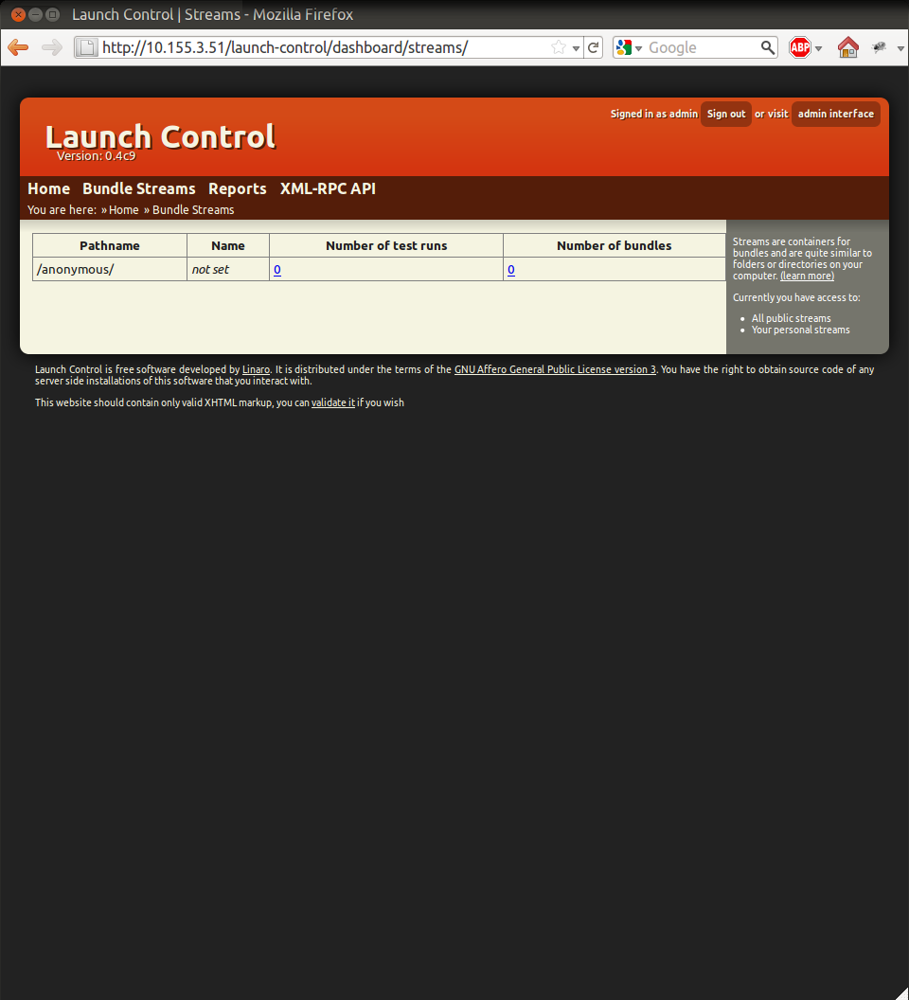

Congratulations, you have now correctly installed and configured the Lava
Dashboard. You can now use lava-test and lava-dashboard-tool to upload data to
your system.
