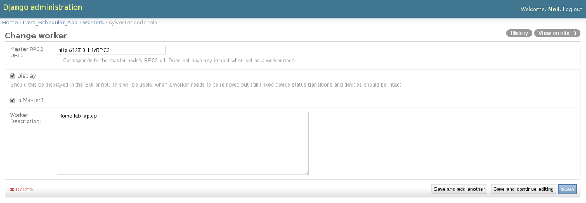

.. _installation:

LAVA Installation
*****************

The default install provides an Apache2 config suitable for
a LAVA server at ``http://localhost/`` once enabled.

See :ref:`packaging_distribution` for more information or for
debugging.

.. _debian_installation:

Debian-based distributions
##########################

LAVA is currently packaged for Debian unstable using Django1.6 and
Postgresql. Until LAVA packages are available from official repositories,
the packages can be installed from ``people.linaro.org``::

 $ sudo apt-get install emdebian-archive-keyring
 $ sudo apt-get update

Add the ``people.linaro.org`` LAVA source. Usually, you can just create
a file called ``lava.list`` in ``/etc/apt/sources.list.d/``
containing::

 deb http://people.linaro.org/~neil.williams/lava sid main

Update your apt sources to find the LAVA packages::

 $ sudo apt-get update

To install all of LAVA on a single machine, use::

 $ sudo apt-get install postgresql
 $ sudo apt-get install lava
 $ sudo a2dissite 000-default
 $ sudo a2ensite lava-server.conf
 $ sudo service apache2 restart

To install just the lava-server from the current packages, use::

 $ sudo apt-get install lava-server
 $ sudo a2dissite 000-default
 $ sudo a2ensite lava-server.conf
 $ sudo service apache2 restart

This will install lava-dispatcher and lava-server but not
linaro-media-create and other optional packages which come from
the Linaro PPA::

 deb http://ppa.launchpad.net/linaro-maintainers/tools/ubuntu precise main

The PPA uses this signing key::

 http://keyserver.ubuntu.com:11371/pks/lookup?search=0x1DD749B890A6F66D050D985CF1FCBACA7BE1F97B&op=index

.. _create_superuser:

Superuser
=========

A default lavaserver superuser is setup during package installation with
a random password. The default superuser is not the same as the lavaserver
system user nor the postgres user (despite the name)::

 $ sudo lava-server manage createsuperuser --username default --email=$EMAIL

This will prompt for name, email address and password.

You can always delete this user later, but at least it gets
you a default [sic] admin user with a password you know.

To change the password of the dummy superuser, login as this new superuser
at ``http://localhost/admin`` and select Users in the administrator interface.
Selecting lavaserver brings up the details of the installation superuser
and below the password field is a link to change the password without
needing to know the random password.

To delete the dummy superuser, login as this new superuser at
``http://localhost/admin`` and select Users in the administrator interface.
Select lavaserver and click the `Delete` link at the bottom of the page.

Software Requirements
=====================

We currently recommend using `Debian`_ unstable. Work is ongoing to support
Debian Jessie, Ubuntu Trusty, Ubuntu Unicorn and other distributions.

Support for Debian Jessie needs migrations affecting `uwsgi`_ to complete.

Dependencies of LAVA are migrating automatically into Ubuntu Unicorn
but these will need backports to be used with Trusty. Adapting LAVA to
Ubuntu builds is not currently working.

.. _Debian: http://www.debian.org/

.. _uwsgi: http://packages.qa.debian.org/u/uwsgi.html

If you'd like to help us with other distributions feel free to contact
us at linaro-validation (at) lists (dot) linaro (dot) org.

Hardware Requirements
=====================

A small LAVA instance can be deployed on any modest hardware. We
recommend at least one 1GB of RAM for runtime activity (this is
shared, on a single host, among the database server, the application
server and the web server). For storage please reserve about 20GB for
application data, especially if you wish to mirror current public LAVA
instance used by Linaro.  LAVA uses append-only models so the storage
requirements will grow at about several GB a year.

A small LAVA instance can be deployed on reasonably modest hardware. [#f2]_
We recommend:

 * At least 1GB of RAM for runtime activity (this is shared, on a single
   host, among the database server, the application server and the web server)
 * At least 20GB of storage for application data, job log files etc. in
   addition to the space taken up by the operating system.

.. rubric:: Footnotes

.. [#f1] See the section :ref:`serial_connections` for details of
         configuring serial connections to devices
.. [#f2] If you are deploying many devices and expect to be running large
         numbers of jobs, you will obviously need more RAM and disk space

Device requirements
-------------------

Devices you wish to deploy in LAVA need to be:
 * Physically connected to the server via usb, usb-serial,
   or serial [#f1]_ or
 * connected over the network via a serial console server [#f1]_ or
 * a fastboot capable device accessible from the server or
 * an emulated virtual machines and/or simulators that allow a
   serial connection

Multi-Node hardware requirements
--------------------------------

If the instance is going to be sent any job submissions from third
parties or if your own job submissions are going to use Multi-Node,
there are additional considerations for hardware requirements.

Multi-Node is explicitly about synchronising test operations across
multiple boards and running Multi-Node jobs on a particular instance
will have implications for the workload of that instance. This can
become a particular problem if the instance is running on virtualised
hardware with shared I/O, a limited amount of RAM or a limited number
of available cores.

.. note:: Downloading, preparing and deploying test images can result
 in a lot of synchronous I/O and if this instance is running the server
 and the dispatcher, running synchronised Multi-Node jobs can cause the
 load on that machine to rise significantly, possibly causing the
 server to become unresponsive.

It is strongly recommended that Multi-Node instances use a separate
dispatcher running on non-virtualised hardware so that the (possibly
virtualised) server can continue to operate.

Also, consider the number of boards connected to any one dispatcher.
MultiNode jobs will commonly compress and decompress several test image
files of several hundred megabytes at precisely the same time. Even
with a powerful multi-core machine, this has been shown to cause
appreciable load. It is worth considering matching the number of boards
to the number of cores for parallel decompression and matching the
amount of available RAM to the number and size of test images which
are likely to be in use.

A note on Heartbeat
===================
The heartbeat data of the dispatcher node is sent to the database via
xmlrpc. For this feature to work correctly the ``rpc2_url`` parameter
should be set properly. Login as an admin user and go to
``http://localhost/admin/lava_scheduler_app/worker/``. Click on the
machine which is your master (in case of distributed deployment), or
the machine that is listed in the page (in case of single LAVA instance).
In the page that opens, set the "Master RPC2 URL:" with the correct
value, if it is not set properly, already. Do not touch any other
values in this page except the description, since all the other fields
except description is populated automatically. The following figure
illustrates this:

A note on wsgi buffers
======================

When submitting a large amount of data to the django application,
it is possible to get an HTTP 500 internal server error. This problem
can be fixed by appending ``buffer-size = 65535`` to
``/etc/lava-server/uwsgi.ini``

Automated installation
======================

Using debconf pre-seeding
-------------------------

debconf can be easily automated with a text file which contains the
answers for debconf questions - just keep the file up to date if the
questions change. For example, to preseed a worker install::

 # cat preseed.txt
 lava-server   lava-worker/db-port string 5432
 lava-server   lava-worker/db-user string lava-server
 lava-server   lava-server/master boolean false
 lava-server   lava-worker/master-instance-name string default
 lava-server   lava-worker/db-server string snagglepuss.codehelp
 lava-server   lava-worker/db-pass string werewolves
 lava-server   lava-worker/db-name string lava-server

Insert the seeds into the debconf database::

 debconf-set-selections < preseed.txt

::

 # debconf-show lava-server
 * lava-worker/master-instance-name: default
 * lava-server/master: false
 * lava-worker/db-pass: werewolves
 * lava-worker/db-port: 5432
 * lava-worker/db-name: lava-server
 * lava-worker/db-server: snagglepuss.codehelp
 * lava-worker/db-user: lava-server

The strings available for seeding are in the Debian packaging for the
relevant package, in the ``debian/<PACKAGE>.templates`` file.

* http://www.debian-administration.org/articles/394
* http://www.fifi.org/doc/debconf-doc/tutorial.html

User authentication
===================

LAVA frontend is developed using Django_ web application framework
and user authentication and authorization is based on standard `Django
auth subsystems`_. This means that it is fairly easy to integrate authentication
against any source for which Django backend exists. Discussed below are
tested and supported authentication methods for LAVA.

.. _Django: https://www.djangoproject.com/
.. _`Django auth subsystems`: https://docs.djangoproject.com/en/dev/topics/auth/

Using OpenID (registration is free) allows for quick start with LAVA
bring-up and testing.

Local Django user accounts are also supported. When using local Django
user accounts, new user accounts need to be created by Django admin prior
to use.

Support for `OAuth2`_ is under investigation in LAVA.

.. _OAuth2: http://oauth.net/2/

Using Launchpad OpenID
----------------------

LAVA server by default is preconfigured to authenticate using
Launchpad OpenID service. (Launchpad has migrated from the problematic
CACert.)

Your chosen OpenID server is configured using the ``OPENID_SSO_SERVER_URL``
in ``/etc/lava-server/settings.conf`` (JSON syntax).

To use Launchpad even if the LAVA default changes, use::

 "OPENID_SSO_SERVER_URL": "https://login.ubuntu.com/",

Restart ``lava-server`` and ``apache2`` services if this is changed.

Using Google+ OpenID
--------------------

To switch from Launchpad to Google+ OpenID, change the setting for the
``OPENID_SSO_SERVER_URL`` in ``/etc/lava-server/settings.conf``
(JSON syntax)::

 "OPENID_SSO_SERVER_URL": "https://www.google.com/accounts/o8/id",

The Google+ service is already deprecated and is due to be deactivated
in September 2014 in preference for OAuth2.

Restart ``lava-server`` and ``apache2`` services for the change to
take effect.

LAVA Dispatcher network configuration
=====================================

``/etc/lava-dispatcher/lava-dispatcher.conf`` supports overriding the
``LAVA_SERVER_IP`` with the currently active IP address using a list of
network interfaces specified in the ``LAVA_NETWORK_IFACE`` instead of a
fixed IP address, e.g. for LAVA installations on laptops and other devices
which change network configuration between jobs. The interfaces in the
list should include the interface which a remote worker can use to
serve files to all devices connected to this worker.

.. _serial_connections:

Setting Up Serial Connections to LAVA Devices
=============================================

.. _ser2net:

Ser2net daemon
--------------

ser2net provides a way for a user to connect from a network connection to a serial port, usually over telnet.

http://ser2net.sourceforge.net/

Example config (in /etc/ser2net.conf)::

 #port:connectiontype:idle_timeout:serial_device:baudrate databit parity stopbit
 7001:telnet:36000:/dev/serial_port1:115200 8DATABITS NONE 1STOPBIT

StarTech rackmount usb
----------------------

W.I.P

* udev rules::

   SUBSYSTEM=="tty", ATTRS{idVendor}=="0403", ATTRS{idProduct}=="6001", ATTRS{serial}=="ST167570", SYMLINK+="rack-usb02"
   SUBSYSTEM=="tty", ATTRS{idVendor}=="0403", ATTRS{idProduct}=="6001", ATTRS{serial}=="ST167569", SYMLINK+="rack-usb01"
   SUBSYSTEM=="tty", ATTRS{idVendor}=="0403", ATTRS{idProduct}=="6001", ATTRS{serial}=="ST167572", SYMLINK+="rack-usb04"
   SUBSYSTEM=="tty", ATTRS{idVendor}=="0403", ATTRS{idProduct}=="6001", ATTRS{serial}=="ST167571", SYMLINK+="rack-usb03"

This will create a symlink in /dev called rack-usb01 etc. which can then be addressed in the :ref:`ser2net` config file.

Contact and bug reports
========================

Please report bugs using
https://bugs.launchpad.net/lava-server/+filebug

Feel free to contact us at validation (at) linaro (dot) org.

Distributed deployment
######################

.. toctree::
   :maxdepth: 2

   distributed-deployment.rst

Migrating existing LAVA instances
#################################

.. toctree::
   :maxdepth: 2

   migration.rst
