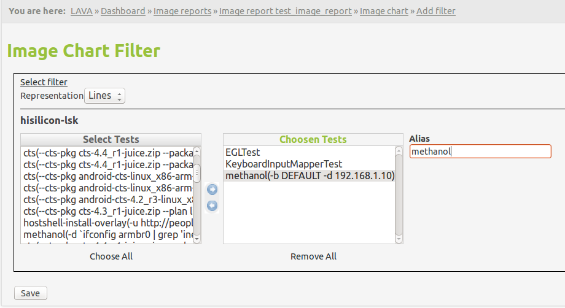

.. _image_reports2.0:

Image Reports 2.0
=================

Image reports 2.0 allow you to view test run pass/fail results or test result
measurements over time combined from multiple filters per chart with the
possibility of adding multiple charts per report.

Each LAVA user can create his own image reports and update/remove those reports
he(and only he) owns. Image reports can be published/unpublished, making them
visible/non-visible to all the users accross the system.

Image report list page will show table with reports user owns and one
additional with published reports.

Example:

.. image:: ./images/image-reports-list.png
    :width: 800
    :height: 344

Each report can contain multiple charts and each of those chart can combine
results from multiple filters whether they be pass/fail results or measurement
results gathered from test results.

How to create a Image Report?
-----------------------------

After clicking on Add new report link and entering the name and the description
for the Image report, you will be presented with the following page:

.. image:: ./images/image-report-detail.png
    :width: 600
    :height: 320

From there you can edit, preview or publish the image report. Furthermore, you
can add charts from this page.

Once image report is published, you can assign it to a image report group:

Image Report grouping
---------------------

Once Image Report is published, you can see the "Image report group" field on
the image report detail page.
Clicking the field allows you to edit the group for that report.
If you like to assign the existing group to this report, just start typing the
group name and the autocomplete field will display all the existing group
starting with that term. If you enter an unexisting group name into the field,
the group will be automatically created and assigned to this report.

Removing the group name from the image report group field will unassign this
report from any group. At that point, if the group you just unassigned does not
have any more reports assigned to it, it will be deleted.

Adding Image Report charts
--------------------------

.. image:: ./images/image-report-chart.png
    :width: 600
    :height: 320

Chart type represents the type of information chart will be collecting from the
filters and currently options 'Pass/fail' and 'Measurement' are supported.
Pass/fail charts will collect number of passed test results from each test run
you selected while creating chart(see :ref:`adding-filter`) compared to total
number of test results from each test run. Each plot line in chart will
represent one test.
Measurement charts will let you select which of the test cases he would like
to monitor and collect the measurement value from each of the corresponding
test results. Each plot line in chart will represent one test case.

Target goal is a fixed number and it will be diplayed in the chart as the
straight dotted line. All the users subscribed to the target goal will
receive an email notification any time any of the plot lines in chart go below
the target goal.

.. _adding-filter:

Adding filters to Image report charts
-------------------------------------

.. image:: ./images/image-report-filter-select.png
    :width: 800
    :height: 480

Selecting filter from the filter list will result in having two select boxes,
one with available and one with chosen tests (or test cases when chart type is
measurement). User creating the report should keep in mind at this stage that
users with no access to the specific chosen filters will not be able to see the
report which includes those filters at all.

You can also select the representation for this filter in the chart
with the options being either 'lines' or 'bars'.

.. image:: ./images/image-report-filter.png
    :width: 600
    :height: 320

Once user has chosen the tests(test cases) he would like to have on this chart,
he can also set the aliases for each of those tests(test cases). This alias
will be displayed in the legend of the chart for each plot line, default
value being filter_name:test_name in case of Pass/fail chart type and
filter_name:test_name:test_case_name in case of measurement chart.

Image Reports 2.0 display page
------------------------------

See below for description of each specific feature of the display page.

.. image:: ./images/image-report-display.png
    :width: 800
    :height: 480

Interactive charts
^^^^^^^^^^^^^^^^^^

You can click on each of the indices on the chart and a new tab will open with
that particular test run/test result.

If mouse is hovered over the any of the indices on the chart, a tooltip will
appear with either pass/fail number of tests or measurement value depending on
the chart type.

Filters List
^^^^^^^^^^^^

Filters used for every particular chart are displayed just above the chart with
links to each of the filters so you can easily change the filters if there is
something off in the report data.

Build number limits
^^^^^^^^^^^^^^^^^^^

You can limit the build numbers in the dropdowns. Start build nuber setting
will be saved and automatically loaded once you visit this page next time.

Print menu
^^^^^^^^^^

There are two options in the print menu:
 * Download as csv - downloads CSV file with all the test data from this chart
 * View as image - displays only chart as an image in a new tab

Target goal subscriptions
^^^^^^^^^^^^^^^^^^^^^^^^^

You can subscribe to the target goal set by the report owner. If you are
subscribe, you will get an email any time the report value drops below the
target goal (value can be either number of passed tests, in case of pass/fail
charts, or measurement value in case of measurement charts).

Legend
^^^^^^

Legend displays the colors of the trends on chart and the aliases set up
during image report creating (default is "filtername: testname: testcasename").

Legend is also interactive. You can shuffle the items in the legend with drag
and drop. The advantage to this is that the indices in the chart can overlap so
in order to use the interactivity you might need to change the order of the
legend items.
