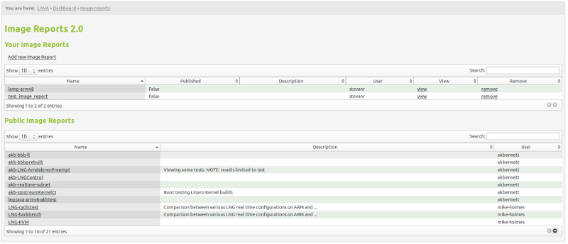
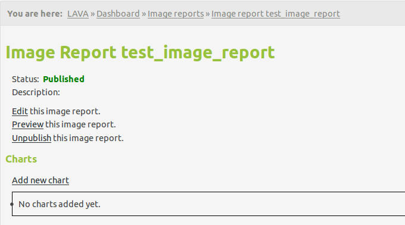
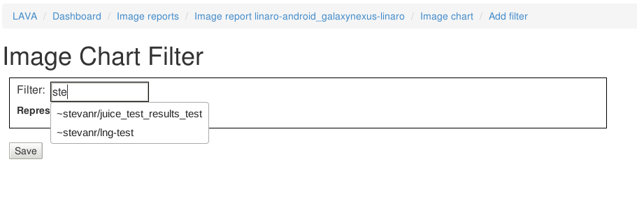
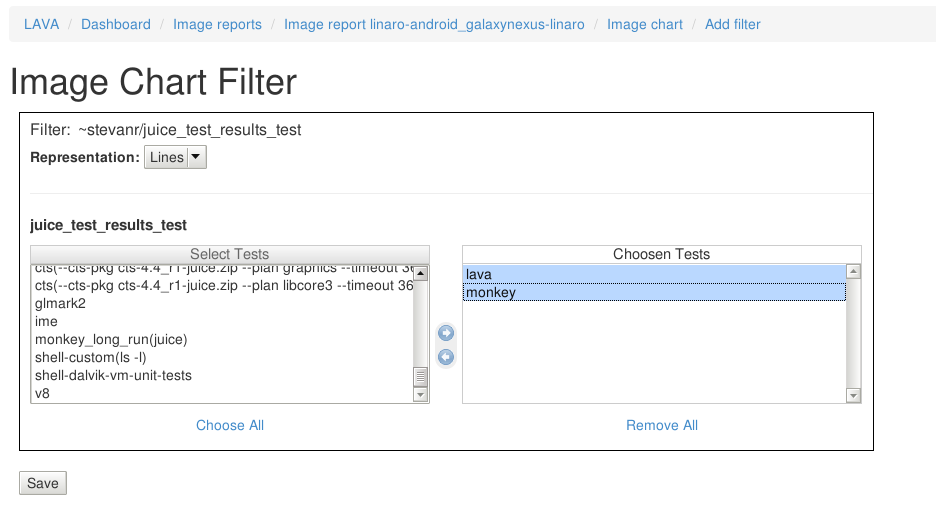
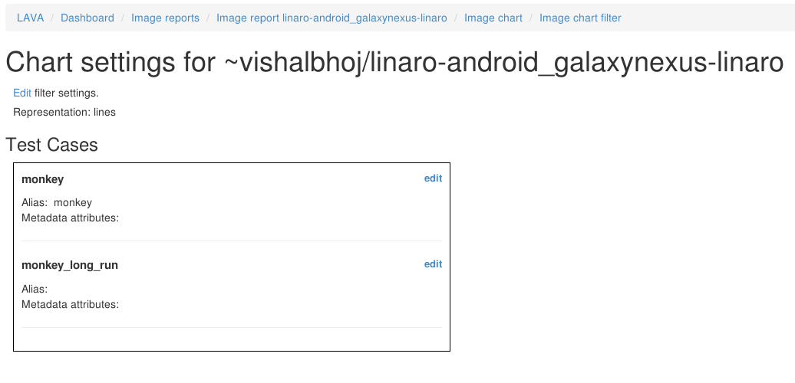
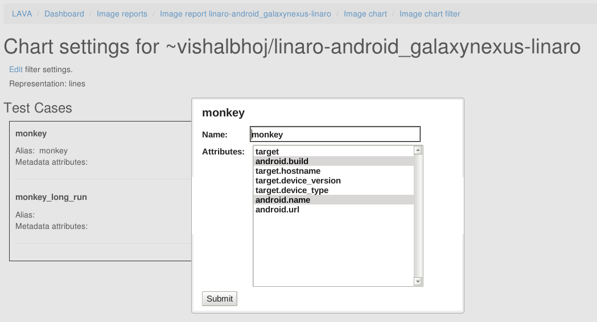
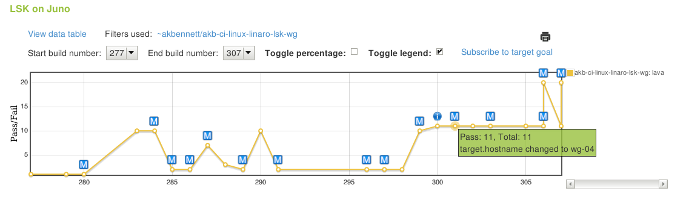

.. _image_reports2.0:

Image Reports 2.0
=================

Image reports 2.0 allow you to view test run pass/fail results or test result
measurements over time combined from multiple filters per chart with the
possibility of adding multiple charts per report.

Each LAVA user can create his own image reports and update/remove those reports
he(and only he) owns. Image reports can be published/unpublished, making them
visible/non-visible to all the users accross the system. Image reports can be
assigned to image report groups which will be clearly distinguished on the
image report list page.

Image report list page will show table with reports user owns, table for each
image report group and one additional non-grouped published image reports.

Example:

Each report can contain multiple charts and each of those chart can combine
results from multiple filters whether they be pass/fail results or measurement
results gathered from test results.

How to create a Image Report?
-----------------------------

After clicking on Add new report link and entering the name and the description
for the Image report, you will be presented with the following page:

From there you can edit, preview or publish the image report. Furthermore, you
can review, add and remove charts for this image report from this page.

Once image report is published, you can assign it to a image report group:

Image Report grouping
---------------------

Once Image Report is published, you can see the "Image report group" field on
the image report detail page.
Clicking the field allows you to edit the group for that report.
If you like to assign the existing group to this report, just start typing the
group name and the autocomplete field will display all the existing group
starting with that term. If you enter an unexisting group name into the field,
the group will be automatically created and assigned to this report.

Removing the group name from the image report group field will unassign this
report from any group. At that point, if the group you just unassigned does not
have any more reports assigned to it, it will be deleted.

Adding Image Report charts
--------------------------

.. image:: ./images/image-report-chart.png
    :width: 600
    :height: 320

Chart type represents the type of information chart will be collecting from the
filters and currently options 'Pass/fail', 'Measurement' and 'Attributes' are
supported.

**Pass/fail** charts will collect number of passed test results from each test
run you selected while creating chart(see :ref:`adding-filter`) compared to
total number of test results from each test run. Each plot line in chart will
represent one test.

**Measurement** charts will let you select which of the test cases he would
like to monitor and collect the measurement value from each of the
corresponding test results. Each plot line in chart will represent one test
case.

**Attributes** chart will let you select one or more of the custom attributes
for each selected test and the chart will display that particular custom
attribute value for each test run/build. Each plot line in chart will represent
one attribute value over time. Attributes are added to the chart in the same
way metadata is(see :ref:`image-reports-metadata`).

Target goal is a fixed number and it will be diplayed in the chart as the
straight dotted line. All the users subscribed to the target goal will
receive an email notification any time any of the plot lines in chart go below
the target goal.

Note that order of the image charts in the report can be changed in the image
report review page. Simple drag and drop of the charts in the list can be used
for re-ordering.

.. _adding-filter:

Adding filters to Image report charts
-------------------------------------

Selecting filter includes autocomplete input field with search by either
username or filter name.
Once specific filter is selected user will have two select boxes, one with
available and one with chosen tests (in case of measurement chart, user will
first be able to select from which test you wish to select test cases from and
then chose specific test cases for your chart).
User creating the report should keep in mind at this stage that users with no
access to the specific chosen filters will not be able to see the report
which includes those filters at all.

User can also select the representation for this filter in the chart
with the options being either 'lines' or 'bars'.

Once user has chosen the tests(test cases) he would like to have on this chart
and saved the changes to the filter, he will see the list of those tests and
will be able to change alias and metadata(see :ref:`image-reports-metadata`)
for each of those tests by clicking the edit button next to that specific test.
This alias will be displayed in the legend of the chart for each plot line,
default value being filter_name:test_name in case of Pass/fail chart type and
filter_name:test_name:test_case_name in case of measurement chart.

Filter list in charts:

Editing filter alias and metadata(see :ref:`image-reports-metadata`):

Image Reports 2.0 display page
------------------------------

See below for description of each specific feature of the display page.

.. image:: ./images/image-report-display.png
    :width: 800
    :height: 380

Interactive charts
^^^^^^^^^^^^^^^^^^

You can click on each of the indices on the chart and a new tab will open with
that particular test run/test result.

If mouse is hovered over the any of the indices on the chart, a tooltip will
appear with either pass/fail number of tests or measurement value depending on
the chart type. This tooltip will also contain information if there are any
comments added to the test results and also metadata changes as well, where
applicable(see :ref:`image-reports-metadata`).

Image reports also have the ability of zooming in/out and panning. You can
zoom in the report by double-clicking anywhere on the report and panning is
available with mouse dragging. In the top right corner there is a small button
for zooming out to previous setting. By doing any of the operation like test
selection through legend(see :ref:`legend`) or date selection or percentage
toggle, the report zooming/panning will be reset.

Filters List
^^^^^^^^^^^^

Filters used for every particular chart are displayed just above the chart with
links to each of the filters so you can easily change the filters if there is
something off in the report data.

Build number limits
^^^^^^^^^^^^^^^^^^^

You can limit the build numbers in the dropdowns. Start build nuber setting
will be saved and automatically loaded once you visit this page next time.

Print menu
^^^^^^^^^^

There are two options in the print menu:
 * Download as csv - downloads CSV file with all the test data from this chart
 * View as image - displays only chart as an image in a new tab

Target goal subscriptions
^^^^^^^^^^^^^^^^^^^^^^^^^

You can subscribe to the target goal set by the report owner. If you are
subscribe, you will get an email any time the report value drops below the
target goal (value can be either number of passed tests, in case of pass/fail
charts, or measurement value in case of measurement charts).

.. _image-reports-metadata:

Metadata for Image reports 2.0
^^^^^^^^^^^^^^^^^^^^^^^^^^^^^^

Metadata is a feature in image reports 2.0 that tracks changes in the custom
attributes of the test runs/results.

Whenever user adds custom attributes field in the metadata as described in
creating image chart filter section(see :ref:`adding-filter`), for each plot
point in the chart a small letter 'M' will appear if there were any changes
in the custom attributes since the previous test run. Also, in the mouse hover
tooltip, a new value for all custom attributes which changed will appear.

In the example picture below, custom attributes which is tracked is
target.hostname.

.. _legend:

Legend
^^^^^^

Legend displays the colors of the trends on chart and the aliases set up
during image report creating (default is "filtername: testname: testcasename").

Legend is also interactive. You can shuffle the items in the legend with drag
and drop. The advantage to this is that the indices in the chart can overlap so
in order to use the interactivity you might need to change the order of the
legend items.
