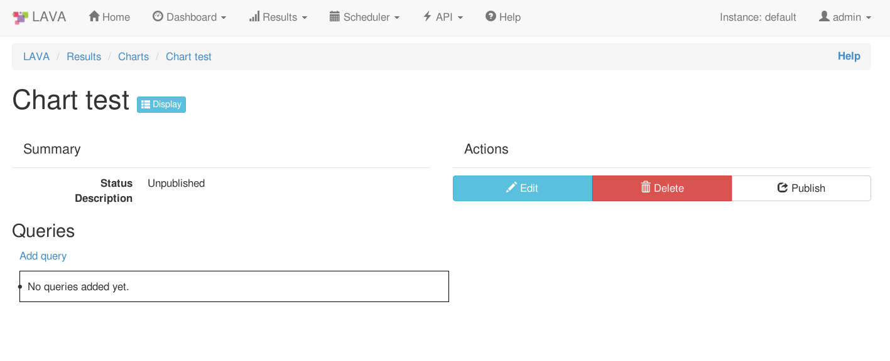
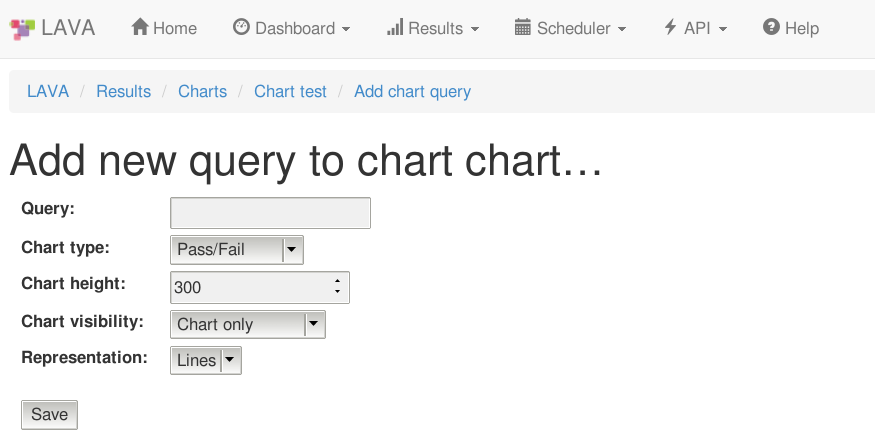

.. _result_queries:

LAVA result visualization
#########################

LAVA Queries
************

This is documentation for the new queries app, still in **development** stage.

It is part of the new :ref:`dispatcher_design`.

Current features include querying following object sets:

* Test jobs

* Test cases

* Test suites

Conditions
==========

You can add multiple conditions to each query where the query results must
satisfy **all** conditions in order to be displayed.
Conditions can span through multiple object sets so for example user can query
the Jobs that have test cases in which particular field satisfies a condition.
List of supported fields which can be used as condition field is available
as autocomplete list in the condition 'Field name' field.
You can also add conditions with fields in the object set which is queried
(i.e. if test jobs are query object set user can add conditions such as
submitter, device, priority, status...).

It is also possible to add conditions using custom metadata. Since metadata can
contain custom field names, keep in mind that the query might not return
desired results since those field names are not validated when adding
conditions.
This also means you can add the condition even if the field in the metadata is
is not yet present in the system.

Caching queries
===============

Queries can be live or cached. Cached queries data can be refreshed either
through UI or via the XMLRPC API call by creator or someone in group assigned
to the query.
Please keep in mind, live queries are executed whenever someone visits the
query page or refreshes it. Viewing a live query will usually take longer than
a cached query, sometimes markedly longer. Live queries can stress the LAVA
server which can cause the query to timeout.

When adding/updating and removing conditions, query is **not** automatically
updated. This needs to be done either through UI after updating the conditions
or via XMLRPC.

Authorization and admin
=======================

Queries which are not published are visible exclusively to the query owner.
When query is published, it's results are generally visible to all users,
permitting the user has access to the jobs which provide the results.
All the authorization is managed through test jobs visibility rules,  meaning
that individual results will be omitted in the query display list depending on
user authorization to see the specific jobs.

Besides owner of the specific query, administration of the query can be allowed
to a group in the system as well, through the 'Group edit permission' option.
Note that this can be done only after the query is published.

Queries can be organized in 'query groups' which is visible only in the query
listing page, via 'query group label' option.

.. _query_by_url:

Query by URL
============

The ability to add conditions through URL is also available. User can add as
many conditions as possible through URL but must also specify the object set
which is to be queried.

The query string format looks like this::

  entity=$(object_name)&conditions=$(object_name)__$(field_name)__$(operator)__$value,$(object_name)__$(field_name)__$(operator)__$value,...

.. note:: object_name can be omitted if it's the same as the query object set.
	  Operator is one of the following - exact, iexact, contains, gt, lt.

`Example Query by URL <https://playground.validation.linaro.org/results/query/+custom?entity=testjob&conditions=testjob__priority__exact__Medium,testjob__submitter__contains__code>`_

Once the query by URL results are displayed, user can create new query from
these conditions, which will be automatically added to the query.

User should keep in mind that querying by URL is considered to be a live query
so if the query is used often it should be created in the system so that the
caching is enabled.

Export Query
============

Currently, the only supported format for exporting is CSV.

User can download the query CSV export file from the query display page.

LAVA Charts
***********

This is documentation for the new charts app, still in **development** stage.

It is part of the new :ref:`dispatcher_design`.

LAVA charts represent the visual representation for the Queries app.

How to create a Chart?
======================

On the Charts main page, after clicking on Create link and entering the name
and the description for the Chart, you will be presented with the following
page:

From there you can edit, remove or publish the chart. Furthermore, you
can review, add and remove queries associated with this chart from this page.

User can also create new charts from queries. On the query display page, a
simple click on the button will create the chart with this particular query
already added to the chart (with default settings).
There's also a posibility of only viewing the chart for particular query
without making it permanent in the system (also from query display).

Once chart is published, you can assign it to a chart group:

Chart grouping
==============

Once Chart is published, you can see the "Chart group label"
field on the chart detail page.
Clicking the field allows you to edit the grouping for that chart.
If you want to assign the existing chart groups to this chart, just
start typing the group name and the autocomplete field will display all the
existing chart group starting with that term.
If the chart group you enter does not exist, it will be
automatically created and assigned to this chart.

Removing the chart group label from the chart group field will unassign this
chart from any chart group. At that point, if the chart group you just
unassigned does not have any more charts assigned to it, the chart group will
be deleted.

.. _chart-permissions:

Chart permissions
=================

Once Chart is published, you can see the ownership options on the chart detail
page.
First field displays the "maintainer" username of the user who created this
chart (this field cannot be changed).
The second field is where the system group editing rights can be added.
All users belonging to this system group (you can check your group membership
on the Profile page) will be able to edit/update this particular chart as if
they were maintainers.
This field cannot be used to enable users to see the data in the chart if they
are not able to for other authorization reasons (no device permissions or test
job visibility permissions).

Adding Queries
==============

In the Query field user can select the query they would like to chart with the
help of the autocomplete feature.

Chart display depends mostly on the object set selected in the query so for
example if the query object set is test job, charts will display results per
test job, etc.

Chart type represents the type of information chart will be collecting from the
query and currently options 'Pass/fail', 'Measurement' and 'Attributes' are
supported.

**Pass/fail** charts will collect number of passed test results compared to
total number of test results from each query object set. Each plot line in
chart will represent query object set (test job or test suite). Keep in mind
that pass/fail charts are unavailable for test case based queries.

**Measurement** charts will collect the measurement value from each of the
corresponding test results. Unless the query object set is test job, each plot
line in chart will represent one test case. Otherwise, the chart will calculate
average value of each test case accross related test suites and diplay that
value.

**Attributes** chart will let you enter one or more of the custom attributes
(separated by coma) and the chart will display that particular custom attribute
value for each query object set. Each plot line in chart will represent
one attribute value over object set. Keep in mind that there is no validation
for this field.

Note that order of the query in the chart can be changed in the chart review
page. Simple drag and drop of the queries in the list can be used for
re-ordering.

Charts display page
===================

See below for description of each specific feature of the display page.

Interactive charts
^^^^^^^^^^^^^^^^^^

You can click on each of the indices on the chart and a new tab will open with
that particular test job/suite/case.

If mouse is hovered over the any of the indices on the chart, a tooltip will
appear with either pass/fail number of tests or measurement value depending on
the chart type. This tooltip will also contain information if there are any
comments added to the test results and also metadata changes as well, where
applicable.

Charts also have the ability of zooming in/out and panning. You can
zoom in the chart by double-clicking anywhere on the chart and panning is
available with mouse dragging. In the top right corner there is a small button
for zooming out to previous setting. By doing any of the operation like test
selection through legend(see :ref:`legend`) or date selection or percentage
toggle, the chart zooming/panning will be reset.

Date limits
^^^^^^^^^^^

You can limit the dates in the dropdowns. Start date setting
will be saved and automatically loaded once you visit this page next time.

Print menu
^^^^^^^^^^

There are three options in the print menu:
 * Download as csv - downloads CSV file with all the test data from this chart
 * View as image - displays only chart as an image in a new tab
 * This chart by URL - opens a new tab with manually set conditions and object set

.. _legend:

Legend
^^^^^^

Legend displays the colors of the trends on chart depending on the object set
which is active.

Legend is also interactive. You can shuffle the items in the legend with drag
and drop and also turn on/off particular legend items.
The advantage to this is that the indices in the chart can overlap so in order
to use the interactivity you might need to change the order of the legend
items.

Chart using metadata
^^^^^^^^^^^^^^^^^^^^

By default, charts will use date and time to diplay results.
User can change this behavior and use a custom attribute (i.e. build number)
to plot the result data. This setting can be changed in the chart settings -
'xaxis attribute' field.

If the field is empty, the date/time will be used to plot the data. Users
should keep in mind that this setting is a free text field so if the custom
attribute set is not found in the system, no results will be shown.
Similarly, if particular test result does not contain the custom attribute that
is set, that result will be omitted from chart.

Chart by URL
============

Similar as for queries (see :ref:`query_by_url`), user can view charts by
typing in the entity and conditions in URL. There is one aditional option
compared to queries, the chart type. New URL paramater is named "type" and can
take values of pass/fail, measurement and attributes.

`Example Chart by URL <https://playground.validation.linaro.org/results/chart/+custom?type=pass/fail&entity=testjob&conditions=testjob__priority__exact__Medium,testjob__submitter__contains__code>`_
