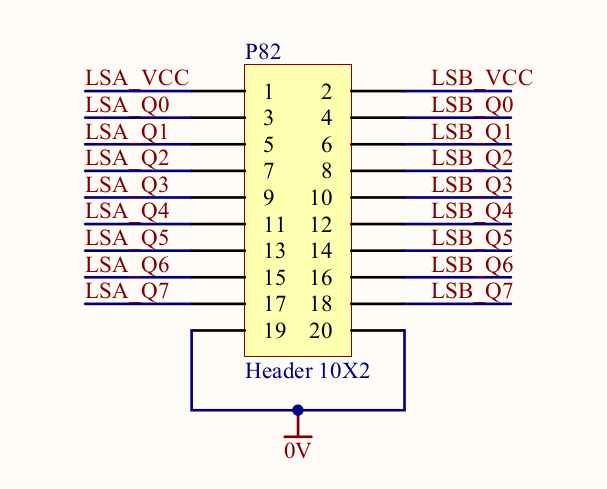
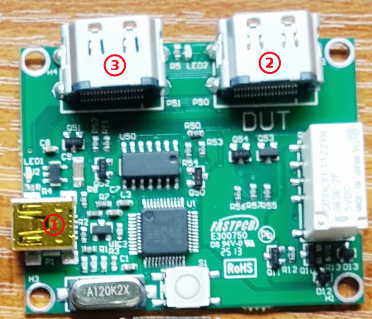

.. _lava_lmp_test_guide:

LAVA-LMP Test Guide
*******************

LAVA-LMP is a set of small (40mm x 50mm) cheap USB Cortex-M0 based hardware
boards which enable many automated tests in LAVA which would otherwise be manual.

Overview
========
Four kinds of LMP are supported:

:term:`LAVA-LMP USB`

:term:`LAVA-LMP LSGPIO`

:term:`LAVA-LMP ETH+SATA`

:term:`LAVA-LMP HDMI`

Every LMP set has its own unique USB serial number which can be set after flashing
the firmware, so multiple LMP sets can be controlled by a single LAVA server or dispatcher.

.. image:: lmp_set_1.png

.. note:: For more info, Please read: `LMP Wiki page`_.

.. _`LMP Wiki page`: https://wiki.linaro.org/Platform/LAVA/LMP_in_practice

The device config file changes
------------------------------
For controlling the different set of LMP modules,
we need to add LMP serial number into the config file of the connected device.

If you only have one set of LMP modules connected to a device, you can
add the line below::

  lmp_default_id = 13060020

And when you use the LMP API shell scrips, you can just omit the [module_name]
parameter, eg::

  lava-lmp-usb disconnect

If you have more than one LMP set, or more than one same LMP modules (for
example, two USB modules) connected to one test board, you need to add the info below to
distinguish one module from others by ``name``::

  lmp_<module_name>_id = {"<name_1>":"<serial_number_1>", "<name_2>":"<serial_number_2>"}

For example::

  lmp_sata_id = {"sata1":"13060020", "sata2":"13060021"}

JSON Control interface
----------------------
In most cases, before starting the test, you need to initialize all
the LMP modules to a specified status. This initial status can be added in
the JSON file using the ``lmp_module`` section.

.. note:: If you want to run a test that works with LMP modules,
 You **MUST** add ``lmp_module`` in the json file.

The type of ``lmp_module`` is array, so the format should be like this::

  "lmp_module": [
      {
          "lmp module name": "init value",
          "parameters": {
              "role": "for Multi Node test",
              "name": "LMP module name, in case you have more than one same LMP module"
          }
      }
  ]

For example::

    "lmp_module": [
        {
            "hdmi": "passthru",
            "usb": "host",
            "parameters": {
            "role": "client",
            "name": "default"
            }
        },
        {
            "eth": "passthru",
            "parameters": {
            "name": "eth1"
            }
        }
    ],

LAVA-LMP USB
============

Description
-----------
The USB module is workable with 12Mbps and 480Mbps USB2, including OTG.
It can switch a mini USB B socket (1) between:

* A USB device type A socket (2), populated with, eg, a USB memory stick.
* A USB port (3) connected to the test host, for testing the dev board in device mode.

The mini USB B socket (4) is connected to LAVA server for switching control.

.. image:: lmp_usb.png

The device config file changes
------------------------------

For multiple USB modules test, you need to use ``lmp_usb_id`` to
distinguish one module from others . For example::

  lmp_usb_id = {"otg_port":"13060020", "usb3":"13060021"}

JSON Control interface
----------------------

The all possible pairs for USB module are below::

  "usb": "host"
  "usb": "device"
  "usb": "disconnect"

For example::

    "lmp_module": [
        {
            "usb": "disconnect",
            "parameters": {
            "role": "client",
            "name": "usb3"
            }
        },
        {
            "usb": "host",
            "parameters": {
            "role": "server",
            "name": "otg"
            }
        }
    ],

Test interface in lava-test-shell
---------------------------------

You can use the LMP API (shell scripts) below in the :ref:`lava_test_shell`,
they can help you to control the USB modules::

  lava-lmp-usb  <host/device/disconnect/id_on/id_off> [module_name]

For example::

  metadata:
      name: lmp_test_usb
      version: 1.1
      format: "Lava-Test-Shell Test Definition 1.0"
      description: "LMP USB module tests in LAVA."

  run:
      steps:
          - lava-test-case set_usb_default_to_disconnect --shell lava-lmp-usb disconnect
          - lava-test-case set_usb3_to_device_port --shell lava-lmp-usb device usb3
          - lava-test-case otg_LED1_on --shell lava-lmp-usb id_on otg
          - lava-test-case set_otg_to_host_port --shell lava-lmp-usb host otg
          - lava-test-case otg_LED1_off --shell lava-lmp-usb id_off otg

LAVA-LMP LSGPIO
===============

Description
-----------
The LSGPIO module allows setting or monitoring up to 16 GPIO (4) with controllable
voltage threshold, it can also be used to switch 4-pin 3.5” jack (1) (2) connectivity.

The mini USB B socket (3) is connected to LAVA server for switching control

.. image:: lmp_lsgpio.png

.. note:: The current working `firmware commit`_.

.. _`firmware commit`: https://linaro-private.git.linaro.org/gitweb?p=lava-lmp-firmware.git;a=commit;h=7aa05266c9670ba37141a671d46019c6bac54a26

The device config file changes
------------------------------

For multiple LSGPIO modules test, you need to use ``lmp_lsgpio_id`` to
distinguish one module from others. For example::

  lmp_lsgpio_id = {"gpio_v3":"13060020", "gpio_v5":"13060021", "audio_jack":"13060020"}

JSON Control interface
----------------------

The all possible pairs for LSGPIO module are below::

  "audio": "passthru"
  "audio": "disconnect"
  "lsgpio": "a_in"
  "lsgpio": "a_out_xx"
  "lsgpio": "b_in"
  "lsgpio": "b_out_xx"

For example::

    "lmp_module": [
        {
            "lsgpio": "a_out_5f",
            "lsgpio": "b_in",
            "parameters": {
            "role": "client",
            "name": "gpio_v3"
            }
        },
        {
            "audio": "disconnect",
            "parameters": {
            "role": "server",
            "name": "audio_jack"
            }
        }
    ],

Test interface in lava-test-shell
---------------------------------

You can use the LMP API (shell scripts) below in the :ref:`lava_test_shell`,
they can help you to control the LSGPIO modules::

  lava-lmp-audio-jack  <passthru/disconnect/id_on/id_off>  [module_name]
  lava-lmp-lsgpio  <a_get/a_set_xx/b_get/b_set_xx/id_on/id_off> [module_name]

Once you get a gpio value by ``a_get`` or ``b_get``, the value will be stored in
``$LMP_CACHE`` temporarily, and the format is::

  port_a=xx

or::

  port_b=xx

For example::

  metadata:
      name: lmp_test_lsgpio
      version: 1.0
      format: "Lava-Test-Shell Test Definition 1.0"
      description: "LMP LSGPIO module tests in LAVA."

  params:
      LMP_CACHE: /tmp/lava_lmp_cache.txt

  run:
      steps:
          - lava-test-case set_audio_LED1_on --shell lava-lmp-audio-jack  id_on audio_jack
          - lava-test-case set_audio_to_passthru --shell lava-lmp-audio-jack passthru audio_jack
          - lava-test-case set_audio_LED1_off --shell lava-lmp-audio-jack  id_off audio_jack
          - lava-test-case set_audio_to_disconnect --shell lava-lmp-audio-jack disconnect audio_jack
          - lava-test-case set_gpio_a_value_00 --shell lava-lmp-lsgpio  a_set_00 gpio_v3
          - lava-test-case get_gpio_b_value --shell lava-lmp-lsgpio  b_get gpio_v3
          - lava-test-case check_b_value --shell cat $LMP_CACHE

.. note:: The SPI Bus function of LSGPIO module is under development.

LAVA-LMP ETH+SATA
=================

Description
-----------
The ETH+SATA module is for 10/100 Ethernet or SATA hot-plug test.

.. note:: When you get the ETH+SATA module, there are both RJ-45 and SATA ports on it.
 But it is SATA module by default. If you want to use it as ETH module,
 you need to remove the R60, and re-flash the serial number.

.. note:: 1GBps Ethernet is **NOT** supported.

* The ETH module can connect/disconnect 10/100 Ethernet (2) (3) connectivity without caring about the details of the signalling.

* The SATA module can connect/disconnect SATA (4) (5) connectivity without caring about the details of the signalling.

The mini USB B socket (1) is connected to LAVA server for switching control

.. image:: lmp_eth_sata.png

The device config file changes
------------------------------

For multiple ETH modules test, you need to use ``lmp_eth_id`` to distinguish
between LMP ETH modules. For example::

  lmp_eth_id = {"eth0":"12010412", "eth1":"12010405"}

For multiple SATA modules test, you need to use ``lmp_sata_id`` to distinguish
between LMP SATA modules. For example::

  lmp_sata_id = {"sata0":"12010412", "sata1":"12010405"}

JSON Control interface
----------------------

The all possible pairs for ETH module are below::

  "eth": "passthru"
  "eth": "disconnect"

For example::

    "lmp_module": [
        {
            "eth": "disconnect",
            "parameters": {
            "role": "client",
            "name": "eth0"
            }
        },
        {
            "eth": "passthru",
            "parameters": {
            "role": "client",
            "name": "eth1"
            }
        }
    ],

The all possible pairs for SATA module are below::

  "sata": "passthru"
  "sata": "disconnect"

For example::

    "lmp_module": [
        {
            "sata": "disconnect",
            "parameters": {
            "role": "client",
            "name": "sata0"
            }
        },
        {
            "sata": "passthru",
            "parameters": {
            "role": "client",
            "name": "sata1"
            }
        }
    ],

Test interface in lava-test-shell
---------------------------------

You can use the LMP API (shell scripts) below in the :ref:`lava_test_shell`,
they can help you to control the ETH and SATA modules::

  lava-lmp-sata  <passthru/disconnect/id_on/id_off> [module_name]
  lava-lmp-eth  <passthru/disconnect/id_on/id_off> [module_name]

For example::

  metadata:
      name: lmp_test_ethsata
      version: 1.0
      format: "Lava-Test-Shell Test Definition 1.0"
      description: "LMP ETH+SATA module tests in LAVA."

  run:
      steps:
          - lava-test-case eth0_LED1_on --shell lava-lmp-eth id_on eth0
          - lava-test-case eth1_LED1_on --shell lava-lmp-eth id_on eth1
          - lava-test-case set_eth1_to_disconnect --shell lava-lmp-eth disconnect eth1
          - lava-test-case set_eth0_to_connect --shell lava-lmp-eth passthru eth0
          - lava-test-case eth0_LED1_off --shell lava-lmp-eth id_off eth0
          - lava-test-case eth1_LED1_off --shell lava-lmp-eth id_off eth1
          - lava-test-case sata0_LED1_on --shell lava-lmp-sata id_on sata0
          - lava-test-case sata1_LED1_on --shell lava-lmp-sata id_on sata1
          - lava-test-case set_sata1_to_disconnect --shell lava-lmp-sata disconnect sata1
          - lava-test-case set_sata0_to_connect --shell lava-lmp-sata passthru sata0
          - lava-test-case sata0_LED1_off --shell lava-lmp-sata id_off sata0
          - lava-test-case sata1_LED1_off --shell lava-lmp-sata id_off sata1

LAVA-LMP HDMI
=============

Description
-----------
The HDMI module is for HDMI hot-plug test.

* The HDMI module can connect/disconnect HDMI (2) (3) by controlling the voltage of HPD pin.

.. note:: it does not really connect/disconnect the connectivity of TMDS Channel.
 All the TMDS signal lines are always connected. For more info about HPD,
 please check: `HDMI Specification`_

.. _`HDMI Specification`: http://www.hdmi.org/manufacturer/specification.aspx

* The HDMI module can provide fake EDID to test board, and fetch the EDID from monitor.

.. note:: The EDID function is under development.

How to connect:
* The mini USB B socket (1) is connected to LAVA server for switching control
* The HDMI (DUT) (2) is connected to the HDMI port of test board
* The HDMI (3) is connected to the HDMI port of monitor

The device config file changes
------------------------------

For multiple HDMI modules test, you need to use ``lmp_hdmi_id`` to
distinguish one module from others. For example::

  lmp_hdmi_id = {"hdmi0":"12010412", "hdmi1":"12010405"}

JSON Control interface
----------------------

The all possible pairs for HDMI module are below::

  "hdmi": "passthru"
  "hdmi": "disconnect"

For example::

    "lmp_module": [
        {
            "hdmi": "disconnect",
            "parameters": {
            "role": "video_1",
            "name": "hdmi0"
            }
        },
        {
            "hdmi": "passthru",
            "parameters": {
            "role": "video_2",
            "name": "hdmi1"
            }
        }
    ],

Test interface in lava-test-shell
---------------------------------

You can use the LMP API (shell scripts)below in the :ref:`lava_test_shell`,
they can help you to control the HDMI modules::

  lava-lmp-hdmi  <passthru/disconnect/id_on/id_off> [module_name]

For example::

  metadata:
      name: lmp_test_hdmi
      version: 1.0
      format: "Lava-Test-Shell Test Definition 1.0"
      description: "LMP HDMI module tests in LAVA."

  run:
      steps:
          - lava-test-case HDMI1_LED1_on --shell lava-lmp-hdmi id_on hdmi1
          - lava-test-case set_HDMI1_to_disconnect --shell lava-lmp-hdmi disconnect hdmi1
          - lava-test-case delay_for_check_HDMI1_monitor --shell sleep 5
          - lava-test-case set_HDMI1_to_connect --shell lava-lmp-hdmi passthru hdmi1
          - lava-test-case HDMI1_LED1_off --shell lava-lmp-hdmi id_off hdmi1
