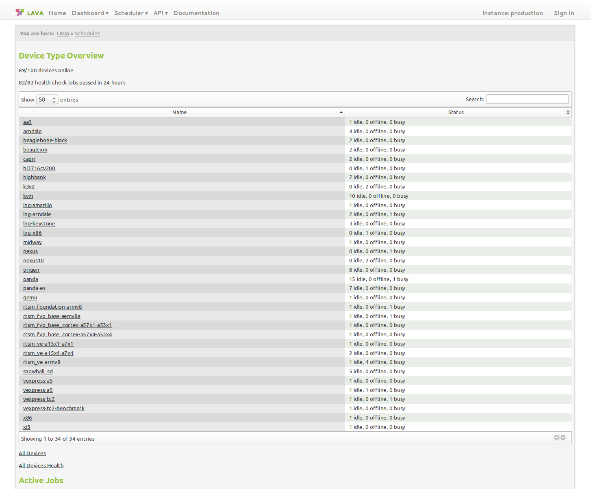
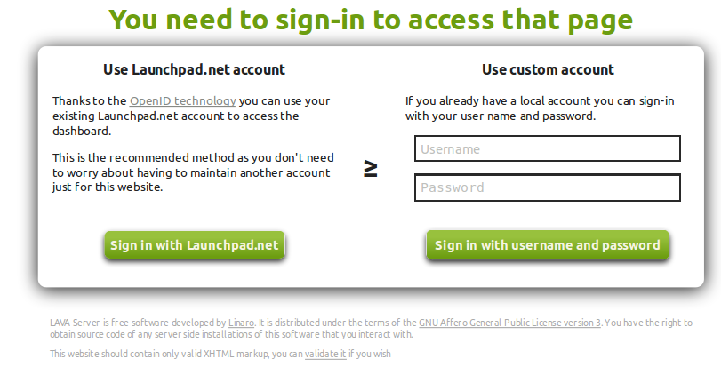
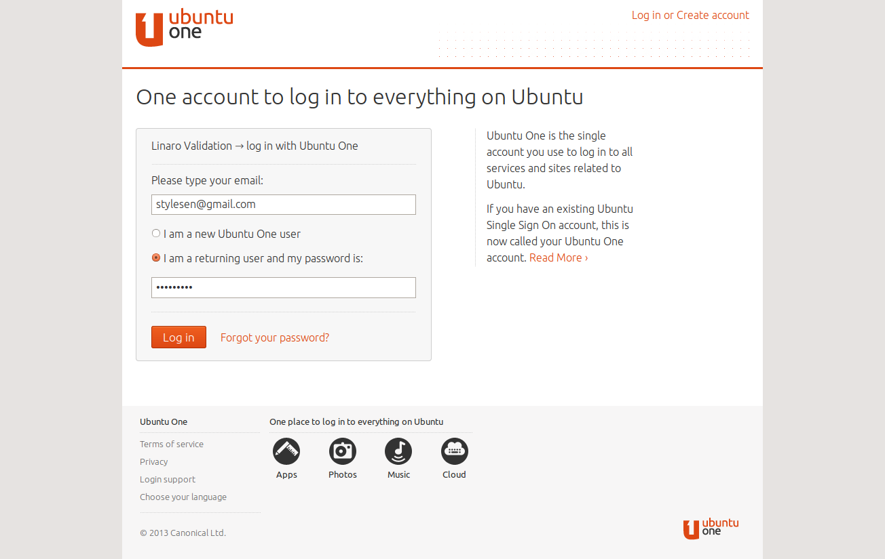
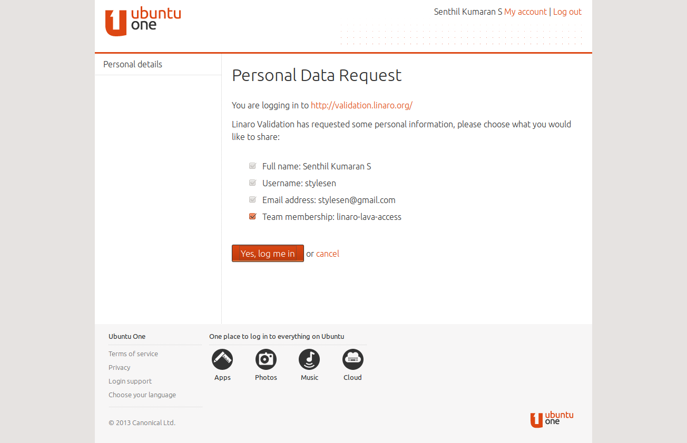
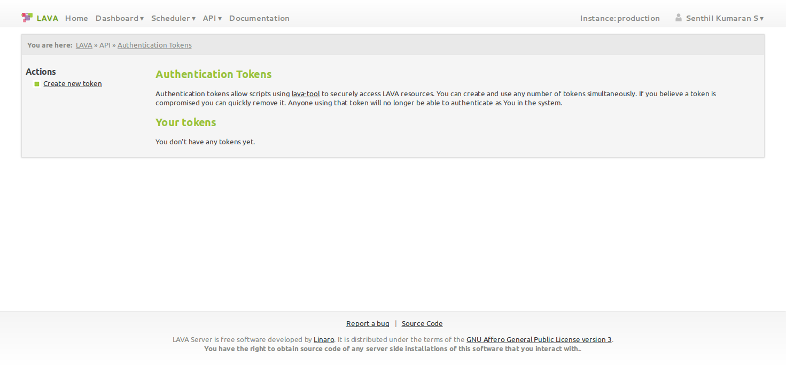
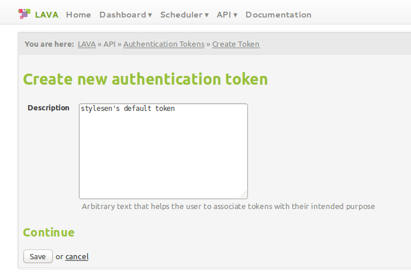
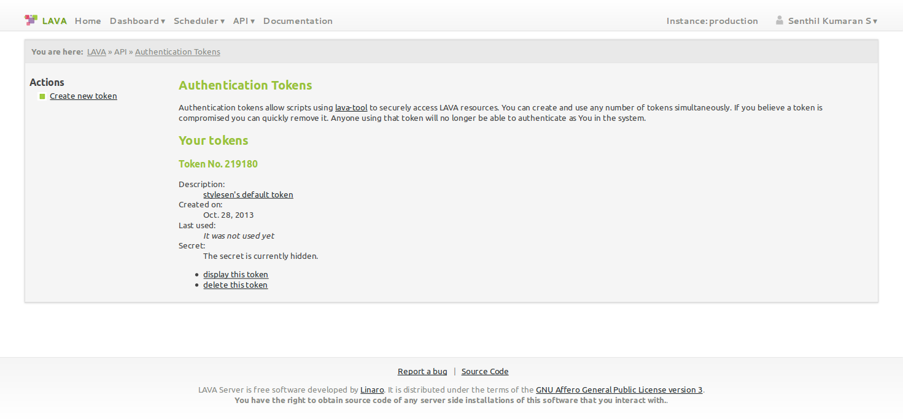
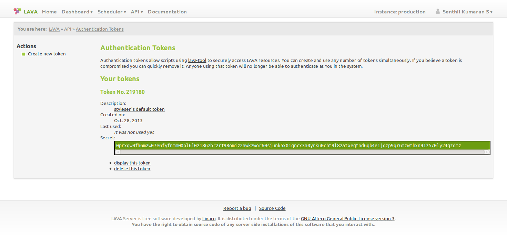
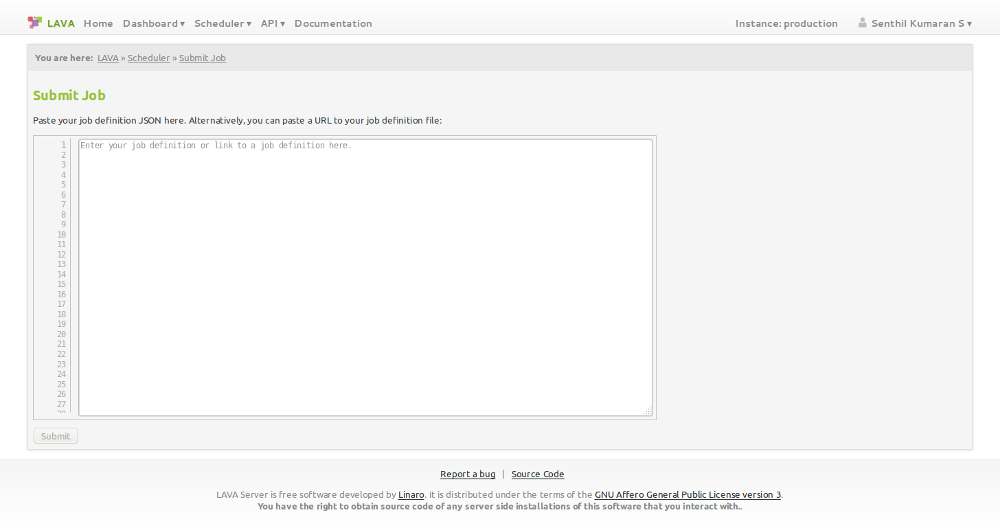

LAVA Overview
*************

.. index:: LAVA

What is LAVA?
=============

LAVA is the Linaro Automation and Validation Architecture. LAVA is a
collection of participating components, the overall idea and evolving
architecture that allows us to make testing, quality control and
automation. LAVA-the-stack aims to make systematic, automatic and
manual quality control more approachable for projects of all sizes.

LAVA is for validation - telling whether the code the other Linaro
engineers are producing "works" in whatever sense that means. It could
be a simple compile or boot test for the kernel, testing whether the
code produced by gcc is smaller or faster, whether a kernel scheduler
change reduces power consumption for a certain workload, or many other
things.

Beyond simple validation though, what LAVA really about is automated
validation. LAVA builds and tests the kernel on all supported boards
every day. LAVA builds and tests proposed android changes in gerrit
before they are landed, and the same for the gcc work. There is a
validation lab in Cambridge - the boards from the Linaro members we
want to test on, but also Cyclades serial console servers, routers,
and a few servers.

.. note:: This overview document explains LAVA using
          http://validation.linaro.org/ which is the official
          production instance of LAVA hosted by Linaro.

.. _index:: login

Logging In
==========

The validation lab in Cambridge is accessible via
http://validation.linaro.org/ which is the official production
instance of LAVA.

There are different ways in which you can access LAVA as given below:

Local User Account
------------------
A local user account can be created by an administrator within LAVA. The
administrator grants different permissions which allows the user to
perform various operations within LAVA. A typical login screen will
look like the following. In order to login with an username and
password enter your credentials in the provided text boxes and click
"Sign in with username and password" button

LP User Account
---------------

Alternatively launchpad login could be used via OpenID in order to
login to LAVA. You must be part of linaro-lava-access group in
launchpad in order to perform various operations within LAVA. In order
to login with launchpad click on "Sign in with Launchpad.net" button,
which will take you to the following screen in order to
authenticate. Enter your launchpad credentials in the provided text
boxes and click "Login"

Once "Login" button is clicked, page redirects to "Personal Data
Request" as follows. Click on "Yes, log me in" button which will
authenticate the user and redirects to http://validation.linaro.org/

.. _index:: token

.. _authentication_tokens:

Authentication Tokens
=====================

In order to securely access LAVA resources via XML-RPC APIs using
lava-tool or XML-RPC clients, an Authentication token should be
created by the user.

Once the user is logged in to http://validation.linaro.org/ click on
"API" link which will bring up a drop down menu on which click on
"Authentication Tokens" link. The following page will appear

Click on "Create new token" link on the above page which takes to the
following page. Fill in the "Description" text box to associate tokens
with their intended purpose (this helps you identify and delete tokens
\- if required at a later stage).

Once the description is entered, click on "Save" button to generate
the token. The token will be assigned a token number (which is
autogenerated by LAVA).

To display the token that was generated above click on the "display
this token" link on the above page.

If a token is compromised it can be removed by clicking on "delete
this token" link. Anyone using that token will no longer be able to
authenticate as You in the system.

.. index:: lava-tool

.. _lava_tool:

lava-tool overview
==================

lava-tool is the command-line tool for interacting with the various
services offered by LAVA via XML-RPC APIs.

Installing lava-tool
--------------------

The latest version of lava-tool is available in the linaro-maintainers
PPA repository. The following explains installation of lava-tool from
linaro-maintainers PPA in ubuntu::

  $ sudo apt-get install python-software-properties
  $ sudo add-apt-repository ppa:linaro-maintainers/tools

Import the "Launchpad Linaro Overlay PPA" public key::

  $ sudo apt-key adv --keyserver hkp://keyserver.ubuntu.com:80 --recv-keys F1FCBACA7BE1F97B

Now update your packages and install lava-tool::

  $ sudo apt-get update
  $ sudo apt-get install lava-tool

Using lava-tool
---------------

Once the token is created add it to lava-tool as follows. Click on
"display the token" link on the "Authentication Tokens" page and copy
the token.

::

  $ lava-tool auth-add http://<username>@validation.linaro.org/RPC2/
  Paste token for http://<username>@validation.linaro.org/RPC2/:
  Please set a password for your new keyring:
  Please confirm the password:
  Token added successfully for user <username>.

.. note:: Paste the token copied previously when it is asked
          above. Replace *username* with your username. If the keyring is
          created newly, set a password for the same, else enter the
          password for the keyring already created.

.. index:: bundle-stream

.. _bundle_stream:

Bundle Stream Overview
======================

What is a Bundle Stream?
------------------------

LAVA runs tests which produce results with multiple tests being run for
each submitted job. The collection of results from any one submitted
job is termed a Result Bundle. Each bundle can contain multiple sets
of test results, as well as other information about the system where the
testing was performed.

Within a single result bundle are the results of each test definition
execution, termed a Test Run. Each Test Run is typically a single YAML
file and is listed in the bundle via the description of the test
definition. The individual id and result of a single test within a test
run is called the Test Case, typically a single line in the YAML file.
If the job ran across multiple devices, the bundle can include test
runs from each device from that job.

Result Bundles are uploaded to the server at the end of the test run
into a Bundle Stream which is a way of organising related results
bundles. A bundle stream could be imagined as a folder within which all
related result bundle will be stored. A bundle stream could be private
or anonymous. The name of the stream is specified in the job definition to
determine where the result bundle from the job should be submitted.

How to setup a Bundle Stream?
-----------------------------

A public/anonymous bundle stream could be setup with the help of
lava-tool as follows,

::

  $ lava-tool make-stream --dashboard-url
  http://<username>@validation.linaro.org/RPC2/ /anonymous/USERNAME/

.. note:: Replace *username* and *USERNAME* with your
          username. Alternatively an existing stream like
          anonymous/test could be used for initial testing purposes.

.. index:: submit

.. _submit_first_job:

Submitting your first job
=========================

A job defines what image to deploy on the DUT and further actions that
should be performed on the DUT. Jobs are defined in *JSON* files.

Job Definition
--------------

Here's a minimal job that could be executed ::

    {
      "job_name": "kvm-test",
      "device_type": "kvm",
      "timeout": 1800,
      "actions": [
        {
          "command": "deploy_linaro_image",
          "parameters":
            {
              "image": "http://images.validation.linaro.org/kvm-debian-wheezy.img.gz"
            }
        },
        {
          "command": "boot_linaro_image"
        },
        {
          "command": "submit_results",
          "parameters":
            {
              "server": "http://<username>@validation.linaro.org/RPC2/",
              "stream": "/anonymous/test/"
            }
        }
      ]
    }

.. note:: Replace *username* with your username.

.. _job_submission:

Job Submission
--------------

A job could be submitted either from the command line (using
lava-tool) or via the web UI.

Command Line Job Submission
^^^^^^^^^^^^^^^^^^^^^^^^^^^

Once you have copied the above job definition to a file, for example
*/tmp/job.json* Use the lava-tool as shown below,

::

  $ lava-tool submit-job https://<username>@validation.linaro.org/RPC2/
  /tmp/job.json
  Please enter password for encrypted keyring:
  submitted as job id: 82287

.. note:: Replace *username* with your username. Enter the password
          for the encrypted keyring which is the same that was used
          when adding authentication token.

Once the job is submitted successfully, the job-id is returned back,
which could be used in order to check the status of the job on the
UI. In the above submission job-id returned is 82287. Visit
http://validation.linaro.org/scheduler/job/<job-id> in order to see
the details of the job run. The following is an example job screen,

Job Definition
--------------

Here's a minimal job that could be executed ::

    {
      "job_name": "kvm-test",
      "device_type": "kvm",
      "timeout": 1800,
      "actions": [
        {
          "command": "deploy_linaro_image",
          "parameters":
            {
              "image": "http://images.validation.linaro.org/kvm-debian-wheezy.img.gz"
            }
        },
        {
          "command": "boot_linaro_image"
        },
        {
          "command": "submit_results",
          "parameters":
            {
              "server": "http://<username>@validation.linaro.org/RPC2/",
              "stream": "/anonymous/test/"
            }
        }
      ]
    }

.. note:: Replace *username* with your username.

Job Submission
--------------

A job could be submitted either from the command line (using
lava-tool) or via the web UI.

Command Line Job Submission
^^^^^^^^^^^^^^^^^^^^^^^^^^^

Once you have copied the above job definition to a file, for example
*/tmp/job.json* Use the lava-tool as shown below,

::

  $ lava-tool submit-job https://<username>@validation.linaro.org/RPC2/
  /tmp/job.json
  Please enter password for encrypted keyring:
  submitted as job id: 82287

.. note:: Replace *username* with your username. Enter the password
          for the encrypted keyring which is the same that was used
          when adding authentication token.

Once the job is submitted successfully, the job-id is returned back,
which could be used in order to check the status of the job on the
UI. In the above submission job-id returned is 82287. Visit
http://validation.linaro.org/scheduler/job/<job-id> in order to see
the details of the job run. The following is an example job screen,

Web Based Job Submission
^^^^^^^^^^^^^^^^^^^^^^^^

Visit http://validation.linaro.org/scheduler/jobsubmit and paste your
json file into the window and click "Submit" button. The job
submission screen is shown below,

.. note:: If a link to job json file is pasted on the above screen,
          the JSON file will be fetched and displayed in the text box
          for submission.

Once the job is successfully submitted, the following screen appears,
from which the user can navigate to the job details or the list of
jobs page.

.. image:: ./images/web-ui-job-submission-success.png

Test Jobs
---------

In order to run a test, a test definition is required. A test
definition is expressed in YAML format. A minimal test definition
would look like the following ::

  metadata:
      name: passfail
      format: "Lava-Test-Shell Test Definition 1.0"
      description: "Pass/Fail test."
      version: 1.0

  run:
      steps:
          - "lava-test-case passtest --result pass"
          - "lava-test-case failtest --result pass"

In order to run the above test definition with a minimal job file, the
following job json could be used and submitted in the same way as
explained above ::

  run:
      steps:
          - "lava-test-case passtest --result pass"
          - "lava-test-case failtest --result pass"

In order to run the above test definition with a minimal job file, the
following job json could be used and submitted in the same way as
explained above ::

  {
      "job_name": "kvm-test",
      "device_type": "kvm",
      "timeout": 1800,
      "actions": [
          {
              "command": "deploy_linaro_image",
              "parameters": {
                  "image":
                  "http://images.validation.linaro.org/kvm-debian-wheezy.img.gz"
              }
          },
          {
              "command": "lava_test_shell",
              "parameters": {
                  "testdef_urls": [
                      "http://people.linaro.org/~senthil.kumaran/test.yaml"
                  ]
              }
          },
          {
              "command": "boot_linaro_image"
          },
          {
              "command": "submit_results",
              "parameters": {
                  "server":
                  "http://stylesen@validation.linaro.org/RPC2/",
                  "stream": "/anonymous/test/"
              }
          }
      ]
  }

.. note:: The test definition is uploaded to an URL that will be
          accessible over http which is referred in the job json.

.. note:: Test definitions could be referred from git
          repositories. The official upstream Linaro git repository
          for test definitions is
          https://git.linaro.org/gitweb?p=qa/test-definitions.git

.. include:: tables.rst
