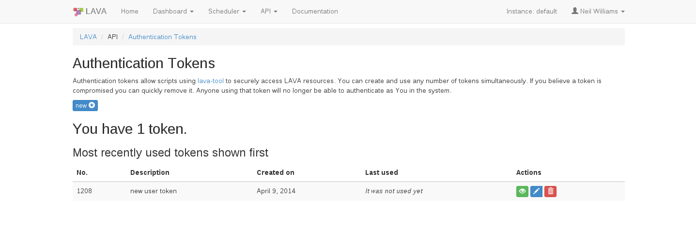

.. index:: login

Logging In
==========

Each LAVA instance offers a :ref:`local_user` and can also be configured
to offer an alternative authentication method:

* :ref:`launchpad_openid`
* :ref:`google_openid`
* :ref:`ldap_authentication`

OpenID is no longer available for all installs of LAVA. The OpenID
support changed in the 2015.12 release due to incompatible
changes in the underlying django support. See :ref:`user_authentication`
for more information.

LDAP authentication relies on local configuration and may involve obtaining
a privileged access token from the LDAP administrators.

Local accounts remain available for all instances.

Whichever authentication method is used, there is no difference in how
users interact with LAVA, once logged in.

.. _local_user:

Local User Account
------------------
A local user account can be created by an administrator within LAVA. The
administrator grants different permissions which allows the user to
perform various operations within LAVA. A typical login screen will
look like the following. In order to login with an username and
password enter your credentials in the provided text boxes and click
"Sign in with username and password" button

Local user accounts can be particularly useful for automated users like
build systems or continuous integration scripts using the XMLRPC API.
The local admin can create the user with a secure password, login as
that user to create a token and then supply the token to the scripts.

.. image:: ./images/local-user-login.png

Logging into the validation lab in Cambridge
--------------------------------------------

The validation lab in Cambridge is accessible via
http://validation.linaro.org/ which is the official production
instance of LAVA.

The validation lab in Cambridge is now accessed using Linaro LDAP.
In order to login with LDAP, enter your details in the LDAP login fields.

.. note:: If your Linaro email is ``first.second@linaro.org`` then use
   ``first.second`` as your username.

.. image:: ./images/ldap-user-login.png

A successful authentication will redirect you to http://validation.linaro.org/

If you do not have a Linaro LDAP account, you can :ref:`register`.

The LAVA scheduler page looks like the following,

.. image:: ./images/lava-scheduler-page.png

.. index:: token

.. _authentication_tokens:

Authentication Tokens
=====================

In order to securely access LAVA resources via XML-RPC APIs using
lava-tool or XML-RPC clients, an Authentication token should be
created by the user.

.. _note: An authentication token and a username are sufficient to allow
          any remote user to use that account in LAVA. Take care when sharing
          scripts that the token and username are not disclosed. If a
          token becomes compromised, login to that LAVA instance and
          delete the token before creating a new one.

Once the user is logged in to a LAVA instance
(e.g. http://validation.linaro.org/) click on the "API" link which will
bring up a drop down menu on which click on "Authentication Tokens" link.
The following page will appear

.. image:: ./images/authentication-tokens-page.png

Click on "new" button on the above page which raises a dialog box
asking for a "Description" of the token to help you identify and
delete tokens \- if required at a later stage.

.. image:: ./images/create-new-authentication-token.png

Click on the "Create" button to generate the token. The token
will be assigned a token number (which is autogenerated by LAVA).

To display the token that was generated above click on the green "display
this token" button in the Actions column on the above page.

.. image:: ./images/token-display-page.png

If a token is compromised it can be removed by clicking on the red "delete
this token" button in the Actions column. Anyone using that token will no longer be able to
authenticate as You in the system.

.. index:: lava-tool

.. _lava_tool:

lava-tool overview
==================

``lava-tool`` is the command-line tool for interacting with the various
services offered by LAVA via XML-RPC APIs. The full list of API calls
is visible on the **Available methods** link from the API menu::

 http://localhost/api/help

``lava-tool`` is primarily designed to assist users and uses desktop
integration hooks provided by ``python-keyring`` and ``gnome-keyring``.
When scripts need to interact with LAVA, the XMLRPC API calls should be
used directly so that the scripts do not need to prompt for a password
to the local user keyring. Scripts used by build servers and continuous
integration tools should use a dedicated user created by the
administrator of a particular instance),

The API help page includes an example python script to connect to the
local instance. To add token support, use the syntax **username:token**
for the server concerned::

 server = xmlrpclib.ServerProxy("https://%s:%s@%s/RPC2" % (username, token, server))

See :ref:`xml_rpc` for more information.

.. _installing_lava_tool:

Installing lava-tool
--------------------

``lava-tool`` is installed alongside LAVA by default, when the top
level ``lava`` package is installed on a :ref:`debian_installation`.
``lava-tool`` can also be installed on any remote machine running a
Debian-based distribution, without needing the rest of LAVA, to allow
a remote user to interact with any LAVA instance on which the user has
an account.::

  $ sudo apt-get update
  $ sudo apt-get install lava-tool

(If you are installing on Debian Jessie, you may want to first enable
``jessie-backports`` to install an updated ``lava-tool`` to use
some superuser operations or for other updates.)

.. _using_lava_tool:

Using lava-tool
---------------

Once the token is created add it to lava-tool as follows. Click on
"display the token" link on the "Authentication Tokens" page and copy
the token. e.g. if your token was created on validation.linaro.org::

  $ lava-tool auth-add http://<username>@validation.linaro.org/RPC2/
  Paste token for http://<username>@validation.linaro.org/RPC2/:
  Please set a password for your new keyring:
  Please confirm the password:
  Token added successfully for user <username>.

.. note:: Paste the token copied previously when it is asked
          above. Replace *username* with your username. If the keyring is
          created newly, set a password for the same, else enter the
          password for the keyring already created.

.. index:: bundle-stream

.. _bundle_stream:

Bundle Stream Overview
======================

What is a Bundle Stream?
------------------------

LAVA runs tests which produce results with multiple tests being run for
each submitted job. The collection of results from any one submitted
job is termed a Result Bundle. Each bundle can contain multiple sets
of test results, as well as other information about the system where the
testing was performed.

Within a single result bundle are the results of each test definition
execution, termed a Test Run. Each Test Run is typically a single YAML
file and is listed in the bundle via the description of the test
definition. The individual id and result of a single test within a test
run is called the Test Case, typically a single line in the YAML file.
If the job ran across multiple devices, the bundle can include test
runs from each device from that job.

Result Bundles are uploaded to the server at the end of the test run
into a Bundle Stream which is a way of organising related results
bundles. A bundle stream could be imagined as a folder within which all
related result bundle will be stored. A bundle stream could be private
or anonymous. The name of the stream is specified in the job definition to
determine where the result bundle from the job should be submitted.

How to setup a Bundle Stream?
-----------------------------

A public/anonymous bundle stream could be setup with the help of
lava-tool as follows,

::

  $ lava-tool make-stream --dashboard-url
  http://<username>@validation.linaro.org/RPC2/ /anonymous/USERNAME/

.. note:: Replace *username* and *USERNAME* with your
          username. Alternatively an existing stream like
          anonymous/test could be used for initial testing purposes.

.. index:: submit

.. _submit_first_job:

Submitting your first job
=========================

A job defines what image to deploy on the DUT and further actions that
should be performed on the DUT. Jobs are defined in *JSON* files.

Job Definition
--------------

Here's a minimal job that could be executed ::

    {
      "job_name": "kvm-test",
      "device_type": "kvm",
      "timeout": 1800,
      "actions": [
        {
          "command": "deploy_linaro_image",
          "parameters":
            {
              "image": "http://images.validation.linaro.org/kvm-debian-wheezy.img.gz"
            }
        },
        {
          "command": "boot_linaro_image"
        },
        {
          "command": "submit_results",
          "parameters":
            {
              "server": "http://<username>@validation.linaro.org/RPC2/",
              "stream": "/anonymous/test/"
            }
        }
      ]
    }

.. note:: Replace *username* with your username.

.. _job_submission:

Job Submission
--------------

A job could be submitted either from the command line (using
lava-tool) or via the web UI.

Command Line Job Submission
^^^^^^^^^^^^^^^^^^^^^^^^^^^

Once you have copied the above job definition to a file, for example
*/tmp/job.json* Use the lava-tool as shown below,

::

  $ lava-tool submit-job https://<username>@validation.linaro.org/RPC2/
  /tmp/job.json
  Please enter password for encrypted keyring:
  submitted as job id: 82287

.. note:: Replace *username* with your username. Enter the password
          for the encrypted keyring which is the same that was used
          when adding authentication token.

Once the job is submitted successfully, the job-id is returned back,
which could be used in order to check the status of the job on the
UI. In the above submission job-id returned is 82287. Visit
``http://validation.linaro.org/scheduler/job/<job-id>`` in order to see
the details of the job run.
