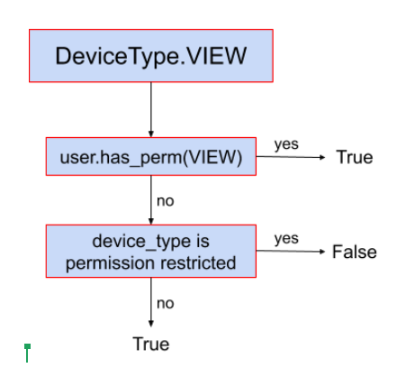
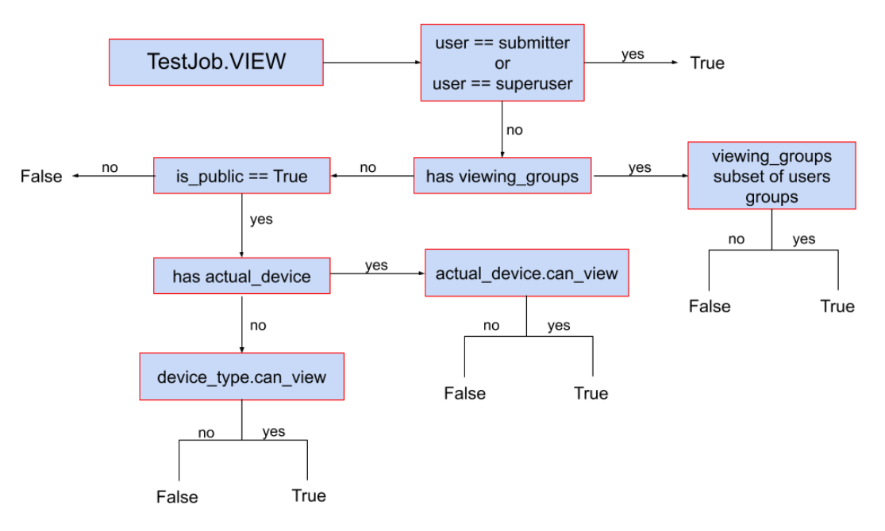

.. index:: authorization, permissions

.. _authorization:

User permissions and authorization
##################################

Requirements
************

You need to be familiar with these sections:

#. :ref:`installation`
#. :ref:`create_superuser`
#. :ref:`logging_in` (as superuser)
#. :ref:`device_types` and :ref:`device_type_elements`
#. :ref:`first_devices`

.. _permission_summary:

Introduction
************

We can split LAVA authorization backend into two separate groups:

Global authorization
====================

LAVA global authorization system is derived from a django authorization and can
be found _`here`: https://docs.djangoproject.com/en/2.2/topics/auth/default/#topic-authorization

Specific user can have a global permission for any system entity in which case
this global permission is checked first and has higher priority than
per-object permission setup when detemining this users' access rights.
This kind of setup can be managed in admin user settings.

Per-object authorization
========================

LAVA per-object authorization is used to apply a fine-grained access to a
specific objects in the system so it's best used when there's a need to i.e.
hide a device(and all jobs on that device) from a general public.

Per-object authorization system is **group** based and applies to
following entities exclusively:

* **Device Type**
* **Device**
* **Test Job**

It is split accoss the following permissions:

* **view**
* **submit**
* **admin**

LAVA per-object authorization works in an inverse manner, meaning that if there
are no permissions assigned for an object, it is unprotected. Once a permission
is assigned to it for a specific group, the system will check that the specific
user belongs to the group and allow/disallow the access rights.

It is also **inheritable** meaning that the permissions from ``device type``
are passed over to a ``device`` and permissions from a ``device`` are passed
over to ``test job``. More in depth explanation on this can be found later in
this chapter.

Permission inheritance
**********************

As we already covered that the object is ``permission restricted`` if it has any
permission assigned for a specific group and ``permission unrestricted``
otherwise. Since each ``test job`` has either a ``device type`` (requested) or
a ``device`` (actual) and each ``device`` belongs to a ``device type``, the
per-object authorization will cascade through 'parent' entity to check for
permissions if the object is ``permission unrestricted`` but not otherwise.

Example: Lets say the device qemu01 is ``permission unrestricted`` but the
qemu device type has a permission to allow group 'lkft' to view it. Only users
from this particular group will be able to see device qemu01 even if it's not
``permission restricted`` because the underlying device type has the
restriction. Same goes for test jobs. If the test job is not ``permission
restricted`` it will be visible (example) only if device and device type it
belongs to are unrestricted (or the user belongs to one of the groups the
view permission aplies to).

This particular behaviour allows admin to set the permissions on higher level
and it will be applied to all the lower level objects, i.e. if you set the
**view** permission for aforementioned 'lkft' group for the ``device type``,
all the devices and test job will be automagically hidden for non-lkft users.

Anonymous users vs authenticated users
**************************************

For out of the box LAVA installation, device types, devices and test jobs are
publicly visible meaning that a non-authenticated users can view everything.
This does not apply to **submit** and **admin** permissions.

But if the object is ``permission restricted`` for **view** permission, or it
inherits the permission restriction, anonymous users will not be able to see
that particular object any more.

If a user is authenticated but belongs to no group, it will have pretty much
similar access as the anonymous user with the exception that he will be able to
**submit** jobs to devices which are not ``permission restricted`` for
**submit** permission.

User belonging to one or more groups will have additional permissions based on
the admin setup for per-object permissions.

Test job specifics on visibility
********************************

Test job visibility is affected by two more settings.

Field ``viewing_groups``, if set, will allow only users belonging to specific
groups to view this job. User must belong to **all** the groups specified in
the ``viewing_groups`` field. This field has higher priority than per-object
auth and it can be set in the ``job definition``.

Field ``is_public`` can be used to completely hide job from general public.
If set to ``False``, only submitter, superusers and users belonging to
``viewing_groups`` field (if set) will be able to view the test job. If set to
``True``, regular per-object authorization will be applied. This field can also
be set in the ``job definition``.

Setup
*****

The per-object permission can only be assigned to ``device`` and
``device type`` objects. The ``test job`` objects will always use
**inheritance** to determine user access level.

To add per-object group permissions one can use either admin UI and go to
individual ``device type`` and ``device`` objects or use XMLRPC API methods -
/api/help/#system.assign_perm_device and
/api/help/#system.assign_perm_device_type.

Data migration
**************

Per-object authorization and new permission model were introduced in 2019.09
version of LAVA. While some of the fields in relevant tables were removed, the
Django migration in this version includes a data migration as well so that
permission entries are automatically created so that no user access is modified
by introducing the new model.

.. caution:: Downgrades are not recomended after the system 2019.09 upgrade.
   The reason for this is that the backward database migration will **not**
   recreate previous settings regarding ``device type`` and ``device``
   authorization.

.. caution:: The way ``is_public`` field works has changed starting with
   2019.09 and authorization update. The way this field worked before was to
   allow all users viewing the test job if set to ``True``. After the update,
   test job visibility is also restricted by ``device`` and ``device type``
   per-object settings to so some users might see a change in behavior (i.e.
   not being able to view a test job where previously they could)

Visibility decision trees
*************************

Device type:

Device:

.. image:: images/device-decision-tree.png

Test job:

