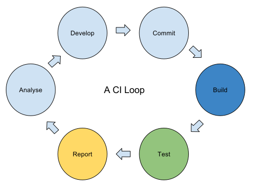

.. index:: custom result handling

.. _custom_result_handling:

Custom result handling
######################

.. index:: ci loop - closing

.. _ci_loop:

Closing the CI loop
*******************

LAVA is generic and will just display results as generic results - LAVA does
not have any specific intelligence to know how to do anything more or how to
make those results meaningful to the developers who originally caused the
:abbr:`CI (Continuous Integration)` system to spawn the test job.

The stages in light blue, (**analyse**, **develop** and **commit**) are the
developer input. (The *develop* stage is here assumed to include some amount of
local testing). Building the tree after a commit is typically handed off to a
dedicated service like Jenkins_. Jenkins in turn is able to hand off the
testing of the build to LAVA.

The missing step here is the reporting. Each team needs customised reports and
data based on custom criteria. LAVA cannot meet all these requirements at the
same time. Instead, teams are advised to design a custom frontend which
collects data from LAVA, the build system and the VCS and presents that data in
a cohesive manner.

If the development team is very small, the entire team may be able to retain an
overview of the entire CI system. This allows the team to get useful, relevant
results directly. However, this model does not scale to larger teams.

.. _Jenkins: https://jenkins.io/

Important features of a CI loop
===============================

* **Time** - developers need test results in a timely fashion, before they
  have moved on to a completely unrelated topic.

* **Relevance** - the results which the developer sees need to be directly
  relevant to the work which started the CI loop in the first place.

  .. note:: this can easily involve multiple variants of the final results
     report to cover the various topics which that development team needs to
     handle.

* **Usefulness** - this includes not sending reports that everything is working
  when only failure reports are useful, or sending reports that only hint at
  the problem rather than provide access to the actual fault. This can be the
  hardest element to get right. The more time is spent here talking to the
  development team, the better the process will work for everyone.

Where LAVA fits into the testing
================================

Build tools like Jenkins can also do an amount of testing on the built files,
for example unit tests. On the basis of always optimising the CI loop to fail
early, it is always worth balancing the number of tests run after the build
against how long those tests take to run. It may be pointless to test a build
in LAVA when that a unit test on that build would have failed. It is also
possible to execute the build, submit to LAVA and run the unit tests as a new
Jenkins job in parallel if the unit tests are slow.

LAVA is best suited for those tests where the hardware is directly relevant. In
some cases, the machines used for building the files will be faster than the
machines used to test the files in LAVA. If those files can be tested on the
faster build machine, omit that part of the testing from the submission to
LAVA.

LAVA combines the benefits of ready access to a multiple types of device with a
genuinely scalable scheduler. LAVA is capable of running thousands of test jobs
a day across hundreds of devices on a single instance. With a custom frontend
organising the submissions and collating the results, this can scale to larger
groups using multiple LAVA instances.

Splitting the testing
=====================

Not all tests need to be run on every commit. Identify which tests can be run
on a daily or weekly cycle or as a bespoke per-release test.

It is not necessarily appropiate for all commits to go through the entire CI
loop. The hook in the version control system which triggers the Jenkins build
could be based on merges rather than commits.

Questions to ask
================

* **Frequency** - how often is the loop to be triggered?

  * Set up some test builds and test jobs and run through a variety of use
    cases to get an idea of how long it takes to get from the commit hook to
    the results being available to what will become your frontend.

  * Investigate where the hardware involved in each stage can be improved and
    analyse what kind of hardware upgrades may be useful.

  * Reassess the entire loop design and look at splitting the testing if the
    loop cannot be optimised to the time limits required by the team. The loop
    exists to serve the team but the expectations of the team may need to be
    managed compared to the cost of hardware upgrades or finite time limits.

* **Scale** - how many branches, variants, configurations and tests are
  actually needed?

  * Scale has a direct impact on the affordability and feasibility of the final
    loop and frontend. Ensure that the build infrastructure can handle the
    total number of variants, not just at build time but for storage.
    Developers will need access to the files which demonstrate a particular
    bug or regression

  * Scale also provides benefits of being able to ignore anomalies.

  * Identify how many test devices, LAVA instances and Jenkins slaves are
    needed. (As a hint, start small and design the frontend so that more can be
    added later.)

* **Interface** - the development of a custom interface is not a small task.
  Capturing the requirements for the interface may involve lengthy discussions
  across the development team. Where there are irreconcilable differences, a
  second frontend may become necessary, potentially pulling the same data and
  presenting it in a radically different manner.

  * Include discussions on how or whether to push notifications to the
    development team. Take time to consider the frequency of notification
    messages and how to limit the content to only the essential data.

  * **Bisect** support can flow naturally from the design of the loop **if**
    the loop is carefully designed. Bisect requires that a simple boolean test
    can be generated, built and executed across a set of commits. If the
    frontend implements only a single test (for example, does the kernel boot?)
    then it can be easy to identify how to provide bisect support. Tests which
    produce hundreds of results need to be slimmed down to a single pass/fail
    criterion for the bisect to work.

* **Results** - this may take the longest of all elements of the final loop.
  Just what results do the developers actually want and can those results be
  delivered? There may be requirements to aggregate results across many LAVA
  instances, with comparisons based on metadata from the original build as well
  as the LAVA test.

  * What level of detail is relevant?

  * Different results for different members of the team or different teams?

  * Is the data to be summarised and if so, how?

* **Resourcing** - a frontend has the potential to become complex and need
  long term maintenance and development.

.. index:: kernel ci

.. _kernelci_org:

KernelCI.org
############

KernelCI_ is a build and boot automation tool for upstream Linux kernel trees.
Under the hood, kernelci uses LAVA alongside other automation systems. The LAVA
workload is based on booting each build of the kernel with a known working
rootfs on as many devices as possible. KernelCI schedules builds of supported
kernel configurations, then submits those builds to test instances. It imports
the test results and generates a user interface which is specific to the needs
of the upstream Linux kernel developer teams.

Development of KernelCI started in 2013, gathering the requirements from the
kernel developers. This included a number of sessions covering what the
developers wanted and needed from the project.

The specific details of the interface of KernelCI may not be directly relevant
to other development teams, but it is a good example of the kind of custom
frontend that the LAVA team recommend. Specific frontends may differ, but the
ideas are common - using the results from LAVA effectively, targeting the needs
of the development team.

One important feature from KernelCI is that the devices themselves are
development boards and can fail for reasons other than the build being tested.
Mitigating this problem requires a balance of having enough devices to smooth
out the anomalous results against the risk of missing an unusual corner case
which genuinely only affects devices in a specific set of circumstances.

.. _KernelCI: https://kernelci.org/faq/
