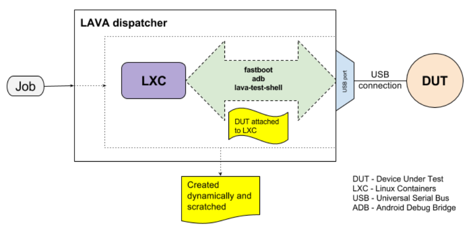

.. # can refer to Android when *not* describing how to rebuild or modify AOSP.

.. index:: deploy lxc test job, deploy android using lxc

.. _deploy_using_lxc:

Deploying test images using LXC
###############################

Uses CGroups (Linux kernel 2.6.24 and later) with isolated namespaces, using the
same kernel as the host. The container provides a lightweight method to allow custom
software to be used on the dispatcher. The container is used to provide transparent
access.

LXC can be available as a dedicated device-type as well as using the LXC :term:`protocol`.

.. _lava_lxc_protocol_android:

Using the LXC protocol to support Android
*****************************************

.. _lava_android_naming_conventions:

LAVA Android Naming Conventions
===============================

* **production image** - a build of Android which, when deployed to a device, means that
  the device is **not** visible to ``adb``. This is typically how a device is configured
  when first sold to the consumer.

* **developer image** - a build of Android which, when deployed to a device, means that
  the device **is visible** to ``adb``. Devices configured this way will be able to have
  the image replaced using any machine, just be connecting a suitable cable, so these images
  are not typically deployed onto hardware which will be sold to the customer without
  having this image replaced with a production image.

Introduction
============

Installing tools like ``adb`` and ``fastboot`` on the dispatcher can be problematic.
Some of these issues arise from the need to put many different types of devices onto
a single dispatcher, other issues arise from needing to use different versions of the
build on the devices. Testing an old system may require downgrading support like
``openjdk``, new devices or new builds may require upgrading the same support. Containers
isolate this variation so that each testjob can have a suitable container instead of
needing to deal with changes on the dispatcher:

#. **Shared lock issues** - Tools can require use of ``flock`` and similar methods to
   distinguish a connection to one device from another.

#. **Version disparaties** - different device versions, different OS versions, may require
   different support in debug tools like ``adb`` and ``fastboot``.

#. **hardware issues** - USB hub variability.

.. seealso:: :ref:`lxc_deploy` for more information on the administration of LXC for LAVA.

Using the ``lava-lxc`` protocol, a Lava Test Shell is provided inside the LXC to support
installing and configuring whatever tools, packages and files which the testjob will need
to use. Installing ``adb`` in this test shell removes the need to have a POSIX type shell
on the device. Files can be pushed and pulled from the device and executed using the
Android support in the image.

.. _lava_android_requirements:

Requirements and Limitations
============================

#. The image deployed to the device **must** enable the Android Debug Bridge,
   i.e. a :term:`developer image`. This means enabling developer access over USB or TCP.
   This rules out the use of production images.

#. A list of packages to install into the bare container to provide the necessary tools
   to communicate with the device.

#. The LXC depends on underlying kernel architecture. For armel, armhf, etc. dispatcher
   should run on these architectures.

#. Each distro has its own template and the templates do not have common options. It can
   be difficult to have generic support for all distros.

#. ``namespaces`` to relate different job actions to run in the LXC and for the device.

.. _namespaces_with_lxc:

Namespaces
==========

* Ties related actions together

* Aids execution of actions in the desired order

Protocol elements
=================

.. code-block:: yaml

 protocols:
   lava-lxc:
     name: pipeline-lxc-test
     template: debian
     distribution: debian
     release: sid
     arch: amd64
     mirror: http://ftp.us.debian.org/debian/
     security_mirror: http://mirror.csclub.uwaterloo.ca/debian-security/

  actions:
  - deploy:
    namespace: tlxc
    timeout:
      minutes: 5
    to: lxc
    packages:
    - android-tools-adb
    - android-tools-fastboot
    - systemd
    - systemd-sysv
    os: debian

.. include:: examples/test-jobs/hi6220-hikey.yaml
   :code: yaml
