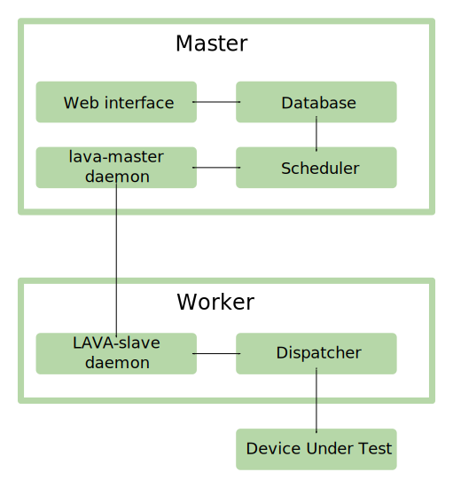

.. index:: developer: design

.. _dispatcher_design:

Lava Dispatcher Design
######################

This is the **developer** documentation for the new V2 dispatcher design. See
:ref:`pipeline_use_cases` for information for lab administrators and users of
the new design.

The refactoring takes place alongside the V1 dispatcher and existing JSON jobs
are unaffected. A migration will take place where individual devices are
configured for :ref:`pipeline support <pipeline_device_requirements>` and
individual jobs are then re-written using the :ref:`pipeline_schema
<pipeline_schema>`. The administrator of each instance will be able to manage
their own migration and at some point after ``validation.linaro.org`` has
completed the migration of all devices to pipeline support, the support for the
current dispatcher will be removed.

``validation.linaro.org`` supports LAVA V2 pipeline submissions as of the
``2016.2`` release and the V2 support will continue to expand in subsequent
releases.

The LAVA developers use a `staging instance
<https://staging.validation.linaro.org>`_ for testing of the current master
branch and release candidates for the next production release.

Pipeline Architecture
*********************

Principal changes
=================

#. **Database isolation** - Only the master daemon has a connection to the
   database. This simplifies the architecture and avoids the use of
   fault-intolerant database connections to remote workers.

#. **Drop use of SSHFS** between workers and master - this was awkward to
   configure and problematic over external connections.

#. **Move configuration onto the master** - The worker becomes a simple worker
   which receives all configuration and tasks from the master.

.. _objectives:

Objectives
**********

The new dispatcher design is intended to make it easier to adapt the dispatcher
flow to new boards, new mechanisms and new deployments. It also shifts support
to do less work on the dispatcher, make fewer assumptions about the test in the
dispatcher configuration and put more flexibility into the hands of the test
writer.

.. note:: The new code is still developing, some areas are absent, some areas
   will change substantially before the migration completes. There may be
   changes to the submission formats but these will be announced on the
   :ref:`lava_announce` mailing list.

From **2015.8 onwards** the sample jobs supporting the unit tests conform to
the :ref:`pipeline_schema`.

Design
******

Start with a Job which is broken up into a Deployment, a Boot and a Test class.
Results are transmitted live during any part of the job.

+-------------+--------------------+------------------+-------------------+
|     Job     |                    |                  |                   |
+=============+====================+==================+===================+
|             |     Deployment     |                  |                   |
+-------------+--------------------+------------------+-------------------+
|             |                    |   DeployAction   |                   |
+-------------+--------------------+------------------+-------------------+
|             |                    |                  |  DownloadAction   |
+-------------+--------------------+------------------+-------------------+
|             |                    |                  |  ChecksumAction   |
+-------------+--------------------+------------------+-------------------+
|             |                    |                  |  MountAction      |
+-------------+--------------------+------------------+-------------------+
|             |                    |                  |  CustomiseAction  |
+-------------+--------------------+------------------+-------------------+
|             |                    |                  |  TestDefAction    |
+-------------+--------------------+------------------+-------------------+
|             |                    |                  |  UnmountAction    |
+-------------+--------------------+------------------+-------------------+
|             |                    |   BootAction     |                   |
+-------------+--------------------+------------------+-------------------+
|             |                    |   TestAction     |                   |
+-------------+--------------------+------------------+-------------------+

The Job manages the Actions using a Pipeline structure. Actions can specialize
actions by using internal pipelines and an Action can include support for
retries and other logical functions:

+------------------------+----------------------------+
|     DownloadAction     |                            |
+========================+============================+
|                        |    HttpDownloadAction      |
+------------------------+----------------------------+
|                        |    FileDownloadAction      |
+------------------------+----------------------------+

If a Job includes one or more Test definitions, the Deployment can then extend
the Deployment to overlay the LAVA test scripts without needing to mount the
image twice:

+----------------------+------------------+---------------------------+
|     DeployAction     |                  |                           |
+======================+==================+===========================+
|                      |   OverlayAction  |                           |
+----------------------+------------------+---------------------------+
|                      |                  |   MultinodeOverlayAction  |
+----------------------+------------------+---------------------------+
|                      |                  |   LMPOverlayAction        |
+----------------------+------------------+---------------------------+

The TestDefinitionAction has a similar structure with specialist tasks being
handed off to cope with particular tools:

+--------------------------------+-----------------+-------------------+
|     TestDefinitionAction       |                 |                   |
+================================+=================+===================+
|                                |    RepoAction   |                   |
+--------------------------------+-----------------+-------------------+
|                                |                 |   GitRepoAction   |
+--------------------------------+-----------------+-------------------+
|                                |                 |   UrlRepoAction   |
+--------------------------------+-----------------+-------------------+

.. _code_flow:

Following the code flow
***********************

+---------------------------------------+---------------------------------------------------+
|            Filename                   | Role                                              |
+=======================================+===================================================+
| lava_dispatcher/actions/commands.py   | Command line arguments, call to YAML parser       |
+---------------------------------------+---------------------------------------------------+
| lava_dispatcher/device.py             | YAML Parser to create the Device object           |
+---------------------------------------+---------------------------------------------------+
| lava_dispatcher/parser.py             | YAML Parser to create the Job object              |
+---------------------------------------+---------------------------------------------------+
| ....actions/deploy/                   | Handlers for different deployment strategies      |
+---------------------------------------+---------------------------------------------------+
| ....actions/boot/                     | Handlers for different boot strategies            |
+---------------------------------------+---------------------------------------------------+
| ....actions/test/                     | Handlers for different LavaTestShell strategies   |
+---------------------------------------+---------------------------------------------------+
| ....actions/deploy/image.py           | DeployImages strategy creates DeployImagesAction  |
+---------------------------------------+---------------------------------------------------+
| ....actions/deploy/image.py           | DeployImagesAction.populate adds deployment       |
|                                       | actions to the Job pipeline                       |
+---------------------------------------+---------------------------------------------------+
|   ***repeat for each strategy***      | each ``populate`` function adds more Actions      |
+---------------------------------------+---------------------------------------------------+
| ....action.py                         | ``Pipeline.run_actions()`` to start               |
+---------------------------------------+---------------------------------------------------+

The deployment is determined from the device_type specified in the Job (or the
device_type of the specified target) by reading the list of support methods
from the device_types YAML configuration.

Each Action can define an internal pipeline and add sub-actions in the
``Action.populate`` function.

Particular Logic Actions (like RetryAction) require an internal pipeline so
that all actions added to that pipeline can be retried in the same order.
(Remember that actions must be idempotent.) Actions which fail with a JobError
or InfrastructureError can trigger Diagnostic actions. See
:ref:`retry_diagnostic`.

.. code-block:: yaml

 actions:
   deploy:
     allow:
       - image
   boot:
     allow:
       - image

This then matches the python class structure::

 actions/
    deploy/
        image.py

The class defines the list of Action classes needed to implement this
deployment. See also :ref:`dispatcher_actions`.

.. _pipeline_construction:

Pipeline construction and flow
******************************

The pipeline is a FIFO_ and has branches which are handled as a `tree walk`_.
The top level object is the job, based on the YAML definition supplied by the
**lava-master**. The definition is processed by the scheduler and the
submission interface with information specific to the actual device. The
processed definition is parsed to generate the top level pipeline and
:ref:`strategy classes <using_strategy_classes>`. Each strategy class adds a
top level action to the top level pipeline. The top level action then populates
branches containing more actions.

Actions are populated, validated and executed in strict order. The next action
in any branch waits until all branches of the preceding action have completed.
Populating an action in a pipeline creates a **level** string, e.g. all actions
in level 1.2.1, including all actions in sublevel 1.2.1.2 are executed before
the pipeline moves on to processing level 1.3 or 2::

    Deploy (1)
       |
       \___ 1.1
       |
       \ __ 1.2
       |     |
       |     \_ 1.2.1
       |     |   |
       |     |   \_ 1.2.1.1
       |     |   |
       |     |   \_ 1.2.1.2
       |     |         |
       |     |         \__ 1.2.1.2.1
       |     |
       |     \__1.2.2
       |
       \____1.3
       |
      Boot (2)
       |
       \_ 2.1
       |
       \_ 2.2

#. One device per job. One top level pipeline per job

   * loads only the configuration required for this one job.

#. A NewDevice is built from the target specified (commands.py)
#. A Job is generated from the YAML by the parser.
#. The top level Pipeline is constructed by the parser.
#. Strategy classes are initialized by the parser

   #. Strategy classes add the top level Action for that strategy to the top
      level pipeline.
   #. Top level pipeline calls ``populate()`` on each top level Action added.

      #. Each ``Action.populate()`` function may construct one internal
         pipeline, based on parameters.
      #. internal pipelines call ``populate()`` on each Action added.
      #. A sublevel is set for each action in the internal pipeline.
         Level 1 creates 1.1 and level 2.3.2 creates 2.3.2.1.

#. Parser waits while each Strategy completes branch population.
#. Parser adds the FinalizeAction to the top-level pipeline
#. Loghandlers are set up
#. Job validates the completed pipeline

   #. Dynamic data can be added to the context

#. If ``--validate`` not specified, the job runs.

   #. Each ``run()`` function can add dynamic data to the context and/or
      results to the pipeline.
   #. Pipeline walks along the branches, executing actions.

#. Job ends, check for errors
#. Completed pipeline is available.

.. _FIFO: https://en.wikipedia.org/wiki/FIFO_(computing_and_electronics)
.. _tree walk: https://en.wikipedia.org/wiki/Tree_traversal

.. index:: developer: strategy classes

.. _using_strategy_classes:

Using strategy classes
======================

Strategies are ways of meeting the requirements of the submitted job within the
limits of available devices and code support.

If an internal pipeline would need to allow for optional actions, those actions
still need to be idempotent. Therefore, the pipeline can include all actions,
with each action being responsible for checking whether anything actually needs
to be done. The populate function should avoid using conditionals. An explicit
select function can be used instead.

Whenever there is a need for a particular job to use a different Action based
solely on job parameters or device configuration, that decision should occur in
the Strategy selection using classmethod support.

Where a class is used in lots of different strategies, identify whether there
is a match between particular strategies always needing particular options
within the class. At this point, the class can be split and particular
strategies use a specialized class implementing the optional behavior and
calling down to the base class for the rest.

If there is no clear match, for example in ``testdef.py`` where any particular
job could use a different VCS or URL without actually being a different
strategy, a select function is preferable. A select handler allows the pipeline
to contain only classes supporting git repositories when only git repositories
are in use for that job.

The list of available strategies can be determined in the codebase from the
module imports in the ``strategies.py`` file for each action type.

This results in more classes but a cleaner (and more predictable) pipeline
construction.

Lava test shell scripts
=======================

.. note:: See :ref:`criteria` - it is a mistake to think of the LAVA test
   support scripts as an *overlay* - the scripts are an **extension** to the
   test. Wherever possible, current deployments are being changed to supply the
   extensions alongside the deployment instead of overlaying, and thereby
   altering, the deployment.

The LAVA scripts are a standard addition to a LAVA test and are handled as a
single unit. Using idempotent actions, the test script extension can support
LMP or MultiNode or other custom requirements without requiring this support to
be added to all tests. The extensions are created during the deploy strategy
and specific deployments can override the ``ApplyExtensionAction`` to unpack
the extension tarball alongside the test during the deployment phase and then
mount the extension inside the image. The tarball itself remains in the output
directory and becomes part of the test records. The checksum of the overlay is
added to the test job log.

Pipeline error handling
***********************

.. _runtime_error_exception:

RuntimeError Exception
======================

Runtime errors include:

#. Parser fails to handle device configuration
#. Parser fails to handle submission YAML
#. Parser fails to locate a Strategy class for the Job.
#. Code errors in Action classes cause Pipeline to fail.
#. Errors in YAML cause errors upon pipeline validation.

Each runtime error is a bug in the code - wherever possible, implement a unit
test to prevent regressions.

.. _infrastructure_error_exception:

InfrastructureError Exception
=============================

Infrastructure errors include:

#. Missing dependencies on the dispatcher
#. Device configuration errors

.. _job_error_exception:

JobError Exception
==================

Job errors include:

#. Failed to find the specified URL.
#. Failed in an operation to create the necessary extensions.

.. _test_error_exception:

TestError Exception
===================

Test errors include:

#. Failed to handle a signal generated by the device
#. Failed to parse a test case

Result bundle identifiers
*************************

Old style result bundles are assigned a text based UUID during submission. This
has several issues:

* The UUID is not sequential or predictable, so finding this one, the next one
  or the previous one requires a database lookup for each. The new dispatcher
  model will not have a persistent database connection.

* The UUID is not available to the dispatcher while running the job, so cannot
  be cross-referenced to logs inside the job.

* The UUID makes the final URL of individual test results overly long,
  unmemorable and complex, especially as the test run is also given a separate
  UUID in the old dispatcher model.

The new dispatcher creates a pipeline where every action within the pipeline is
guaranteed to have a unique *level* string which is strictly sequential,
related directly to the type of action and shorter than a UUID. To make a
pipeline result unique on a per instance basis, the only requirement is that
the result includes the JobID which is a sequential number, passed to the job
in the submission YAML. This could also have been a UUID but the JobID is
already a unique ID **for this instance**.

When bundles are downloaded, the database query will need to assign a UUID to
that downloaded file but the file will also include the job number and the
query can also insert the source of the bundle in a comment in the YAML.

.. seealso:: :ref:`criteria` and :ref:`providing_gold_standard_files`

.. _secondary_media_design:

Secondary media
***************

With the migration from master images on an SD card to dynamic master images
over NFS, other possibilities arise from the refactoring.

* Deploy a ramdisk, boot and deploy an entire image to a USB key, boot and
  direct bootloader at USB filesystem, including kernel and initrd.

* Deploy an NFS system, boot and bootstrap an image to SATA, boot and direct
  bootloader at SATA filesystem, including kernel and initrd.

* Deploy using a script written by the test author (e.g. debootstrap) which is
  installed in the initial deployment. Parameters for the script need to be
  contained within the test image.

.. seealso:: :ref:`secondary_media`

Device configuration design
***************************

Device configuration, as received by ``lava_dispatch`` has moved to YAML and
the database device configuration has moved to `Jinja2`_ templates. This method
has a much larger scope of possible methods, related to the pipeline strategies
as well as allowing simple overrides and reuse of common device configuration
stanzas.

There is no need for the device configuration to include the hostname in the
YAML as there is nothing on the dispatcher to check against - the dispatcher
uses the command line arguments and the supplied device configuration. The
configuration includes all the data the dispatcher needs to be able to run the
job on the device attached to the specified ports.

The device type configuration on the dispatcher is replaced by a device type
template on the server which is used to generate the YAML device configuration
sent to the dispatcher.

Device Dictionary
=================

The normal admin flow for individual devices will be to make changes to the
:term:`device dictionary` of that device. In time, an editable interface will
exist within the admin interface. Initially, changes to the dictionary are made
from the command line with details being available in a read-only view in the
admin interface.

The device dictionary acts as a set of variables inside the template, in a very
similar manner to how Django handles HTML templates. In turn, a device type
template will extend a base template.

It is a bug in the template if a missing value causes a broken device
configuration to be generated. Values which are not included in the specified
template will be ignored.

Once the device dictionary has been populated, the scheduler can be told that
the device is a ``pipeline device`` in the admin interface.

.. note:: Several parts of this process still need helpers and tools or may
   give unexpected errors - there is a lot of ongoing work in this area.

Exporting an existing device dictionary
---------------------------------------

If the local instance has a working pipeline device called ``mypanda``, the
device dictionary can be exported as a `Jinja2 child template`_ which *extends*
a device type jinja template::

 $ sudo lava-server manage device-dictionary --hostname mypanda --export
 
 
 
 
 
 
 

This dictionary declares that the device inherits the rest of the device
configuration from the ``panda`` device type. Settings specific to this one
device are then specified.

.. seealso:: :ref:`power_commands`

.. _Jinja2 child template: http://jinja.pocoo.org/docs/dev/templates/#child-template

Reviewing an existing device dictionary
---------------------------------------

To populate the full configuration using the device dictionary and the
associated templates, use the ``review`` option::

 $ sudo lava-server manage device-dictionary --hostname mypanda --review

.. _Jinja2: http://jinja.pocoo.org/docs/dev/

Example device configuration review
-----------------------------------

.. code-block:: yaml

 device_type: beaglebone-black
 commands:
   connect: telnet localhost 6000
   hard_reset: /usr/bin/pduclient --daemon localhost --hostname pdu --command reboot --port 08
   power_off: /usr/bin/pduclient --daemon localhost --hostname pdu --command off --port 08
   power_on: /usr/bin/pduclient --daemon localhost --hostname pdu --command on --port 08

 parameters:
  bootm:
   kernel: '0x80200000'
   ramdisk: '0x81600000'
   dtb: '0x815f0000'
  bootz:
   kernel: '0x81000000'
   ramdisk: '0x82000000'
   dtb: '0x81f00000'

 actions:
  deploy:
    # list of deployment methods which this device supports
    methods:
      # - image # not ready yet
      - tftp

  boot:
    # list of boot methods which this device supports.
    methods:
      - u-boot:
          parameters:
            bootloader_prompt: U-Boot
            boot_message: Booting Linux
            # interrupt: # character needed to interrupt u-boot, single whitespace by default
          # method specific stanza
          oe:
            commands:
            - setenv initrd_high '0xffffffff'
            - setenv fdt_high '0xffffffff'
            - setenv bootcmd 'fatload mmc 0:3 0x80200000 uImage; fatload mmc 0:3 0x815f0000 board.dtb;
              bootm 0x80200000 - 0x815f0000'
            - setenv bootargs 'console=ttyO0,115200n8 root=/dev/mmcblk0p5 rootwait ro'
            - boot
          nfs:
            commands:
            - setenv autoload no
            - setenv initrd_high '0xffffffff'
            - setenv fdt_high '0xffffffff'
            - setenv kernel_addr_r '{KERNEL_ADDR}'
            - setenv initrd_addr_r '{RAMDISK_ADDR}'
            - setenv fdt_addr_r '{DTB_ADDR}'
            - setenv loadkernel 'tftp ${kernel_addr_r} {KERNEL}'
            - setenv loadinitrd 'tftp ${initrd_addr_r} {RAMDISK}; setenv initrd_size ${filesize}'
            - setenv loadfdt 'tftp ${fdt_addr_r} {DTB}'
            # this could be a pycharm bug or a YAML problem with colons. Use &#58; for now.
            # alternatively, construct the nfsroot argument from values.
            - setenv nfsargs 'setenv bootargs console=ttyO0,115200n8 root=/dev/nfs rw nfsroot={SERVER_IP}&#58;{NFSROOTFS},tcp,hard,intr ip=dhcp'
            - setenv bootcmd 'dhcp; setenv serverip {SERVER_IP}; run loadkernel; run loadinitrd; run loadfdt; run nfsargs; {BOOTX}'
            - boot
          ramdisk:
            commands:
            - setenv autoload no
            - setenv initrd_high '0xffffffff'
            - setenv fdt_high '0xffffffff'
            - setenv kernel_addr_r '{KERNEL_ADDR}'
            - setenv initrd_addr_r '{RAMDISK_ADDR}'
            - setenv fdt_addr_r '{DTB_ADDR}'
            - setenv loadkernel 'tftp ${kernel_addr_r} {KERNEL}'
            - setenv loadinitrd 'tftp ${initrd_addr_r} {RAMDISK}; setenv initrd_size ${filesize}'
            - setenv loadfdt 'tftp ${fdt_addr_r} {DTB}'
            - setenv bootargs 'console=ttyO0,115200n8 root=/dev/ram0 ip=dhcp'
            - setenv bootcmd 'dhcp; setenv serverip {SERVER_IP}; run loadkernel; run loadinitrd; run loadfdt; {BOOTX}'
            - boot

Importing configuration using a known template
----------------------------------------------

To add or update the device dictionary, a file using the same syntax as the
``export`` content can be imported into the database::

 $ sudo lava-server manage device-dictionary --hostname mypanda --import mypanda.yaml

(The file extension is unnecessary and the content is not actually YAML but
will be rendered as YAML when the templates are used.)

Creating a new template
-----------------------

Start with the ``base.yaml`` template and use the structure of that template to
ensure that your template remains valid YAML.

Start with a complete device configuration (in YAML) which works on the
``lava-dispatch`` command line, then iterate over changes in the template to
produce the same output.

.. note:: A helper is being planned for this step.

.. index:: lava-run

.. _running_lava_run:

Running lava-run directly
=========================

``lava-run`` can be used to execute test jobs locally on the worker without
submitting the job or waiting for the scheduler. This is used during device
integration and triage of infrastructure problems.

.. caution:: Ensure that the device is offline (health state Bad from a
   failed health check or manually set to health Maintenance) so that the
   scheduler does not try to start another test job whilst you are running
   a test job locally.

``lava-run`` accepts a YAML file containing the device configuration which
can be accessed from the download link on the device dictionary page.
The absolute or relative path to the YAML file must be specified to the
``--device`` option. ``--output-dir`` must also be specified. Additional, a
fake ``--job-id`` should be specified to satisfy ``lava-run``::

 $ sudo lava-run --job-id 0 --device devices/fred.yaml panda-ramdisk.yaml --output-dir=/tmp/test
