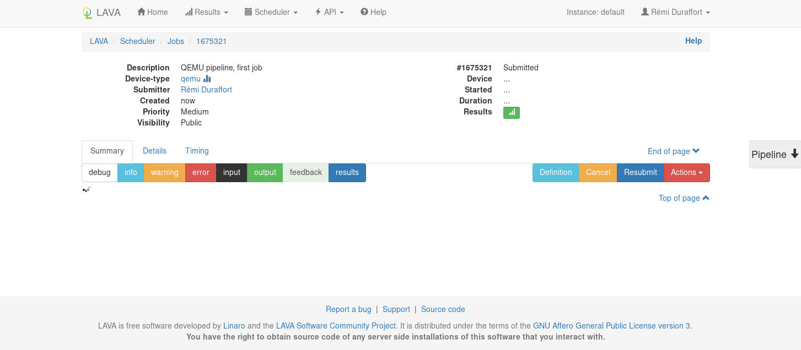
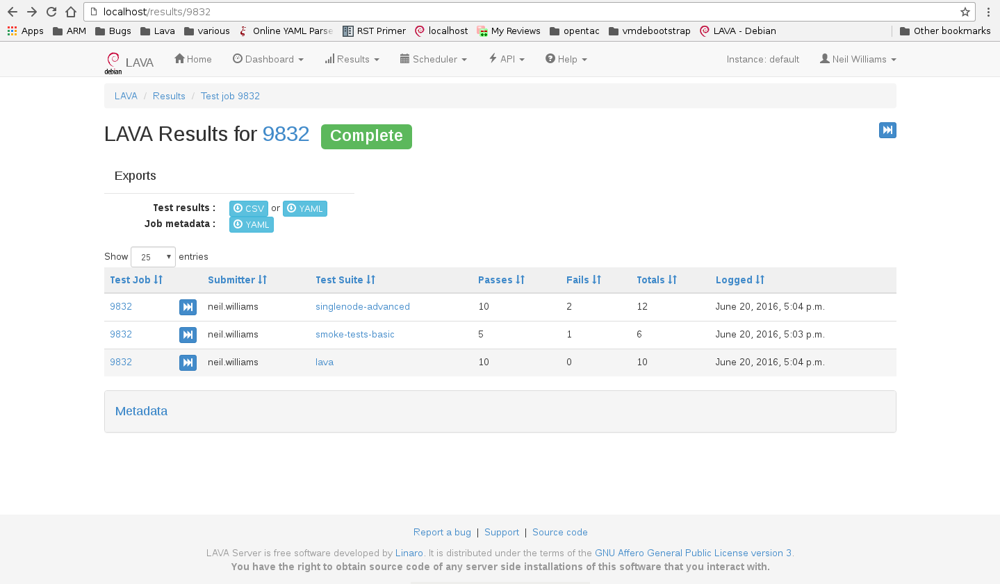
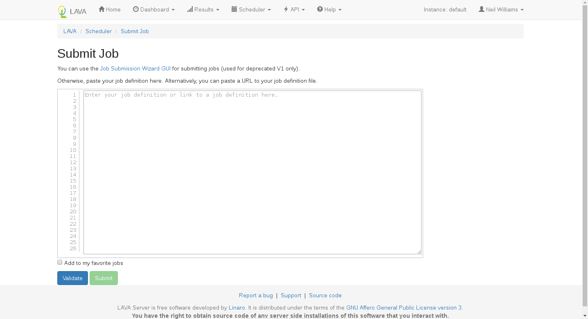
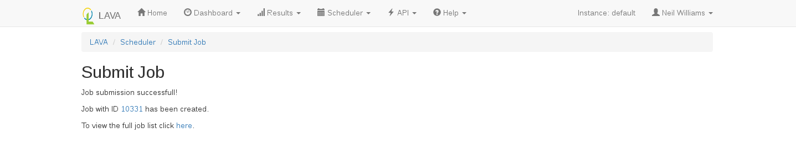

.. index:: submit, first job

.. _submit_first_job:

Submitting your first job
#########################

A job defines what software should be deployed on the ``device under test``
(DUT) and what actions should be performed there. Jobs are defined in *YAML*
files.

.. index:: first job definition, job definition

.. _first_job_definition:

Job Definition
==============

Here's an example minimal job that you should be able to use right away if you
have user access to an appropriately-configured LAVA installation.

.. include:: examples/test-jobs/qemu-pipeline-first-job.yaml
     :code: yaml

`Download / view <examples/test-jobs/qemu-pipeline-first-job.yaml>`_

.. seealso:: :ref:`explain_first_job`.

.. index:: job submission

.. _job_submission:

Job Submission
==============

Jobs may be submitted to LAVA in one of three ways:

* the command line (using the ``lava-tool`` program); or
* the :ref:`XML-RPC <xml_rpc>` API
* the :ref:`web UI <web_ui_submit>`

.. note:: ``lava-tool`` is a general-purpose command line interface for LAVA
   which can be used directly on the LAVA server machines and also remotely on
   any computer running a Debian-based distribution. See :ref:`lava_tool` for
   more information.

For now, lava-tool is the easiest option to demonstrate. Once you have copied
the above job definition to a file, (for example */tmp/job.yaml*), use
``lava-tool`` to submit it as a test job in Linaro's main LAVA lab:

::

  $ lava-tool submit-job https://<username>@validation.linaro.org/RPC2/
  /tmp/job.yaml
  Please enter password for encrypted keyring:
  submitted as job id: 82287

.. note:: Replace *username* with your username. Enter the password for the
   encrypted keyring which is the same that was used when adding the
   authentication token.

Once the job is submitted successfully, the job id is returned; this may be
used in order to check the status of the job via the web UI. In the above
submission the job id returned is 82287. Visit
``https://validation.linaro.org/scheduler/job/<job-id>`` in order to see the
details of the job run: the test device chosen, the test results, etc.

It may take some time before the job actually starts, depending on the number
of jobs waiting in the queue for a device of this type. Once the job starts,
the status information will automatically update and the logs will appear.

Results are populated live and will start to appear during the operation of the
deploy action. The plain log can be downloaded and the definition is available
for later reference. If you are the submitter of the job, you can also choose
to cancel the job.

.. index: test definitions

.. _test_definitions:

Test Definitions
================

In order to run a test, a test definition is required. A test definition is
expressed in YAML format. A minimal test definition would look something like
the following:

.. code-block:: yaml

  metadata:
      name: passfail
      format: "Lava-Test-Shell Test Definition 1.0"
      description: "Pass/Fail test."
      version: 1.0

  run:
      steps:
          - "lava-test-case passtest --result pass"
          - "lava-test-case failtest --result pass"

The first job mentioned above uses a more complex test definition:

https://git.linaro.org/qa/test-definitions.git/tree/ubuntu/smoke-tests-basic.yaml

The metadata in a test definition is for the maintenance of that test
definition and covers details like the maintainer, the kinds of devices which
may find this test definition useful and the scope of the test definition.
(Scope is arbitrary, often a scope of functional is used to describe a test
which is useful to test that the image is functioning correctly.) The run steps
of this definition are:

.. code-block:: yaml

 run:
    steps:
        - lava-test-case linux-linaro-ubuntu-pwd --shell pwd
        - lava-test-case linux-linaro-ubuntu-uname --shell uname -a
        - lava-test-case linux-linaro-ubuntu-vmstat --shell vmstat
        - lava-test-case linux-linaro-ubuntu-ifconfig --shell ifconfig -a
        - lava-test-case linux-linaro-ubuntu-lscpu --shell lscpu
        - lava-test-case linux-linaro-ubuntu-lsb_release --shell lsb_release -a

This simple test executes a series of commands in the booted image. The exit
value of each command is used to determine whether the test case passed or
failed. You can try any of these commands on a Ubuntu or Debian system to see
what the commands should create as output.

.. seealso:: :ref:`writing_tests`

.. index: results

.. _viewing_results:

Viewing test results
====================

On the job view page, there is a button to access the Results. Results can also
be accessed from the Results Overview in the menu. The results for the first
job example could look like:

The results include the test definitions submitted within the job as well as a
reserved ``lava`` set of results generated during the operation of the test job
itself. There is also metadata which is generated by the test job, including
details like the URL of the test definitions used and the type of deploy and
boot methods involved in the test job.

.. index:: downloading results, results download

.. _downloading_results:

Downloading test results
========================

.. include:: restapi.rsti

.. index:: web ui submit

.. _web_ui_submit:

Web Based Job Submission
========================

Remember to check the YAML syntax of your test job files using the `Online YAML
parser <http://yaml-online-parser.appspot.com/?yaml=&type=json>`_ before
submission.

.. seealso:: :ref:`writing_new_job_yaml`

The Scheduler menu contains a Submit Job action which can be used to submit
jobs to any instance using your browser. You need to be logged in and have
permission to submit jobs to that instance. The web submission form for a
localhost installation would be ``http://localhost/scheduler/jobsubmit``.

To submit jobs to the Linaro lab in Cambridge, visit
``https://validation.linaro.org/scheduler/jobsubmit``. Paste your YAML file
into the window and click the "Submit" button. An example job submission screen
is shown below,

.. note:: If a link to a test job YAML file is pasted on the above screen, the
   YAML file will be fetched and displayed in the text box for submission. Make
   sure that the link is to the raw content of the YAML file, not HTML.

Once the job is successfully submitted, the following screen appears, from
which the user can navigate to the job details or the list of jobs page.

Viewing the submitted job will show the same screen as other submission methods.

.. index:: XML-RPC submit

.. _xmlrpc_job_submit:

.. index:: xml-rpc job submission

XML-RPC Job Submission
======================

:ref:`lava_tool` is a wrapper around the XML-RPC API with helpers for personal
usage. The XML-RPC API itself supports a variety of queries and operations
which can assist in creating a frontend to LAVA which can automate the
submission of test jobs.

Many languages have XML-RPC support, the API help page on each LAVA instance
provides a python example script, with and without using tokens. Job submission
requires using an :ref:`authentication token <authentication_tokens>` and
should use ``https`` wherever possible to protect the token.

.. seealso:: For help using the XML-RPC API to submit jobs, see the sections on
   :ref:`lava_tool` and the **Available methods** link from the API menu of the
   LAVA instance. For example: ``http://localhost/api/help``.
