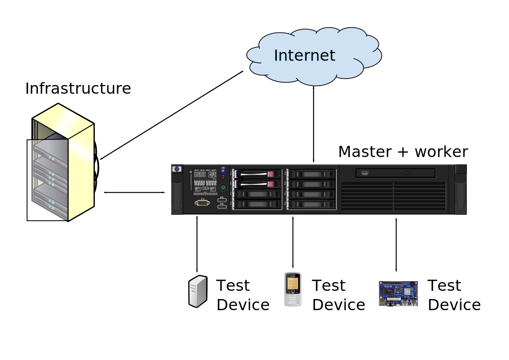

.. index:: growing your lab, micro-instance

.. _growing_your_lab:

Growing your lab
################

Assumptions
***********

At this point, it is expected that you will have a simple lab setup
with some virtual devices and some simple test boards, each regularly
passing :ref:`health checks <health_checks>`. It is generally a good
idea to allow time for your lab to settle. Run a number of test jobs
and understand the administrative burden before trying to expand your
setup.

Once you are happy that things are working and you know how to run
that simple lab, here are suggested steps to follow to grow it.

Requirements
************

When planning your lab, keep in mind the basic requirements of
automation and LAVA:

* Instances need high reliability.

* Devices under test may often be prototypes or developer editions of
  hardware. This can lead to reliability and stability issues.

* Extra hardware may be needed for automation which is not commonly
  found in generic hosting locations like data centres.

* Depending on the type of hardware in use, it may have significant
  problems with automation. Some devices may need security measures
  disabling, for example.

* Test jobs need to run quickly to provide useful results to
  developers.

* Lab infrastructure needs to remain secure (some resources may not be
  open to the public).

.. contents::
   :backlinks: top

Logical layouts
***************

The simplest LAVA instance is a single master with a single worker on the same
machine. Adding more devices to such an instance may quickly cause problems
with load. Test jobs may time out on downloads or decompression and devices
will go offline.

The first step in growing a LAVA lab is to add a remote worker. Remote
workers can be added to any V2 master. To do so, use the
:ref:`django_admin_interface` to add new devices and device types,
allocate some or all devices to the newly created remote worker and
optionally configure :ref:`encrpytion on the master
<zmq_master_encryption>` and :ref:`on the worker
<zmq_slave_encryption>` for secure communication between them.

As load increases, the master will typically benefit from having fewer
and fewer devices directly attached to the worker running on the
master machine. Complex labs will typically only have devices attached
to remote workers.

Depending on the workload and admin preferences, there are several
lab layouts that can make sense:

.. _single_master_single_worker:

Single master, single worker
============================

This is the starting layout for a fresh installation. Depending on the
capability of the master, this layout can support a small variety of
devices and a small number of users. This layout does not scale
well. Adding too many devices or users to this setup can lead to the
highest overall maintenance burden, per test job, of all the layouts
here.

In all of these example diagrams, **Infrastructure** represents the
extra equipment that might be used alongside the LAVA master and
workers, such as mirrors, caching proxies etc.

.. _single_master_multiple_workers:

Single master, multiple workers
===============================

.. figure:: images/worker-lab.svg
   :width: 60%
   :align: center
   :alt: single master, multiple workers

A medium to large lab can operate well with a single master
controlling multiple workers, especially if the master is a dedicated
server running only ``lava-server``.

.. _multiple_masters_multiple_workers:

Multiple masters, multiple workers
==================================

.. figure:: images/frontend-lab.svg
   :width: 60%
   :align: center
   :alt: multiple masters, multiple workers

A custom :term:`frontend` can use :ref:`custom result handling
<custom_result_handling>` to aggregate data from multiple separate
masters into a single data set. The different masters can be
geographically separated and run by different admins. This is the
system used to great effect by :ref:`kernelci_org`.

.. _micro_instances:

Micro-instances
===============

.. figure:: images/micro-instance-lab.svg
   :width: 60%
   :align: center
   :alt: micro-instance layout

When different teams need different sets of device types and
configurations and where there is little overlap between the result
sets for each team, a micro-instance layout may make sense.

The original single lab is split into separate networks, each with a
separate complete instance of a LAVA master and one or more
workers. This will give each team their own dedicated micro-instance,
but the administrators of the lab can use common infrastructure just
like a single lab in a single location. Each micro-instance can be
grown in a similar way to any other instance, by adding more devices
and more workers.

Which layout is best?
=====================

The optimum configuration will depend massively on the devices and
test jobs that you expect to run. Use the :ref:`multiple masters,
multiple workers<multiple_masters_multiple_workers>` option where all
test jobs feed into a single data set. Use micro-instances where teams
have discrete sets of results. Any combination of micro-instances can
still be aggregated behind one or more custom frontends to get
different overviews of the results.

As an example, the Linaro LAVA lab in Cambridge is a hybrid setup. It
operates using a set of micro-instances, some of which provide results
to frontends like :ref:`kernelci_org`.

Recommendations
***************

* Some labs have found it beneficial to have identical machines
  serving as the workers, in identical racks. This makes
  administration of a large lab much easier. It can also be beneficial
  to take this one stage further and have a similar, if not identical,
  set of devices on each worker. If your lab has a wide range of test
  job submissions which cover most device types, you may find that a
  similar layout helps balance the load.

* Consider local mirroring or caching of resources such as NFS rootfs
  tarballs, kernel images, compressed images and git repositories. It
  is valuable to make downloads to the worker as quick as possible -
  slow downloads will inflate the run time of every test.

  * One of the administrative problems of :abbr:`CI (continuous
    integration)` is that these images change frequently, so a caching
    proxy may be more effective than a direct mirror of the build
    system storage.

  * Conversely, the use of ``https://`` URLs inside test jobs
    typically will make caches and proxies much less effective. Not
    supporting ``https://`` access to git repositories or build system
    storage can have implications for the physical layout of the lab,
    depending on local policy.

  * Depending on the lab, local mirroring of one or more distribution
    package archives can also be useful.

    .. note:: This may rely on the build system for NFS rootfs and
       other deployments being configured to always use the local
       mirror in those images. This can then have implications for
       test writers trying to debug failed test jobs without access to
       the mirror.

* Consider the implications of persistence. LAVA does not (currently) archive
  old test jobs, log files or results. The longer a single master is collating
  the results from multiple workers, the larger the dataset on that master
  becomes. This can have implications for the time required to perform backups,
  extract results or run database migrations during upgrades.

* Consider reliability concerns - each site should have :abbr:`UPS
  (Uninterruptible Power Supply)` support. Some sites may need
  generators as well. This is not just needed for the master and
  workers: it will also be required for all the devices, the network
  switches and and all your other lab infrastructure.

* Devices in LAVA always need to remain in a state which can be
  automated. This may add lots of extra requirements: custom hardware,
  extra cabling and other support devices not commonly found in
  general hosting locations. This also means that LAVA is **not**
  suitable for customer-facing testing, debugging or triage.

Physical layouts
****************

.. important:: If the master and one or more of the workers are to be connected
   across the internet instead of within a locally managed subnet,
   :ref:`encrpytion on the master <zmq_master_encryption>` and :ref:`on all
   workers <zmq_slave_encryption>` is **strongly recommended**.

LAVA V2 supports geographically separate masters and workers. Workers
can be protected behind a firewall or even using a NAT internet
connection, without the need to use dynamic DNS or other
services. Connections are made from the worker to the master, so the
only requirement is that the :term:`ZMQ` ports configured on the
master are open to the internet and therefore use **encryption**.

Physically separating different workers is also possible but has implications:

* Resources need to be mirrored, cached or proxied to multiple locations.

* The administrative burden of a LAVA lab is frequently based around
  the devices themselves. LAVA devices frequently require a range of
  support tasks which are unsuitable for generic hosting locations. It
  is common that a trained admin will need physical access to test
  device hardware to fix problems. The latency involved in getting
  someone to the location of the device to change a microSD card,
  press buttons on a problematic device, investigate :term:`PDU`
  failures and other admin tasks will have a large impact on the
  performance of the LAVA lab itself.

* Physical separation across different sites can mean that test
  writers may see varying performance according to which worker has
  idle devices at the time. If one worker has a slower connection to
  the build system storage, test writers will need to allow for this
  in the job submission timeouts, possibly causing jobs on faster
  workers to spend longer waiting for the timeout to expire.

* Each location still needs :abbr:`UPS (Uninterruptible Power Supply)`
  support, backup support and other common lab infrastructure as laid
  out previously.

Resources
*********

The Linaro lab in Cambridge has provided most of the real-world experience used
to construct this guide. If you are looking for guidance about how to grow your
lab, please talk to us on the :ref:`lava_devel` mailing list.
