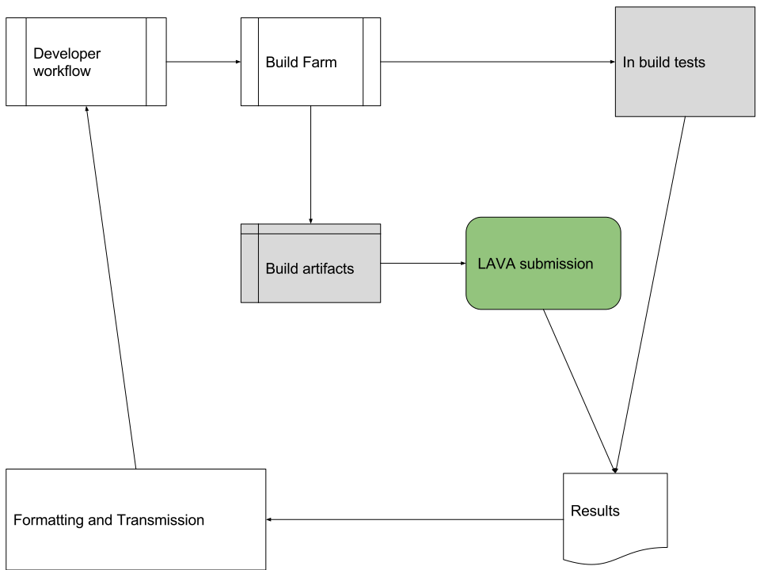

.. index:: continuous integration

.. _continuous_integration:

Continuous Integration
**********************

Continuous Integration (CI) is a development model. Developers make changes
which are continuously integrated into the main development tree. Testing of
that tree then allows those developers to know if their changes have introduced
new bugs, regressions of old bugs or exposed side-effects in other systems or
components. CI depends on the testing done at each integration to work. Tests
need to be:

#. **Relevant** to the developer - providing meaningful results with enough
   information that the developer can identify the actual problem, not a
   symptom.

#. **Reproducible** - results which the developer can reproduce locally make
   for a quicker and more reliable fix.

#. **Timely** - the turnaround time for the test of each integration step needs
   to be within a window where the developer is still working on that system or
   can quickly switch back to it. Other developers are basing their own
   development and testing on the development tree, a failure in one
   integration step needs to be identified before more development is
   integrated into the same tree.

These principles underpin the idea of "closing the CI loop". The loop starts
with the developer change being integrated into the tree. A trigger then causes
a build which is submitted for testing and validation. Obtaining the results is
only one step, the results need to get back to the developer and provide the
developer with enough information to close the loop by making a further change
to fix problems identified by the testing.

.. seealso:: https://en.wikipedia.org/wiki/Continuous_integration for
   background on CI workflow and best practices and :ref:`ci_loop` for an
   example of how LAVA can work within a CI loop.

Summary of CI best practices
============================

There are a number of other resources available for background on CI, these are
reproduced here to show how automation and LAVA relate to CI:

#. Use version control
#. Automate the build
#. Make the build self-testing

   * LAVA provides extensions here to in-build testing by testing the build on
     real hardware separately from the in-build tests on the build hardware.
     The build itself is separate from the LAVA test.

#. Everyone commits to baseline regularly (e.g. daily)
#. Every commit to baseline is built (and tested)
#. Keep the build (and test) fast
#. Test in a clone of the production environment

   * This is where automation can have complications as a true production
     environment closes the access methods used by automation

#. Everyone can see the results
#. Automate deployment

   * Although LAVA does automated deployment, it does so with the requirement
     that the deployment is still accessible to the automation to determine
     that the deployment is successful. This can have implications for how the
     deployment to a production-clone test instance is done. For example,
     within the LAVA software team, deployments to the staging instance are
     **not** done with LAVA but using standard OS build and upgrade tools. This
     is in addition to using these same build and upgrade tools within
     virtualised containers to test fresh installs and clean upgrades.

.. index:: lava and ci

.. _lava_and_ci:

LAVA and CI
***********

LAVA is focused on kernel and system validation as part of a CI loop and
provides a way to test on a wide variety of different hardware to aid
portability and develop multi-platform systems.

CI requires that the testing is useful to the developer and this has important
implications for LAVA. Tests submitted to LAVA need to follow a basic rule to
be able to produce meaningful and relevant output.

* **Test one element at a time** - the basic scientific method. If the test
  changes the kernel, the deployment method and the OS at the same time, there
  is no way to produce relevant or useful output when that test fails. Any one
  of those elements may have contributed to the failure.

  * Test a modified kernel build using a deployment method which is known to
    work for previous builds and using an OS and a test definition which is
    known to work for previous builds.

  * Test a modified deployment method using a known kernel, OS and test
    definition.

  * Describe the purpose of each test in the job name, comments and metadata.

.. index:: automation

.. _automation_and_ci:

Automation & CI
***************

LAVA is an automated architecture and automation itself can have implications
for how relevant the results will be to the developers.

#. Automation might be required to use methods which do not match user methods.

#. Automation can involve hardware or software modifications which do not match
   the user experience.

#. Automation requires that devices are always recovered from a test failure,
   i.e. often termed "unbrickable".

#. Automation requires a level of administative setup and integration of new
   devices far beyond what would be needed for setting up a single device for
   human testing.

.. _automation_and_lava:

How does this affect testing with LAVA?
=======================================

A server or development board can be tested in a similar way to user testing
because the interface available on the board is likely to be command-line only.
e.g. using SSH. However, this test still requires that the device is configured
to recover from failed deployments by enabling remote power control and
ensuring that the boot process can be interrupted reliably.

A device with a graphical user interface (GUI) is much harder to test in a way
that the user would test the device. Video capture is possible but needs extra
hardware and only compares static images. Some GUI systems support automation
by recording clicks/taps and movement. However, this does **not** mean that
LAVA is the best choice of test system for these systems.

* **LAVA is aimed at kernel and system development** and testing across a wide
  variety of hardware platforms. By the time the test has got to the level of
  automating a GUI, there have been multiple layers of abstraction between the
  hardware, the kernel, the core system and the components being tested.
  Following the core principle of testing one element at a time, this means
  that such tests quickly become platform-independent. This reduces the
  usefulness of the LAVA systems, moving the test into scope for other CI
  systems which consider all devices as equivalent slaves. The overhead of LAVA
  can become an unnecessary burden.

* **CI needs a timely response** - it takes time for a LAVA device to be
  re-deployed with a system which has already been tested. In order to test a
  component of the system which is independent of the hardware, kernel or core
  system a lot of time has been consumed before the "test" itself actually
  begins. LAVA can support testing pre-deployed systems but this severely
  restricts the usefulness of such devices for actual kernel or hardware
  testing.

* **Automation may need to rely on insecure access**. Production builds
  (hardware and software) take steps to prevent systems being released with
  known login identities or keys, backdoors and other security holes.
  Automation relies on at least one of these access methods being exposed,
  typically a way to access the device as the root or admin user. User
  identities for login **must** be declared in the submission and be **the same
  across multiple devices** of the same type. These access methods must also be
  exposed consistently and without requiring any manual intervention or
  confirmation. For example, mobile devices **must** be deployed with systems
  which enable debug access which all production builds will need to block.

* **Automation relies on remote power control** - battery powered devices can
  be a signficant problem in this area. On the one hand, testing can be
  expected to involve tests of battery performance, low power conditions and
  recharge support. However, testing will also involve broken builds and failed
  deployments where the only recourse is to hard reset the device by killing
  power. With a battery in the loop, this becomes very complex, sometimes
  involving complex electrical bodges to the hardware to allow the battery to
  be switched out of the circuit. These changes can themselves change the
  performance of the battery control circuitry. For example, some devices fail
  to maintain charge in the battery when held in particular states
  artificially, so the battery gradually discharges despite being connected to
  mains power. Devices which have no battery can still be a challenge as some
  are able to draw power over the serial circuitry or USB attachments, again
  interfering with the ability of the automation to recover the device from
  being "bricked", i.e. unresponsive to the control methods used by the
  automation and requiring manual admin intervention.

* **Automation relies on unique identification** - all devices in an automation
  lab **must** be uniquely identifiable at all times, in all modes and all
  active power states. Too many components and devices within labs fail to
  allow for the problems of scale. Details like serial numbers, MAC addresses,
  IP addresses and bootloader timeouts **must** be configurable and persistent
  once configured.

* **LAVA is not a complete CI solution** - even including the hardware support
  available from some LAVA instances, there are a lot more tools required
  outside of LAVA before a CI loop will actually work. The triggers from your
  development workflow to the build farm (which is not LAVA), the submission to
  LAVA from that build farm are completely separate and outside the scope of
  this documentation. LAVA can help with the extraction of the results into
  information for the developers but LAVA output is generic and most teams will
  benefit from some "frontend" which extracts the data from LAVA and generates
  relevant output for particular development teams.

* **LAVA is not a build farm** - equally LAVA is not useful as a validator of
  production builds which are about to be shrink-wrapped and released to the
  public. It is not possible to deploy a "secure" system and then test that the
  system has even been deployed successfully as any properly secure system will
  lock out the method used by the automation. Any failures in the deployment
  will go completely unnoticed until the product is handed by the user. To test
  such systems requires some form of user-like robotic or human testing,
  involving unlocking the device or interface, configuring services and
  accounts, starting and closing applications via a :abbr:`Graphical User
  Interface (GUI)` and evaluating whether the device produces the correct
  graphical output.

.. seealso:: :ref:`custom_result_handling` and :term:`frontend`
