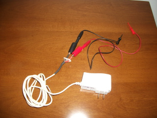

Deploying a Galaxy Nexus phone
==============================

This page describes the hardware and software setup to get a Galaxy Nexus
device on LAVA.

Preparing the phone
-------------------

Hardware
........

**Power supply:** 4V/2A. Note that the power supply has to to stabilized to
  avoid ripple. Cut the wire and separate the positive and negative poles.
  Ideally you also want to put some terminals in these poles, to avoid having
  to clip into raw wires. Red is positive and black is negative.

.. image:: images/nexus/01-power-supply.small.jpg

**Alligator clips.** The alligator ends go into the power supply terminals, and
  the other end in the phone battery pins. On the Nexus 7, the positive (red)
  wire plugs into the first battery contact from left to right, and the
  negative to the third one.

|aligator-clips| |aligator-clips-on-battery|

.. |aligator-clips-on-battery| image:: images/nexus/03-alligator-clips-on-battery-pins.small.jpg

**Optional: stand.** Ideally you want the phone to stand up so that you can
  look at the screen with your hands free, and to prevent the terminals of the
  alligator clips that are plugged into the phone from rubbing against your
  desk (what may cause them to be disconnected). You can make a stand easily by
  cutting a cardboard box as shown in the image below. It will keep the Nexus 7
  standing (provided it has the USB cable plugged in), and as a bonus you can
  keep most of the wires inside the box.

.. image:: images/nexus/04-complete-setup-with-stand.small.jpg

Software
........

* ensure you have `fastboot` installed (`android-tools-fastboot` package
  on Debian/Ubuntu)

* plug USB cable to the phone

* erase the boot partition:

* turn off the phone, and turn if on again while holding the volume up
  and volume down buttons. This will make the phone enter the
  bootloader screen.

* Issue the following command to erase the boot partition::

  $ fastboot erase boot
  $ fastboot erase recovery

* Now every time the phone is turned on, it will enter the bootloader,
  with which we can interact through the `fastboot` program. LAVA will use
  `fastboot` to flash test images and control the phone in general.

Preparing LAVA
--------------

Single phone
............

For a single phone, you only need the usual LAVA setup process. Say you want
the phone to appear as `nexus01`, then you create `nexus01.conf` with the
following content::

    #/etc/lava-dispatcher/devices/nexus01.conf
    device_type = nexus

*Note:* you will also want to configure `hard_reset_command` for your device in
order to reboot it when a test image hangs.

After that, you just do the usual LAVA setup steps: log in as admin user, go to
administration panel, create a device type called "nexus" and a device called
"nexus01" with device type "nexus".

Multiple phones
...............

If you have multiple phones plugged into a single PC, you will need to add some
extra settings to each phone's device config.

First, get the serial number for each phone. Once the phone is set up as
described above and booted into its bootloader, plug it into your PC and run
the following command::

    fastboot devices

Alternatively, if the phone is already running Android, you might get its
serial number with::

    adb devices

Then, for each phone, override the settings `adb_command` and `fastboot
command`. For example, for `nexus01`, you would put the following in
`nexus01.conf`::

    #/etc/lava-dispatcher/devices/nexus01.conf
    device_type = nexus
    adb_command = adb -s NEXUS01SERIAL
    fastboot_command = sudo fastboot -s NEXUS01SERIAL

